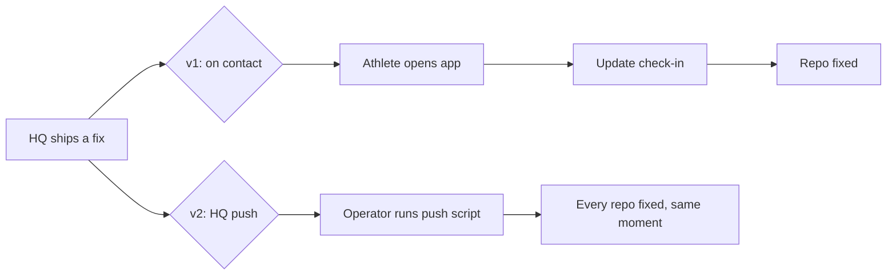

# Automatic Coach Updates — V2: HQ Pushes Directly

> Status: Current · Owner: Tech Lead · Verified: 2026-08-30

## Why this replaces v1's delivery mechanism

[`platform-athlete-repo-updates-v1.md`](platform-athlete-repo-updates-v1.md) already solved the
hard safety problem for #327: what a release may touch, how a migration must behave, the kill
switch, and rollback. That contract is correct and this plan keeps it unchanged.

What v1 got wrong is *how* an update reaches a repo. V1 waits for the athlete to open the app,
then writes with the athlete's own sign-in. That means a fix ships to nobody until they happen to
open Coach, and it needed a whole iOS surface (current / updated / warning / incompatible /
retry) just to show that wait.

We already hit this live. The #675 Fitness Snapshot bug — three real athlete repos silently
missing a schema stamp — sat broken until someone found it and patched each repo by hand. An
HQ-initiated push would have fixed all three the moment the carve script was corrected, for
every athlete, with no dependence on when they next opened the app.

## What changes

**Auth.** Every write today — `commitFilesAtomic()`, coach-chat's commits — uses the signed-in
athlete's own OAuth token (ADR 0001). There is no App-level installation-token auth in this
codebase yet. V2 adds it: a new `platform/scripts/_lib/githubAppAuth.mjs` signs a JWT with the
App's private key and exchanges it for a per-installation access token
(`POST /app/installations/{id}/access_tokens`), plus enumeration of every install via
`GET /app/installations`. New secrets: `GITHUB_APP_ID`, `GITHUB_APP_PRIVATE_KEY`.

**Push script.** New `platform/scripts/push-engine-update.mjs`, same `--dry-run` / `--push` shape
as `carve-skeleton.mjs`. For each installed repo: get its installation token, write only the
release's allowlisted paths (`engine/`, `SOUL.claude.md`, `CLAUDE.md`, `.claude/`,
`propagated/docs/`, `.coach-engine-version` — same list v1's M0 already defines) through the same
Git Data API blob/tree/commit/ref sequence `commitFilesAtomic()` uses today, just with the
installation token instead of a user token. Keeps that function's compare-and-swap-on-parent-SHA
check so a push can't clobber an athlete's own in-flight write — it retries that one repo instead.
Any repo where the allowlist doesn't apply cleanly aborts and is skipped, logged, not force-fixed,
so one bad repo can't block the batch.

**Trigger.** Manual, operator-run — review the `--dry-run` diff, then `--push` — after an HQ
change lands. Not automatic on every merge to `main`, so a broken intermediate HQ state is never
fanned out to every athlete at once. A scheduled/CI trigger is a later iteration, not V1.

**Dropped from v1:** the whole on-contact endpoint and PR3's iOS gating states. If the push
already landed before the athlete opens the app, there's nothing left to gate on entry — just a
passive Settings readout of the current release, kept from v1's diagnostics table, for support.

## What stays from v1, unchanged

- The release + migration contract (M0): only declared paths are ever replaced; `user_data/`
  changes only through a named, forward, lossless, idempotency-tested migration; #454 leftovers
  stay untouched until that issue decides them.
- The atomic single commit (Coach files + migration + release marker together).
- The kill switch (`repo_update_mode=off|observe|enforce`, default `off`) and rollback by
  republishing the last-good release as a new higher release — never history rewrite, never
  reverse-migration.

## Tradeoffs, stated plainly

- Needs new infra that doesn't exist today: App private key + JWT signing.
- A push can race an athlete's own write mid-session — mitigated by reusing
  `commitFilesAtomic()`'s existing parent-SHA check, not a new mechanism.
- No in-the-moment "update happened" screen for the athlete — traded for updates landing before
  they'd ever see one.

## Delivery

| PR | scope | outcome |
|---|---|---|
| This PR | Docs only — this file, v1 marked superseded, ROADMAP updated | #327 direction settled |
| Follow-up 1 | `githubAppAuth.mjs`, App private key wired into HQ secrets | Installation tokens work |
| Follow-up 2 | `push-engine-update.mjs`, kill switch, rollback | Real repos updatable on operator command |
| Follow-up 3 | Passive Settings readout (release/data version) | Athlete-visible diagnostics |

`Refs: #327`. This PR is documentation-only, same as v1's own PR — implementation is a separate,
stacked follow-up once this direction is settled.
