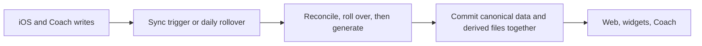

# Data freshness and reliability follow-ups

> Status: Plan · Owner: Tech Lead · Created: 2026-09-16

## Context

The 2026-09-16 audit found stale-data and data-loss paths across athlete-repo Sync, iOS, and the hosted dashboard. Close those paths in small PRs before changing performance architecture. No pipeline rewrite or new cache is proposed.

## Goal

Done when the snapshot matches its committed sources, a failed iOS history read cannot insert a duplicate, and two same-day badminton sessions retain separate records.

## Locked decisions

- ADR 0042 owns reconciliation and scheduled rollover; `week_update` stays the sole Coach write action.
- ADR 0035 requires one hist file per real session. A failed read must not make a committed session look absent.
- ADR 0013 makes `match_history.json` canonical. Supersede its date-only identity with a stable key and migration before changing the contract.
- `ui/api/repo-file.ts` uses `no-store` after a confirmed cross-account cache leak. Performance work must preserve that privacy property.

## Milestones

| Item | Outcome | Size | Result |
|---|---|---|---|
| M0 · Enforced gates | Existing engine suites, UI build, and malformed-history checks run automatically. | S | Named checks run on their own changes; corrupt hist fails with its path. |
| M1 · Fresh derived data | Sync rebuilds all snapshot inputs in source-update order and commits plugin output. | M | Fixtures prove trigger coverage, week parity, daily rollover, and plugin persistence. |
| M2 · Session integrity | iOS dedup fails closed; badminton records have session identity. | M | Garmin read failure makes no duplicate; same-day matches survive save, analytics, and web. |

M1's plugin output must persist before M2's badminton analytics contract is judged. The iOS read-failure PR can run alongside M0 and M1.

## PR stack

| PR | milestone | outcome | final base | files | owner | parallel with | result |
|---|---|---|---|---|---|---|---|
| 1 | M0 | Run engine script suites and UI build in CI/local gate. | main | `checks.conf`, `platform-tests.yml`, `ui-tests.yml` | Tech Lead | 6 | Existing 38 Node and 33 Python tests plus UI build run. |
| 2 | M0 | Reject malformed hist instead of publishing incomplete data. | PR 1 | snapshot builder, `validate-data.yml`, builder tests | Bob | 6 | Corrupt hist fails with its path; prior snapshot survives. |
| 3 | M1 | Build snapshot after week updates and trigger on profile/workout writes. | PR 2 | `sync.user.yml`, `test_sync_workflow.py` | Bob | 6 | Both workflow paths have week parity; file-only pushes rebuild. |
| 4 | M1 | Run rollover daily without committing on a no-op day. | PR 3 | scheduled workflow, `carve-skeleton.mjs`, tests | Bob | 5, 6 | Aged week advances; current week causes no commit. |
| 5 | M1 | Commit plugin analytics and remove obsolete output. | PR 4 | `sync.user.yml`, plugin fixture tests | Bob | 6 | Enabled, disabled, and empty-session trees are correct. |
| 6 | M2 | Stop iOS sync when required hist reads fail. | main | `HealthKitSyncManager.swift`, iOS tests | iOS Builder | 1–5 | Read failure plus Garmin rewrite makes no duplicate. |
| 7 | M2 | Supersede date-only match identity and migrate iOS/Python. | PR 5 | ADR, `ActivityDetailView.swift`, `DescriptionParser.swift`, `analytics.py`, tests | iOS Builder | 6 | Two same-day matches survive save and analytics. |
| 8 | M2 | Make web badminton read structured matches. | PR 7 | `sync.user.yml`, snapshot builder, `matchParser.ts`, Home/lens models, tests | Bob | — | Web and Python agree on the two-session fixture. |

Overlap determines merge order; independent branches may build in parallel, then rebase into the listed stack. Create scoped issues before implementation. This plan PR references the platform-hardening epic without closing it. Delete the plan in the last PR after moving durable contracts into engineering docs.

## Deferred and measurement gates

- Measure Home p50/p95 latency and GitHub requests before combining `repo-file` and widget responses; preserve `no-store`.
- Measure iOS upload duration, blob count, and rate limits before considering bounded concurrency.
- Refresh `docs/eng-docs/scaling-plan.md` and `llm-provider-current.md` against ADRs 0045 and 0046 in a docs-only follow-up.

Build handoff: `engine/.github/workflows/sync.user.yml` (triggers, order, staging), `engine/scripts/build-dashboard-snapshot.mjs` (hist, week, workouts), `ios/CoachHQ/CoachHQ/Services/HealthKitSyncManager.swift` (dedup reads), `ios/CoachHQ/CoachHQ/Views/ActivityDetailView.swift` (match saves), `platform/plugins/badminton/analytics.py` (match identity).
