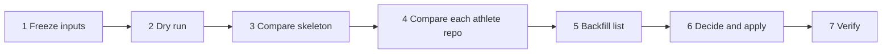

# Skeleton recarve: a repeatable runbook

> Status: Plan · Owner: Tech Lead · Created: 2026-09-19 · LLD: [`platform-skeleton-recarve-lld.md`](platform-skeleton-recarve-lld.md)

## Context

A recarve is not a one-off, so this runbook is written to be run every time. Never assume the last
run's result. Each run starts from a fresh dry run and a fresh comparison.

The last carve was 2026-09-14. All five athlete repos and the skeleton still carry HQ `61b71766` in
`.coach-engine-version`. A dry run against later `main` differs in 17 files. Nothing in the repo
updates an existing athlete repo from the skeleton, so a recarve alone only changes new athletes.

## Decision

Compare first, decide second, apply last. The dry run is read-only and needs no secrets. Every
change to a real repo needs its own go from the athlete.

| Step | What                                                                                             | Stop if                                |
| ---- | ------------------------------------------------------------------------------------------------ | -------------------------------------- |
| 1    | Record the HQ sha, the skeleton `main` sha, and each athlete repo's `main` sha and engine marker | A repo's `main` moves before step 6    |
| 2    | `carve-skeleton.mjs --dry-run --no-sentry` into a temp dir                                       | The carve errors                       |
| 3    | Compare the dry run to the skeleton, file by file                                                | A file has no class                    |
| 4    | Compare the dry run to every athlete repo, every file, plus data structure                       | A validator error on any repo          |
| 5    | List additive data fields to backfill, one diff per repo                                         | A diff is more than the intended lines |
| 6    | Show the report, then apply only what the athlete approves                                       | No go for a step                       |
| 7    | Recheck shas, rerun the validator, dry run again                                                 | The second dry run still differs       |

## Done when

1. The report covers every file in every athlete repo, each in exactly one class.
2. Every backfill is additive, was approved, and changed only the intended lines.
3. The validator passes on every repo after the run, and `main` shas moved only where approved.
4. The second dry run shows no difference from the skeleton.

## Deferred

- A tool that pushes engine and workflow updates into existing athlete repos. Until then step 6
  propagation is manual, one reviewed PR per repo.
- Turning the two comparison snippets in the LLD into a checked-in script.
- Moving this runbook to `docs/eng-docs/` once it has run for real. It is reference then, not a plan.
