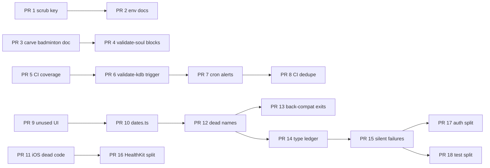

# Repo hygiene sweep

> Status: Plan · Owner: Tech Lead · Created: 2026-09-19 · LLD: [`repo-hygiene-sweep-lld.md`](repo-hygiene-sweep-lld.md)

## Context

A repo-wide audit ran over prose, code and enforcement. The repo is healthier than this plan's
length suggests - zero unreferenced TypeScript exports, zero skipped tests, two TODOs in the whole
source tree, and no `Verified:` date stale by the repo's own 60/90-day rule. The problems are
narrower and worse than rot: a secret that is not scrubbed, a BYOB SOUL that points at one doc the
carve never ships, and a SOUL check that can never block.

Evidence for every claim is in the LLD.

## Decision

Eighteen PRs across seven milestones, ordered so the athlete-facing and security items land
first and the cosmetic ones last.

Arrows show merge order, the `final base` column. Separate chains can be built in parallel.

### The five that matter

1. **The Sentry scrubber protects the wrong key.** `ui/api/_lib/sentry.ts:73-79` scrubs
	`GEMINI_API_KEY`, which ADR 0046 removed from Vercel, and not `OPENROUTER_API_KEY`, which
	production sends as a bearer token.
2. **`SOUL.claude.md` tells BYOB Coach to read `propagated/docs/badminton-plugin.md`, and the carve
	never writes it.** The doc's own header says "NOT WIRED UP YET". It only bites when the
	badminton plugin is enabled. The other two dangling pointers are intentional (see the LLD).
3. **`validate-soul` cannot block.** It exits 1 only on a new finding, which is the right rule.
	But it runs in warn mode with `continue-on-error: true`, so the next SOUL or carve drift
	passes CI.
4. **`docs/eng-docs/env-vars.md` states the opposite of ADR 0046** on which provider production
	runs, and omits five live env vars from a page that calls itself canonical.
5. **`shared/warm-instrument/**` runs four blocking local checks and zero CI checks.** Same shape
	for lint and format across half of `ui/`.

## Done when

1. The carve writes `badminton-plugin.md`, its finding leaves `validate-soul`'s baseline, and
	`validate-soul` fails CI on a new finding.
2. A deliberate SOUL, workflow or dead-path drift fails CI on a scratch branch.
3. A test proves an `OPENROUTER_API_KEY` value in a Sentry breadcrumb is redacted.
4. `grep -rn "function localDateKey" ui` returns one hit.

## Execution stack

| PR | milestone | outcome | final base | files | owner | parallel with | result |
|---|---|---|---|---|---|---|---|
| 1 | M1 Secrets | OpenRouter key scrubbed; stale comment gone | main | `ui/api/_lib/sentry.ts`, `ui/observability/sentryScrubber.ts`, `ui/api/_lib/_tests/sentry.test.ts` | Bob | 3 | leaked key filtered, with a test |
| 2 | M1 Secrets | env truth matches ADR 0046 | 1 | `docs/eng-docs/env-vars.md`, `ui/api/_lib/llmClient.ts` | Bob | 3 | `env-vars.md` is true |
| 3 | M2 Carve | `badminton-plugin.md` carved; test asserts it | main | `platform/scripts/carve-skeleton.mjs`, `platform/tests/test_carve_skeleton.py`, `platform/validate-soul-baseline.json`, `docs/ref-docs/badminton-plugin.md`, `docs/ref-docs/README.md` | Tech Lead | 1, 2 | doc is in every carved repo |
| 4 | M2 Carve | `validate-soul` blocks on new findings | 3 | `platform/scripts/checks.conf`, `.github/workflows/validate-soul.yml`, `platform/validate-soul-baseline.json` | Tech Lead | - | new drift fails CI |
| 5 | M3 Enforcement | `shared/**` and all of `ui/` gain CI coverage | main | `.github/workflows/{ui-tests,ui-tooling-tests}.yml` | subagent | 6 | no blocking local check is CI-invisible |
| 6 | M3 Enforcement | `validate-kdb` fires on what it scans | 5 | `.github/workflows/validate-kdb.yml` | subagent | - | a dead path in a workflow fails CI |
| 7 | M3 Enforcement | cron jobs report their own failure | 6 | `.github/workflows/{sentry-digest,span-health}.yml`, `docs/eng-docs/sentry-runbook.md` | subagent | - | a dead digest is visible |
| 8 | M3 Enforcement | duplicate CI work dropped; orphan checkers resolved | 7 | `ui-tooling-tests.yml`, `ui/docs/reference_interactions_check.py`, `ui/package.json`, `platform/scripts/checks.conf` | subagent | - | one `vitest scripts/lib` run |
| 9 | M4 UI weight | 18 unused primitives and 7 deps deleted | main | `ui/client/src/components/ui/*`, `ui/package.json`, `ui/package-lock.json` | UI Expert | - | repo-wide grep finds no reference, build green, bundle smaller |
| 10 | M4 UI weight | one date module; 9 duplicates collapse | 9 | new `ui/client/src/lib/dates.ts`; lens models, `home-warm/*`, `lib/activities.ts`, `lib/challenge.ts` | UI Expert | 11 | one Monday formula |
| 11 | M5 Retired names | iOS dead code deleted | main | delete `EnginePageView.swift` (keep `EnginePageMath`), `BundledTemplates.swift`; `InstrumentHeaderView.swift` | iOS Builder | 9, 10 | iOS build + tests green |
| 12 | M5 Retired names | dead params gone; one name for coach-day | 10 | `liveWeekContract.ts`, `coachDay.ts` + test, `coachChatModel.ts`, `CoachChat.tsx`, `CoachChatView.swift` | Bob | - | no user-facing "Gemini" |
| 13 | M5 Retired names | back-compat states its exit; stale `fileEdits.ts` contract fixed | 12 | `repo-resolution.ts`, `fileEdits.ts` | Bob | - | every back-compat path names its exit |
| 14 | M6 Boundary | the ledger boundary is typed | 12 | `hooks/useRepoData.ts` and `tsc` fallout | UI Expert | 15 | `SplitLedger` not bypassed at entry |
| 15 | M6 Boundary | 2 silent failures report | 14 | `commit/activitySyncTurn.ts`, `auth/[...action].ts` | Bob | - | a GitHub outage is visible |
| 16 | M7 Splits | `HealthKitSyncManager` split by job | 11 | `ios/.../HealthKitSyncManager.swift` | iOS Builder | 17, 18 | each file under ~600 lines |
| 17 | M7 Splits | auth router split from PKCE and refresh | 15 | `ui/api/auth/[...action].ts` | Bob | 16, 18 | router is routing only |
| 18 | M7 Splits | reprompt test split by scenario | 15 | `coachTurn-reprompt.test.ts` | Bob | 16, 17 | same assertions, readable files |

**Parallelism:** the diagram shows merge order, and separate chains build in parallel. PR 4
follows 3, since both write `validate-soul-baseline.json`. 5-8 are a serial chain over the
workflow files. 9 → 10 → 12 is a serial chain over `ui/client/src`. 14 follows 12 because both
touch `CoachChat.tsx`. 17 and 18 follow 15, since 17 rewrites the auth file that 15 edits. 11 and
16 are the only `ios/` PRs and are serial.

## Deferred

Prose cleanup (false path claims, finished plans, chronology) is tracked in #1249 and is out of
scope here.
