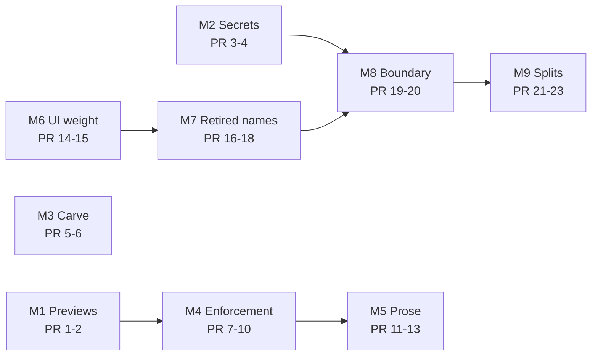

# Repo hygiene sweep

> Status: Plan · Owner: Tech Lead · Created: 2026-09-19 · LLD: [`repo-hygiene-sweep-lld.md`](repo-hygiene-sweep-lld.md)

## Context

A repo-wide audit ran over prose, code and enforcement. The repo is healthier than this plan's
length suggests - zero unreferenced TypeScript exports, zero skipped tests, two TODOs in the whole
source tree, and no `Verified:` date stale by the repo's own 60/90-day rule. The problems are
narrower and worse than rot: a secret that is not scrubbed, a carve that ships athletes a broken
SOUL, a lint baseline muting 12 real findings, and preview deploys failing on every PR.

Evidence for every claim is in the LLD. Nothing here is deferred.

## Decision

Twenty-three PRs across nine milestones, ordered so the athlete-facing and security items land
first and the cosmetic ones last.

### The five that matter

1. **The Sentry scrubber protects the wrong key.** `ui/api/_lib/sentry.ts:73-79` scrubs
	`GEMINI_API_KEY`, which ADR 0046 removed from Vercel, and not `OPENROUTER_API_KEY`, which
	production sends as a bearer token.
2. **The carve ships a SOUL pointing at files it never writes.** Three `propagated/docs/` pointers
	and two workout templates are referenced by SOUL and not carved. BYOB is live (ADR 0021
	retracted its retirement), so this breaks real athlete repos.
3. **`validate-soul` already catches #2 and has been muted since 2026-09-11** - 12 known findings,
	exit 0, `continue-on-error: true`, no burn-down.
4. **`docs/eng-docs/env-vars.md` states the opposite of ADR 0046** on which provider production
	runs, and omits five live env vars from a page that calls itself canonical.
5. **`shared/warm-instrument/**` runs four blocking local checks and zero CI checks.** Same shape
	for lint and format across half of `ui/`.

### Vercel previews - two separate causes

Every red preview row is the `pr-lens-assets` branch, which has no `ui/` directory while the
project's Root Directory is `ui`. The build dies 1s after clone, before `ui/vercel.json` can be
read, so the ignore gate never runs. This is not caused by #1207.

#1207 did introduce a separate hole: it narrowed the ignore list and left `ui/vercel.json` out of
it, so a change to the CSP, security headers or `maxDuration` now reaches production with no
preview build.

## Done when

1. `node platform/scripts/validate-soul.mjs` prints `0 known / 0 new` and the baseline file is
	empty.
2. A deliberate SOUL, workflow or dead-path drift fails CI on a scratch branch.
3. A `ui/vercel.json`-only change produces a preview deploy, and no branch produces a red one.
4. A test proves an `OPENROUTER_API_KEY` value in a Sentry breadcrumb is redacted.
5. No `Status: Current` doc names a path that does not exist, or says "used to" / "no longer".
6. `grep -rn "function localDateKey" ui` returns one hit.

## Execution stack

| PR | milestone | outcome | final base | files | owner | parallel with | result |
|---|---|---|---|---|---|---|---|
| 1 | M1 Previews | `pr-lens-assets` stops failing | main | Vercel project Git settings; `.github/workflows/` asset path | Tech Lead | 3, 5 | no red preview rows |
| 2 | M1 Previews | trigger lists match and cover themselves | 1 | `ui/vercel.json`, `.github/workflows/ui-tests.yml` | Tech Lead | 3, 5 | editing `vercel.json` builds a preview |
| 3 | M2 Secrets | OpenRouter key scrubbed; stale comment gone | main | `ui/api/_lib/sentry.ts`, `ui/observability/sentryScrubber.ts`, `ui/api/_lib/_tests/sentry.test.ts` | Bob | 1, 2, 5 | leaked key filtered, with a test |
| 4 | M2 Secrets | env truth matches ADR 0046 | 3 | `docs/eng-docs/env-vars.md`, `ui/api/_lib/llmClient.ts` | Bob | 5 | `env-vars.md` is true |
| 5 | M3 Carve | 3 docs + 2 templates carved; test asserts it | main | `platform/scripts/carve-skeleton.mjs`, `platform/tests/test_carve_skeleton.py`, `platform/validate-soul-baseline.json` | Tech Lead | 3, 4 | `validate-soul` prints `0 known` |
| 6 | M3 Carve | `validate-soul` blocks | 5 | `platform/scripts/checks.conf`, `.github/workflows/validate-soul.yml` | Tech Lead | - | new drift fails CI |
| 7 | M4 Enforcement | `shared/**` and all of `ui/` gain CI coverage | 2 | `.github/workflows/{ui-tests,ui-tooling-tests}.yml` | subagent | 8 | no blocking local check is CI-invisible |
| 8 | M4 Enforcement | `validate-kdb` fires on what it scans | 7 | `.github/workflows/validate-kdb.yml` | subagent | - | a dead path in a workflow fails CI |
| 9 | M4 Enforcement | cron jobs report their own failure | 8 | `.github/workflows/{sentry-digest,span-health}.yml`, `docs/eng-docs/sentry-runbook.md` | subagent | - | a dead digest is visible |
| 10 | M4 Enforcement | duplicate CI work dropped; orphan checkers resolved | 9 | `ui-tooling-tests.yml`, `ui/docs/reference_interactions_check.py`, `ui/package.json`, `platform/scripts/checks.conf` | subagent | - | one `vitest scripts/lib` run |
| 11 | M5 Prose | dead ref-docs and false path claims removed | main | delete `docs/ref-docs/season-close.md`; `docs/ref-docs/milestone-schema.md`, `platform/scripts/carve-skeleton.mjs`, `kdb/decisions/0022-*.md`, `.github/agents/{bob-the-builder,tech-lead}.md` | Tech Lead | 7-10, 14 | no doc names a missing path |
| 12 | M5 Prose | 5 dead plans deleted; boot claims corrected | 11 | delete `docs/plans/{ops-agent-setup,coach-chat-live-test-round-2,openrouter-m2-chat-lld,agent-restructure,backend-decision}.md`; `AGENTS.md` | Tech Lead | 14 | `docs/plans/` holds only live work |
| 13 | M5 Prose | chronology purged; `gemini-flow.md` in budget | 12 | 12 files under `docs/eng-docs/` | Tech Lead | 14 | no "used to" in a Current doc |
| 14 | M6 UI weight | 18 unused primitives and 7 deps deleted | main | `ui/client/src/components/ui/*`, `ui/package.json`, `ui/package-lock.json` | UI Expert | 11-13 | build green, bundle smaller |
| 15 | M6 UI weight | one date module; 9 duplicates collapse | 14 | new `ui/client/src/lib/dates.ts`; lens models, `home-warm/*`, `lib/activities.ts`, `lib/challenge.ts` | UI Expert | 16 | one Monday formula |
| 16 | M7 Retired names | iOS dead code deleted | main | delete `EnginePageView.swift` (keep `EnginePageMath`), `BundledTemplates.swift`; `InstrumentHeaderView.swift` | iOS Builder | 14, 15 | iOS build + tests green |
| 17 | M7 Retired names | dead params gone; one name for coach-day | 15 | `liveWeekContract.ts`, `coachDay.ts` + test, `coachChatModel.ts`, `CoachChat.tsx`, `CoachChatView.swift` | Bob | - | no user-facing "Gemini" |
| 18 | M7 Retired names | back-compat states its exit; dead write removed | 17 | `repo-resolution.ts`, `fileEdits.ts`, `engine/core/query_history.py` | Bob | - | every back-compat path names its exit |
| 19 | M8 Boundary | the ledger boundary is typed | 17 | `hooks/useRepoData.ts` and `tsc` fallout | UI Expert | 20 | `SplitLedger` not bypassed at entry |
| 20 | M8 Boundary | 2 silent failures report | 19 | `commit/activitySyncTurn.ts`, `auth/[...action].ts` | Bob | - | a GitHub outage is visible |
| 21 | M9 Splits | `HealthKitSyncManager` split by job | 16 | `ios/.../HealthKitSyncManager.swift` | iOS Builder | 22, 23 | each file under ~600 lines |
| 22 | M9 Splits | auth router split from PKCE and refresh | 20 | `ui/api/auth/[...action].ts` | Bob | 21, 23 | router is routing only |
| 23 | M9 Splits | reprompt test split by scenario | 20 | `coachTurn-reprompt.test.ts` | Bob | 21, 22 | same assertions, readable files |

**Parallelism:** 1-2, 3-4 and 5-6 share no files and run concurrently. 7-10 follow 2. 14 → 15 → 19
is one serial chain over `ui/client/src`; 17 follows 15 to avoid conflicting in `coachChatModel.ts`.
16 and 21 are the only `ios/` PRs and are serial.

## Open decision - PR 1

Two ways to stop the `pr-lens-assets` failures. **REC: (a)** - an orphan asset branch inside a repo
Vercel deploys will always fight the Root Directory setting, and (b) is a dashboard setting nobody
in the repo can see or review.

- (a) Publish PR diagrams from a workflow to somewhere that is not a deployable branch.
- (b) Restrict deployments to `main` and PR head branches in the Vercel project's Git settings.

## Deferred

Nothing. Every finding has a PR above.
