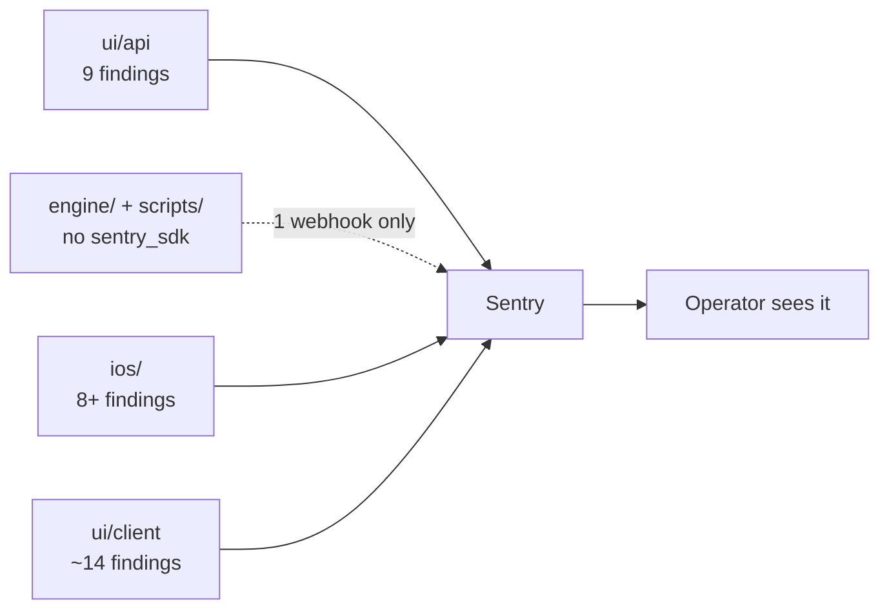

# Sentry Coverage Audit — Closing the Silent-Failure Gaps

> Status: Plan · Owner: Tech Lead · Created: 2026-09-15

## Context

`docs/eng-docs/sentry-runbook.md` § Coverage boundary already documents several known,
intentional gaps (no source maps/dSYMs, GitHub outbound spans, chat text on success). A
four-way audit across `ui/api/`, `engine/`+`scripts/`, `ios/`, and `ui/client/` (this doc's
own findings) turned up real, undocumented silent-failure paths on top of those — including
two spots where a billed Gemini call's result gets lost with zero Sentry record, and an iOS
HealthKit background-sync error that isn't even printed.

## Goal

Every real failure — thrown or returned as an answer — either reaches Sentry or is a
documented, deliberate exception in the runbook's Coverage boundary. Nothing in between.

## Done when

- Every **P0** finding below is captured (list closes to zero).
- Every **P1** finding is either captured or explicitly added to the runbook as a documented,
  deliberate exception (not just left alone).
- `sentry-runbook.md` § Coverage boundary is rewritten to match reality — the "two client
  fetches" claim is currently wrong (it's two of eleven).
- An ADR settles the Python pipeline's Sentry scope (see Open Decisions) — today ADR 0032
  scopes Sentry to "web, backend API, and native iOS" only, so any Python fix needs one.

## Findings inventory

Severity is the same P0/P1/P2 scale as `AGENTS.md` § Priorities: P0 = fix now (fully silent,
real user impact), P1 = fix before calling this done (visible in logs/UI, not Sentry), P2 =
flag only, athlete's call.

### Backend — `ui/api/` (owner: Bob the Builder)

| # | file:line | issue | sev |
|---|---|---|---|
| B1 | `coach-chat/_lib/coachTurn.ts:2398` | `commitTurn` write failure after a billed Gemini call → 502, `console.error` only. Sibling facts-commit catch 40 lines up *does* capture — inconsistency. | P0 |
| B2 | `coach-chat/_lib/commit/activitySyncTurn.ts:198-202` | Same pattern: commit fails after billed generation, no capture. Confirmed by own test asserting only status/body. | P0 |
| B3 | `auth/[...action].ts:285-293` | GitHub OAuth token-exchange failure → redirect, zero logging/capture (the `/user` failure 20 lines below does capture). | P1 |
| B4 | `auth/[...action].ts:661-663` | Installations-repo re-fetch failure silently falls back to `{repositories: []}` — athlete told "no owned repos" on a swallowed GitHub fault. | P1 |
| B5 | `coachTurn.ts:338`, `coach-chat.ts:69`, `activitySyncTurn.ts:80` | 3× "SOUL bundle unavailable" → 500, uncaptured. | P1 |
| B6 | `coach-chat.ts:194` | Missing Gemini/OpenRouter API key → 500, uncaptured. | P1 |
| B7 | `session.ts:140-142`, `auth/[...action].ts:429-431,251-252,121-131` | 4× "site misconfigured" 500s across the auth surface, uncaptured. | P1 |
| B8 | `coachTurn.ts:2285-2325` | First-session benchmark/first-week generation swallows every failure — silently blocks a new athlete's onboarding. | P1 |
| B9 | `coach-chat/_lib/decide/coachSinceStamp.ts:42-44,51-54` | Unparsable profile / failed merge-patch silently skips the `coach_since` stamp that triggers B8. | P1 |
| B10 | `coachChatFiles.ts:191-196`, `coachMessage.ts:401-408` | `parseJsonOrNull` used across 9 athlete data files — documented in-code as best-effort, but zero visibility, not in the runbook. | P2 |
| B11-B15 | merge-patch fallbacks, Gemini explicit-cache `.catch(()=>null)`, `corrupt_oauth_session` redirect | console.warn-only or fully silent, low blast radius / arguably intentional | P2 |

Confirmed **not** findings: `repo-file.ts`, `widget-snapshots.ts` fault paths, `decryptSession`,
`droppedActions` funnel, `githubGitData.ts` retries — all correctly captured already.

### Python pipeline — `engine/`, `scripts/` (owner: Bob the Builder)

No `sentry_sdk` anywhere; no Python dependency manifest exists in the repo at all. The only
signal today is `engine/scripts/notify_sync_failure.py`, a hand-rolled envelope POST that fires
once per **whole Sync workflow** failure (any step nonzero) — it knows "something died," never
which exception. Silently no-ops if `SENTRY_DSN` wasn't exported before carving. Every other
Python entry point (`regenerate_derived.py`, `generate_quest_history.py`, `engine/lib/`,
`engine/core/`, `platform/scripts/*.py`) has zero error reporting. No ADR addresses this scope.

| # | file:line | issue | sev |
|---|---|---|---|
| PY1 | `engine/core/query_history.py:58` | Corrupt activity file silently dropped, no log, no count. | P1 |
| PY2 | `engine/core/vs_usual.py:87-90` | Same pattern for `vs_usual` enrichment. | P1 |
| PY3 | `engine/scripts/generate_quest_history.py:154-196` | Missing ledger → exits 0 writing `{"quests":{}}`, indistinguishable from "no quests." | P1 |
| PY4 | `engine/scripts/regenerate_derived.py:80-92` | `sync_status.json` counters hardcoded to 0 every run — the status file lies. | P1 |
| PY5 | `engine/.github/workflows/validate-data.yml` | Only `gen/widget_snapshots.json` has a shape-validation gate; `dashboard_snapshot`, `athlete_insights`, `quest_history`, `sync_status` have none. | P1 |

**Important nuance:** PY1-PY5 are correctness bugs, not Sentry gaps — nothing here throws, so
no amount of Sentry wiring catches them. They need to start raising/asserting on bad state
*before* Sentry coverage does anything for them.

### iOS — `ios/CoachHQ/` (owner: iOS Builder)

| # | file:line | issue | sev |
|---|---|---|---|
| I1 | `HealthKitSyncManager.swift:179-186` | `HKObserverQuery` error discarded — not even printed. Background sync can silently die. | P0 |
| I2 | `HealthKitSyncManager.swift:150-153` | Background-delivery registration failure, print-only. | P0 |
| I3 | `HealthKitSyncManager.swift:418-431` | `postActivitySync` retries forever on failure, never reported. | P0 |
| I4 | `GitHubAuthManager.swift:515-550` | Token-refresh chain (401/502/exception) from #1073 — print-only or fully silent. Athlete lands on "sign in again" with no Sentry trail of why. | P0 |
| I5 | `GitHubAuthManager.swift:396-415` | Keychain `SecItemAdd`/`SecItemDelete` status discarded on every token save — a failed write looks like a successful refresh until next launch. | P0 |
| I6 | `AppGroupSnapshotBridge.swift:26-35`, `WidgetSnapshotStore.swift:87` | Widget-data pipeline is entirely `try?`-guarded — any failure means stale/empty widgets forever, no signal. | P0 |
| I7 | `ios/CoachHQ/CoachHQWidget/*.swift` | Zero Sentry integration in the widget extension target — no `import Sentry` anywhere. | P0 |
| I8 | `CoachChatAPIClient.swift` (whole file) | Retry layer never reports to Sentry, unlike `GitHubAPIClient`'s equivalent — every Coach Chat network failure is blind at this layer. | P0 |
| I9-I15 | `GitHubAuthManager.swift` (coachAppInstalled, resolveRepoIfNeeded, fetchUser), `WorkoutService.swift` (4 methods), `CoachMessageAPIClient.swift` | print-only or fully silent catches | P1 |

### Frontend — `ui/client/` (owner: UI Expert)

Runbook claims two covered client fetches (`/api/auth/me`, `/api/repo-file`) — accurate, but
**nine more** `ui/api/` calls report nothing on failure, and it's Coach Chat's entire surface:

| # | file:line | issue | sev |
|---|---|---|---|
| F1 | `pages/CoachChat.tsx:188-201` | Activity-sync-to-chat failure: no toast, no console, no Sentry — pending thread just sits there. | P0 |
| F2 | `pages/CoachChat.tsx:414-416` | `fetchProfileStatus` failure: completely silent, `coachSince` quietly stays null. | P0 |
| F3 | `coachChatModel.ts` send/greet/threads (3 verbs) + `CoachChat.tsx` consumers | Toast/error-card shown to athlete, zero Sentry record. | P1 |
| F4 | `hooks/useWidgetSnapshots.ts:21-23`, `coachChatModel.ts:158-159` | Both `/api/widget-snapshots` call sites `.catch(()=>...)` silently. | P1 |
| F5 | `contexts/AuthContext.tsx:96-98` | `/api/auth/list-my-repos` failure → error page shown, cause never in Sentry. | P1 |
| F6 | `components/welcome/WelcomeInviteCta.tsx:38-40` | `/api/waitlist` failure → inline error copy, no Sentry. | P1 |
| F7 | localStorage cache read/write/scan (`coachChatModel.ts` ×4 sites) | Self-healing, low severity | P2 |

Not a Sentry gap but worth flagging: one global `ErrorBoundary` wraps the entire app (both
instances do report to Sentry) — no per-page/per-widget isolation, so any render crash takes
down the whole tree instead of degrading locally. Architecture item, not part of this plan's
"Done when."

## Milestones — PR stack

| PR | milestone | outcome | final base | files | owner | parallel with | result |
|---|---|---|---|---|---|---|---|
| 1 | M1 backend P0 | B1, B2, B8, B9 captured | main | `coachTurn.ts`, `activitySyncTurn.ts`, `coachSinceStamp.ts` | Bob | PR2, PR3 | Result: commit failures + onboarding stall now alert |
| 2 | M1 backend P1 | B3, B4, B7 captured | main | `auth/[...action].ts`, `auth/_lib/session.ts` | Bob | PR1, PR3 | Result: auth/config faults now alert |
| 3 | M1 backend P1 | B5, B6 captured | main | `coach-chat.ts` | Bob | PR1, PR2 | Result: config faults on the chat route now alert |
| 4 | M2 iOS P0 | I1, I2, I3 captured | main | `HealthKitSyncManager.swift` | iOS Builder | PR5, PR6 | Result: background sync failures now alert |
| 5 | M2 iOS P0 | I4, I5 + I9 captured | main | `GitHubAuthManager.swift` | iOS Builder | PR4, PR6 | Result: refresh-chain + Keychain-write failures now alert |
| 6 | M2 iOS P0 | I6, I7 captured | main | `AppGroupSnapshotBridge.swift`, `WidgetSnapshotStore.swift`, `CoachHQWidget/*.swift` | iOS Builder | PR4, PR5 | Result: widget pipeline + extension now report |
| 7 | M3 iOS P1 | I8, I10-I15 captured | main | `CoachChatAPIClient.swift`, `CoachMessageAPIClient.swift`, `WorkoutService.swift` | iOS Builder | — | Result: remaining print-only catches now alert |
| 8 | M4 frontend | F1, F2, F3 captured | main | `coachChatModel.ts`, `pages/CoachChat.tsx` | UI Expert | PR9 | Result: Coach Chat fetch surface now alerts, incl. the two fully-silent paths |
| 9 | M4 frontend | F4, F5, F6 captured | main | `useWidgetSnapshots.ts`, `AuthContext.tsx`, `WelcomeInviteCta.tsx` | UI Expert | PR8 | Result: remaining client fetches now alert |
| 10 | M5 docs | runbook rewritten | after PR1-9 merge | `docs/eng-docs/sentry-runbook.md` | Tech Lead | — | Result: Coverage boundary matches reality |

Python pipeline (PY1-PY5) has no PR yet — blocked on the ADR below.

## Open Decisions

1. **Python pipeline Sentry scope.** ADR 0032 scopes Sentry to web/API/iOS only; no Python
   dependency manifest exists today. Three options: (a) add `sentry_sdk` as a real dependency
   (first Python manifest in the repo), (b) extend `notify_sync_failure.py`'s hand-rolled
   envelope POST to more entry points, (c) leave it workflow-level-only. Needs an ADR before
   any PR — this is an architectural call, not a code fix. **REC: (b)** — no new dependency
   surface, reuses a pattern already proven in production.
2. **PY1-PY5 are validation bugs, not Sentry gaps** — separate follow-up once (1) is settled;
   raising/asserting has to exist before a report layer catches anything.
3. **`parseJsonOrNull` (B10)** — capture on corrupted athlete data files, or leave as
   documented best-effort? Athlete's call, low urgency.

## Deferred (P2, not in this plan)

- Per-widget React error boundaries (frontend architecture, not a Sentry gap).
- Source-map/dSYM upload — already tracked in the runbook as parked.
- Explicit `enableCrashHandler`/`enableAutoSessionTracking = true` in iOS `SentrySDK.start` (currently correct via SDK defaults, just implicit).
