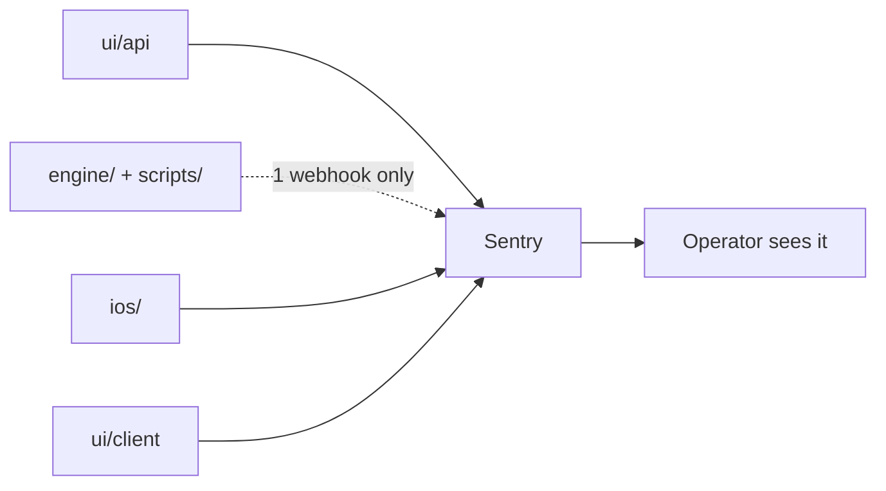

# Sentry Coverage Audit — Closing the Silent-Failure Gaps

> Status: Plan · Owner: Tech Lead · Created: 2026-09-15 · Findings: [sentry-coverage-gaps-lld.md](./sentry-coverage-gaps-lld.md)

## Context

`docs/eng-docs/sentry-runbook.md` § Coverage boundary already documents several known,
intentional gaps. A four-way audit (`ui/api/`, `engine/`+`scripts/`, `ios/`, `ui/client/`) found
real, undocumented ones on top. Worst two: a billed Gemini call's result can be lost with zero
Sentry record, and an iOS HealthKit background-sync error isn't even printed. Full inventory,
every claim checked against the actual code, is in the linked LLD.

## Goal

Every real failure — thrown or returned as an answer — either reaches Sentry or is a
documented, deliberate exception in the runbook's Coverage boundary. Nothing in between.

## Done when

- Every **P0** finding in the LLD is captured, with a test asserting the capture call fires
  (matches the pattern already in `ui/api/coach-chat/_tests` and `GitHubAuthManagerTests.swift`).
- Every **P1** finding is either captured the same way, or added to the runbook as a documented,
  deliberate exception — not just left alone.
- `sentry-runbook.md` § Coverage boundary is rewritten to match reality (today it claims two
  covered client fetches; it's two of eleven).
- An ADR settles the Python pipeline's Sentry scope — ADR 0032 currently names web/API/iOS only.

## Locked decisions

Decided now so no PR has to coordinate one against another mid-stack:

1. **Soft-fallback contract (B17, I4).** Both keep serving the athlete on a transient blip
   instead of forcing a re-auth — correct, keep it. But "soft" means one `level:warning` capture
   when the fallback triggers, not zero signal. Fire once per failed refresh attempt-cycle, never
   per retry inside it.
2. **Carve fail-closed (PY6).** `carve-skeleton.mjs` fails closed by default when `SENTRY_DSN`
   is unset at carve time (today it only warns and still succeeds). Add an explicit `--no-sentry`
   flag for local/test carves that don't need alerting — no silent unflagged path.

## Quota

Sentry's free Developer plan caps at **5,000 error events/month**, one user, 30-day retention
(confirmed against current Sentry pricing, not memory). Past quota it doesn't bill or queue — it
429s the SDK and **permanently drops events**, no replay. The opposite of this plan's goal, so:

- **Capture on terminal state, not every attempt** — a retry loop reports once when retries are
  exhausted (I3), never once per attempt.
- **`level:warning` still counts against the same quota as errors** — the soft-fallback contract
  above fires once per failure, not per retry, for the same reason.

**Checked 2026-09-15 (trailing 30d, via Cyclops):** 511 accepted error events against the
5,000/month cap — ~10% used, `rate_limited`/`filtered` both 0 (not dropping anything today).
Per project: `coach-hq-api` 401, `coach-hq-ios` 88, `coach-hq-web` 22 — API is already the
busiest surface *and* gets the most new capture sites (M1/M1b, 11 findings), so re-check after
M1 lands, not only after M3 (iOS) and M5 (frontend). Plenty of headroom for all 13 PRs at this
baseline; this is a sanity check on the trend, not a blocker.

## Milestones — PR stack

Cut PR1 first — self-contained, no cross-team dependency, the sharpest P0.

| PR | milestone | outcome | final base | files | owner | parallel with |
|---|---|---|---|---|---|---|
| 1 | M1 | B1, B2, B8, B9 captured | main | `coachTurn.ts`, `activitySyncTurn.ts`, `coachSinceStamp.ts` | Bob | PR2, PR3 |
| 2 | M1 | B3, B4, B7 captured; B17 per § Locked decisions | main | `auth/[...action].ts`, `auth/_lib/session.ts` | Bob | PR1, PR3 |
| 3 | M1 | B5, B6 captured | main | `coach-chat.ts` | Bob | PR1, PR2 |
| 4 | M1b | B16 captured (terminal only, 404 stays quiet) | PR1+PR3 tip (files both already changed) | `coachChatFiles.ts`, `coach-chat.ts`, `activitySyncTurn.ts`, `coachTurn.ts` | Bob | — |
| 5 | M2 | PY6 per § Locked decisions | main | `platform/scripts/carve-skeleton.mjs` | Bob | PR6 |
| 6 | M2 | span-health scheduled (script exists, runbook already flags it unscheduled) | main | `.github/workflows/*.yml`, runbook | Bob | PR5 |
| 7 | M3 | I1, I2, I3 captured | main | `HealthKitSyncManager.swift` | iOS Builder | PR8, PR9 |
| 8 | M3 | I4 per § Locked decisions; I5, I9 captured | main | `GitHubAuthManager.swift` | iOS Builder | PR7, PR9 |
| 9 | M3 | I6 captured; I7 captured | main | `AppGroupSnapshotBridge.swift`, `WidgetSnapshotStore.swift`, `CoachHQWidget/*.swift` | iOS Builder | PR7, PR8 |
| 10 | M4 | I8, I10-I15 captured | main | `CoachChatAPIClient.swift`, `CoachMessageAPIClient.swift`, `WorkoutService.swift` | iOS Builder | — |
| 11 | M5 | F1, F2, F3 captured | main | `coachChatModel.ts`, `pages/CoachChat.tsx` | UI Expert | PR12 |
| 12 | M5 | F4, F5, F6 captured | main | `useWidgetSnapshots.ts`, `AuthContext.tsx`, `WelcomeInviteCta.tsx` | UI Expert | PR11 |
| 13 | M6 | runbook rewritten | after PR1-12 merge | `docs/eng-docs/sentry-runbook.md` | Tech Lead | — |

13 PRs, 7 milestones, none over 3 PRs — M1b is its own milestone specifically because it's
sequenced behind M1, not parallel to it.

**Operational follow-ups (not PRs):** PY7 — once PR5 ships, audit already-carved athlete repos
for a missing `SENTRY_DSN` (carve historically only warned). A checklist, no repo diff.

Python pipeline correctness bugs (PY1-PY5) have no PR yet — blocked on Open Decision 1, and are
validation fixes rather than Sentry-capture fixes regardless.

## Open Decisions

1. **Python pipeline Sentry scope.** No Python dependency manifest exists today. (a) add
   `sentry_sdk` as a real dependency (first Python manifest in the repo), (b) extend
   `notify_sync_failure.py`'s hand-rolled envelope POST to more entry points, (c) leave it
   workflow-level-only. Needs an ADR before any PR. **REC: (b)** — no new dependency surface,
   reuses a pattern already proven in production.
2. **`parseJsonOrNull` (B10)** — capture on corrupted athlete data files, or leave as documented
   best-effort? Athlete's call, low urgency.

## Deferred (P2, not in this plan)

- Per-widget React error boundaries (frontend architecture, not a Sentry gap).
- Source-map/dSYM upload — already tracked in the runbook as parked, blocked on a real iOS
  release workflow that doesn't exist yet.
- Explicit `enableCrashHandler`/`enableAutoSessionTracking = true` in iOS `SentrySDK.start`
  (currently correct via SDK defaults, just implicit).
