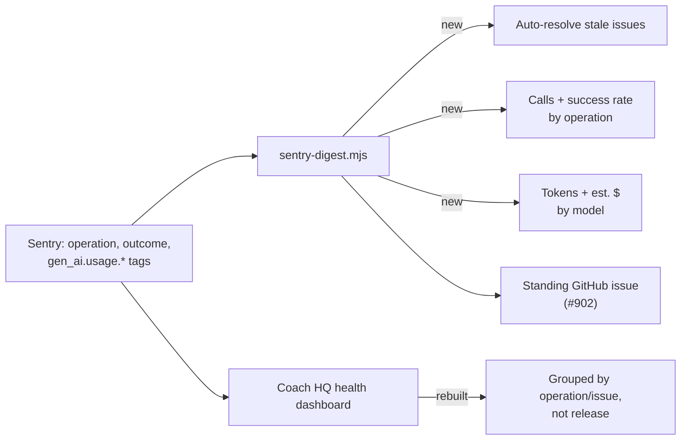

# Sentry digest & dashboard cleanup

> Status: Current · Owner: Tech Lead · Verified: 2026-09-06 · Issue: #904

## Context

The Sentry health digest (#845, #902) and the `Coach HQ health` dashboard were both built assuming
traffic we don't have yet. At 4-6 beta athletes, grouping by `release` fragments one bug into six
unreadable rows, percentage charts (crash-free rate) whipsaw between 0% and 100% on single-digit
sessions, and a 24H window hides signals that only recur every few days. None of this is a missing
data problem — `operation` (per-route tag), `outcome` (ok/error), and `gen_ai.usage.*` tokens are
already recorded identically for both `coach-chat` and `coach-message` (`ui/api/_lib/sentry.ts`).
The one real gap: `gen_ai.usage.cost.usd` is OpenRouter-only by design (#889) — direct Gemini calls
report tokens but never a dollar figure.

Last week's digest run (#902) needed 15 manual Sentry API calls to tell "still firing" apart from
"fired once, went quiet" — that check belongs in the script, not in a person's head every week.

## Goal

The digest issue becomes the one thing checked weekly: live call volume and success rate per
path, token/cost by model, and no manually-cleared backlog. The dashboard is rebuilt to match the
same grouping, once the digest proves the query shape works.

## Milestones

| # | Priority | Result |
|---|---|---|
| M1 | P0 | Digest auto-resolves any open Sentry issue with zero events in-window — no manual cleanup |
| M2 | P0 | Digest shows calls-by-operation (`coach-chat` vs `coach-message` vs other routes) + success rate |
| M3 | P0 | Dashboard widgets rebuilt: group by operation/issue not release, 7D window, crash-free-rate gated or dropped (manual, no PR) |
| M4 | P1 | Digest shows tokens + estimated $ by model, uniform across Gemini-direct and OpenRouter |
| M5 | P1 | Digest adds day-over-day trend delta + extends the existing "by athlete" table with tokens/cost |

## PR stack

| PR | milestone | outcome | final base | files | owner | parallel with | result |
|---|---|---|---|---|---|---|---|
| PR1 | M1 | Auto-resolve stale issues | main | `platform/skills/_sentry-api.mjs` (add PUT), `platform/skills/sentry-digest.mjs` | Bob | — | zero-event issues resolve themselves each run |
| PR2 | M2 | Calls + success rate by operation | PR1 | `platform/skills/_sentry-api.mjs` (add Discover/events query), `platform/skills/sentry-digest.mjs` | Bob | — | digest body has a calls-by-operation table |
| — | M3 | Dashboard rebuild | — | none (Sentry UI, manual) | Tech Lead | PR2 | widgets match the digest's grouping |
| PR3 | M4 | Tokens & est. cost by model | PR2 | `platform/skills/sentry-digest.mjs` | Bob | — | digest shows $ across both paths |
| PR4 | M5 | Trend + per-athlete cost | PR3 | `platform/skills/sentry-digest.mjs` | Bob | — | digest shows direction, not just a snapshot |

## Done when

1. The digest issue answers "how many chat vs message calls, what's the success rate, what did it
   cost" without opening Sentry.
2. A quiet stretch never leaves stale rows behind — auto-resolve handles it, not a person.
3. Dashboard widgets use the same grouping as the digest; crash-free-rate no longer whipsaws on
   low session counts.

## Deferred

- Per-stage success rate (HTTP outcome vs Gemini-call outcome vs downstream JSON-validation
  outcome) — needs trace correlation across spans; revisit once M2's operation-level number proves
  useful on its own.
- Full time-series charts — belongs on the dashboard (M3), not a markdown table.
- IaC for the Sentry dashboard — no existing pattern in this repo; out of scope until rebuild
  cadence justifies it.
