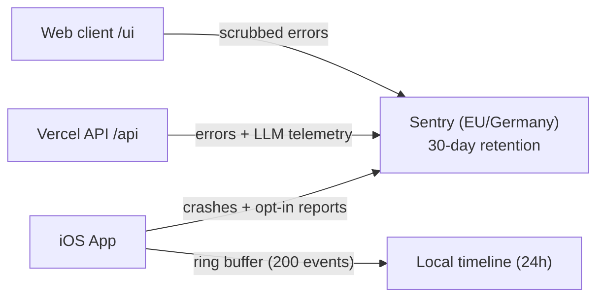

# Sentry observability — LLD

> Status: Current · Owner: Tech Lead · Verified: 2026-08-28 · ADR: 0032

Low-level design for error capture, LLM telemetry, and local diagnostic timelines across web, API, and iOS.

## 1. Context

Four beta athletes use the product; Sentry provides a single, searchable debugging trail across clients and backend functions without relying on memory or raw cloud logs.

## 2. Decision / goal

### Event schemas and tags

| Scope | Tag / Field | Type | Description / Example |
|---|---|---|---|
| **Common** | `release` | string | `git-sha` or semantic version (e.g. `2026.08.26+sha`) |
| **Common** | `environment` | string | `production`, `preview`, or `development` |
| **Common** | `athlete_id` | string | GitHub login / athlete handle (beta cohort only) |
| **Common** | `operation_id` | UUID | Generated per client interaction; joined across web, API, and LLM |
| **Web & API** | `model` | string | Gemini model name (e.g. `gemini-2.5-pro`, `gemini-2.5-flash`) |
| **Web & API** | `prompt_tokens` / `completion_tokens` | number | Exact token counts returned by Gemini API |
| **Web & API** | `athlete_message` / `gemini_reply` | string | Text exchange for the failed/traced turn |
| **iOS** | `app_version` / `build_number` | string | Client version and CFBundleVersion |
| **iOS** | `view_name` | string | Active screen or sheet (e.g. `HomeView`, `CoachChatView`) |
| **iOS** | `timeline_excerpt` | JSON | Only the timeline events the athlete selected in a Rage Report |

### Credential scrubbing rules

All Sentry SDK integrations (browser SDK, Node/Vercel SDK, Swift SDK) must run `beforeSend` scrubbing:

1. **Headers & cookies:** Strip `Authorization`, `Cookie`, `Set-Cookie`, `x-github-token`, and `x-session-token`.
2. **Secrets & tokens:** Redact any string matching `ghp_[A-Za-z0-9_]{36,}`, `AIza[0-9A-Za-z-_]{35}`, or JWT tokens (`Bearer eyJ...`).
3. **Private credentials:** Redact `GEMINI_API_KEY`, `SESSION_SECRET`, and `GITHUB_APP_CLIENT_SECRET`.

### Storage & retention bounds

- **Sentry (Server):** 30-day error retention on the Developer plan, stored in the Sentry Germany
  region. Fixed by plan on sentry.io and not settable per project — 90 days needs the Team plan,
  and only self-hosted Sentry can set it freely.
- **Local iOS timeline:** In-memory ring buffer only, capped at 200 events or 256 KiB. Evicted after 24 hours, on sign-out, or when the app is relaunched. Nothing is written to disk, so there is no diagnostic data at rest on the phone.
- **Beta cohort:** 4 current beta athletes opted in by default; automatic replay/screen capture remains disabled.

## 3. Phases

MVP-first: each phase ships on its own and is proven against the real Sentry project before the
next one starts.

1. **Phase 0 — operator setup.** EU-region org, `coach-hq-web` + `coach-hq-api` projects, DSNs in
   Vercel Production and Preview. **Done.**
2. **Phase 1 — one real error end-to-end.** Browser and Node `Sentry.init` with `release`,
   `environment`, `sendDefaultPii: false`, the `beforeSend` scrubber, and a temporary
   throw-on-purpose route to prove capture from a Preview deploy. **Done.**
3. **Phase 2 — coach-chat Gemini failure path.** Capture the failed turn (athlete message, model,
   upstream status, trace id) where nothing else records it; retire the throw-on-purpose route.
4. **Phase 3 — `operation_id` correlation.** One id per interaction, passed on `x-operation-id`, so
   a browser event and its API event join.
5. **Phase 4 — success-path telemetry.** Spans, tracing, and token counts on turns that work.
6. **Phase 5 — iOS.** Swift SDK, crashes with active view name, local timeline on problem reports.
7. **Phase 6 — source maps and dSYMs.** Upload at build time so production stack frames are readable.

## 4. Deferred

- Athlete privacy preferences and opt-out UI toggles ([#590](https://github.com/sibling-shipyard/coach-hq/issues/590)).
- Automatic session recording / screen replays (deferred indefinitely).
- Long-term log warehousing beyond the 30-day Sentry window.
