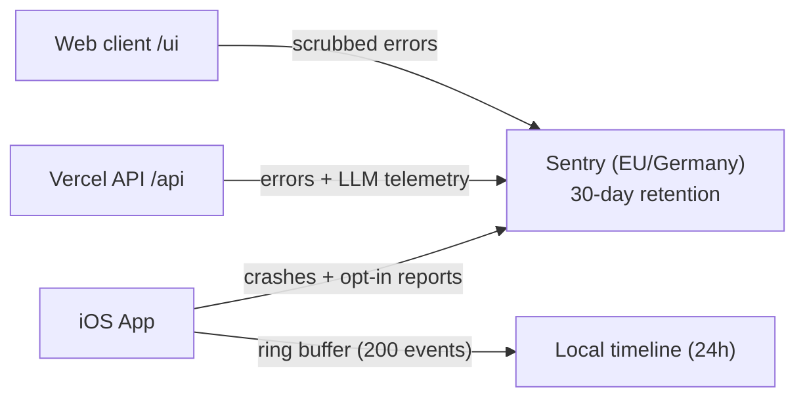

# Sentry observability — LLD

> Status: Current · Owner: Tech Lead · Verified: 2026-08-29 · ADR: 0032

Low-level design for error capture, LLM telemetry, and local diagnostic timelines across web, API, and iOS.

## 1. Context

Four beta athletes use the product; Sentry provides a single, searchable debugging trail across clients and backend functions without relying on memory or raw cloud logs.

## 2. Decision / goal

### Event schemas and tags

| Scope | Tag / Field | Type | Description / Example |
|---|---|---|---|
| **Common** | `release` | string | `git-sha` or semantic version (e.g. `2026.08.26+sha`) |
| **Common** | `environment` | string | `production`, `preview`, or `development` |
| **Common** | `athlete_id` | string | Athlete handle, also sent as Sentry's `user.id`. The owner half of `owner/repo` (`skanda-athlete`), derived identically on web (`setAthleteUser`), API (`setAthleteScope`) and iOS (`DiagnosticsManager.setAthlete`) so one person has one id everywhere. Not the GitHub login: the API's iOS auth mode presents `X-Coach-Repo` and no login. Handle only — no email, no IP; `sendDefaultPii` stays `false` |
| **Common** | `trace_id` | hex string | Sentry's own trace id, propagated browser → API on the `sentry-trace` and `baggage` headers; joins the two events in the trace view |
| **API** | `vercel_trace_id` | string | coach-chat's own id for the turn, for grepping Vercel logs. Distinct from `trace_id` above |
| **API** | `model` | string | Gemini model id, tagged on a *failed* call (e.g. `gemini-flash-latest`) |
| **API** | `athlete_message` | string | Event context on a *failed* Gemini call only (ADR 0032). A turn that works is already in `chat_history.json`, so its spans carry no text — no `gemini_reply` is sent on any path |
| **API span** | `outcome` | `ok` / `error` | On both span kinds below. What the health dashboard groups by |
| **API span** | `http.request.method` / `url.path` / `http.response.status_code` | string / number | On the route's `http.server` span, named `POST /api/coach-chat` |
| **API span** | `gen_ai.request.model` | string | Model id on the `gen_ai.generate_content` span |
| **API span** | `gen_ai.usage.input_tokens` / `output_tokens` / `total_tokens` / `input_tokens.cached` | number | Gemini's `usageMetadata`, mapped to Sentry's own `gen_ai` attribute names — the ones `@sentry/core`'s `tracing/google-genai` integration emits, so our hand-rolled spans read like auto-instrumented ones |
| **Web** | `mechanism.type` | string | `auto.function.react.error_boundary` on a React render crash. `ErrorBoundary.componentDidCatch` is the only thing that reports one — React unwinds before `window.onerror`, so the global handler never sees it |
| **iOS** | `app_version` / `build_number` | string | Client version and CFBundleVersion |
| **iOS** | `view_name` | string | Active screen or sheet (e.g. `HomeView`, `CoachChatView`) |
| **iOS** | `timeline_excerpt` | JSON | Only the timeline events the athlete selected in a Rage Report |

### Credential scrubbing rules

All Sentry SDK integrations (browser SDK, Node/Vercel SDK, Swift SDK) must run `beforeSend` scrubbing:

1. **Headers & cookies:** Strip `Authorization`, `Cookie`, `Set-Cookie`, `x-github-token`, and `x-session-token`.
2. **Secrets & tokens:** Redact any string matching `ghp_[A-Za-z0-9_]{36,}`, `AIza[0-9A-Za-z-_]{35}`, or JWT tokens (`Bearer eyJ...`).
3. **Private credentials:** Redact `GEMINI_API_KEY`, `SESSION_SECRET`, and `GITHUB_APP_CLIENT_SECRET`.

### Storage & retention bounds

- **Sentry (Server):** 30-day error retention on the Developer plan, stored in the Sentry Germany
  region. Fixed by plan on sentry.io and not settable per project — 90 days needs the Team plan,
  and only self-hosted Sentry can set it freely.
- **Local iOS timeline:** In-memory ring buffer only, capped at 200 events or 256 KiB. Evicted after 24 hours, on sign-out, or when the app is relaunched. Nothing is written to disk, so there is no diagnostic data at rest on the phone.
- **Beta cohort:** 4 current beta athletes opted in by default; automatic replay/screen capture remains disabled.

## 3. Phases

MVP-first: each phase ships on its own and is proven against the real Sentry project before the
next one starts.

1. **Phase 0 — operator setup.** EU-region org, `coach-hq-web` + `coach-hq-api` projects, DSNs in
   Vercel Production and Preview. **Done.**
2. **Phase 1 — one real error end-to-end.** Browser and Node `Sentry.init` with `release`,
   `environment`, `sendDefaultPii: false`, the `beforeSend` scrubber, and a temporary
   throw-on-purpose route to prove capture from a Preview deploy. **Done.**
3. **Phase 2 — coach-chat Gemini failure path.** Capture the failed turn (athlete message, model,
   upstream status, trace id) where nothing else records it; retire the throw-on-purpose route.
   **Done.**
4. **Phase 3 — native distributed tracing.** No id of ours. `browserTracingIntegration` sends
   `sentry-trace` and `baggage` on same-origin `/api/...` calls, and the Node SDK continues that
   trace. A browser event and its API event then share one trace id and link structurally — trace
   view and related events, not just a tag to search. `tracesSampleRate` defaults to `1` on both
   sides; spans bill against the 5M/month span quota, not the tight 5k error quota. Outbound HTTP
   is deliberately left untraced: the auto-instrumented span carries the full URL, and Gemini's
   holds the API key. **Done.**
5. **Phase 4 — success-path telemetry.** One `http.server` span per coach route and one
   `gen_ai.generate_content` span per Gemini call, carrying model, token counts, and `outcome`.
   `withContinuedTrace` flushes both before the response leaves, because Vercel freezes the
   function on return and an unflushed span is dropped in silence. **Done.**
6. **Phase 5 — iOS.** Swift SDK, crashes with active view name, local timeline on problem reports.
   **Mostly done:** the SDK, crash capture, release and build number, athlete identity, active view
   name, and the timeline buffer all shipped. The Rage Report UI is the remainder — PR #603, blocked
   on a test-host crash that reproduces only on the runner's Xcode 26.3.
7. **Phase 6 — source maps and dSYMs.** Upload at build time so production stack frames are readable.
   **Not started.** Nothing uploads either artifact: `ui/vite.config.ts` loads no Sentry plugin,
   `@sentry/vite-plugin` is not a dependency, and the repo builds and tests `ios/` in CI but has no
   archive/release workflow to hang a dSYM upload off. Treat every production stack trace — web and
   iOS alike — as unreadable until this phase ships.

8. **Phase 7 — athlete identity and render crashes.** Not in the original plan; added once the first
   real errors proved unreadable. Web and API set the repo owner as the Sentry user and an
   `athlete_id` tag, matching what iOS already derived, so one athlete has one id everywhere. The
   React `ErrorBoundary` reports through `captureReactException`; React unwinds to the boundary before
   `window.onerror` fires, so render crashes reached nothing before this. **Done.**

**Known gaps, tracked:** five API routes — `auth/[...action].ts`, `repo-file.ts`,
`widget-snapshots.ts`, `coach-chat-context.ts`, `waitlist.ts` — still run outside
`withContinuedTrace`, so nothing they throw reaches Sentry
([#639](https://github.com/sibling-shipyard/coach-hq/issues/639)).
Gemini's key still travels in the URL query string rather than the `x-goog-api-key` header
([#638](https://github.com/sibling-shipyard/coach-hq/issues/638)).

## 4. Deferred

- Athlete privacy preferences and opt-out UI toggles ([#590](https://github.com/sibling-shipyard/coach-hq/issues/590)).
- Automatic session recording / screen replays (deferred indefinitely).
- Long-term log warehousing beyond the 30-day Sentry window.
