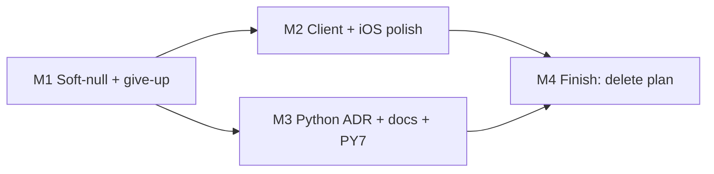

# Plan — post-#1078 Sentry follow-ups (+ adjacent product fixes)

> Status: Plan · Owner: Tech Lead · Verified: 2026-09-16 · Issue: #1108 · Audit: Context `docs/sentry-post-1078-deep-audit.md` · ADR: `kdb/decisions/0032-sentry-data-rules.md`

**Goal:** Close the leftover silent/soft paths after #1078, settle Python Sentry scope, and fix the few **product** bugs the same audit hit (not just more capture).

**End state:** Soft GitHub file reads never look like “missing file” on a 5xx; remaining P1 capture/tag gaps closed; Python scope ADR exists; PY7 DSN audit noted; plan deleted on finish.

## What the audit found beyond “add Sentry”

These showed up while hunting coverage. **In stack** = product correctness that soft-null / setup silence causes. **P2** = worth knowing, not this program.

| P | Non-Sentry finding | Why it matters | In stack? |
|---|---|---|---|
| **P1** | `getFileRaw(...).catch(() => null)` on template/week reads | GitHub outage → coach validates as if files absent → wrong drops / empty context | **Yes — PR1** |
| **P1** | `coachRepoExists` → `false` on any error | Setup can tell athlete “create repo” when the phone was offline | **Yes — PR3** |
| **P1** | First-session benchmark **give-up** | Athlete finishes protocol; benchmarks never appear; only `console.error` | **Yes — PR1** (capture) + athlete-visible follow-up is P2 |
| **P2** | `useRepoData` module cache until bfcache | Mid-session revoke/schema change can leave a stale dashboard | No — separate UX ticket |
| **P2** | Dual `/api/widget-snapshots` fetchers | Extra network on chat+home; same outage can double events | No — unless free in PR2 |
| **P2** | Web activity-sync fail: Sentry yes, **no toast** | Athlete only sees a stuck pending thread | No — UX call |
| **P2** | `syncInFlightRef` drops a second activity-sync | Overlapping sync silently skipped | No |
| **P2** | API error path double-flush (~2s + 2s) | Slower failure responses | No — keep delivery; measure later |
| **P2** | Soul Edge Config fail-open / cold-start race | Latency/cost on direct-Gemini path (prod is OpenRouter today) | No |
| **P2** | PY1–5 soft continues (corrupt hist drop, empty quests exit 0, hardcoded sync counters) | Green Sync with wrong/empty derived data | **After** Python ADR — raises first, then existing notify covers |
| **P2** | `res.json()` throw after HTTP 200 tagged `fetch_failure:network` | Triage mislabel | No |
| **P2** | iOS `connectHealthKit` `try?` auth | Observer may register without clear auth failure | No |
| **P2** | Widget corrupt UserDefaults silent clear | Blank widgets, no signal | No |

**Bottlenecks (observability / perf, not coverage holes):** traces still sample at `1` (right for four athletes; wrong the day it isn’t — runbook already says set rates explicitly). Blanket `ignoreOutgoingRequests` hides GitHub duration unless wrapped in `withGithubSpan`. Source maps/dSYMs still parked → stacks unreadable (knowing *that* it broke is fine; *where* in minified code is not).

## REC defaults

1. Soft-null helper mirrors `getHeadShaOrNull` — do not turn soft-reads into hard turn failures.
2. Collapse iOS activity-sync to **one** operation (prefer `healthkit.activity_sync.post` + metadata, skip second `coach.chat.request` for that verb — or the reverse; pick one in PR3).
3. Python ADR **before** any PY1–5 raises-for-Sentry work. Prefer extend Sync envelope after raises (no new `sentry_sdk` package yet).
4. Source maps / dSYMs stay parked.

## PR stack

| PR | milestone | outcome | final base | files | owner | parallel with |
|---|---|---|---|---|---|---|
| 1 | M1 | `getFileRawOrNull` + coachTurn soft catches; benchmark give-up → one capture | `main` | `coachChatFiles.ts`, `coachTurn.ts`, tests, runbook one-liner if needed | Bob | — |
| 2 | M2 | `schemaUnsupported` → one client capture | PR1 | `useRepoData.ts` (+ test) | UI | 3 |
| 3 | M2 | iOS: one activity-sync op; tag `droppedActions`; Keychain read; `coachRepoExists` → `Bool?` + capture | PR1 | GitHubAuthManager, CoachChatView, HealthKit/CoachChatAPI (+ tests) | iOS | 2 |
| 4 | M3 | Python Sentry-scope ADR + `skeleton-layout.md` fail-closed fix; PY7 ops note in runbook | PR1 tip or `main` if no file overlap | `kdb/decisions/00XX-*.md`, `skeleton-layout.md`, runbook | Tech Lead | 2, 3 if disjoint |
| 5 | M4 | Finishing: delete this plan; any runbook Coverage boundary tweaks | tip | `docs/plans/sentry-post-1078-followups.md`, runbook | Tech Lead | after 1–4 |

## Validate

| Gate | Check |
|---|---|
| PR1 | Unit: non-404 from soft read → one exception, still returns null; 404 quiet |
| PR2 | schema bump card path → `captureFetchFailure` / equivalent once |
| PR3 | XCTest: soft-fallback still once/cycle; activity-sync one event; `coachRepoExists` nil captures |
| PR4 | `validate_kdb.py` on ADR; carve doc matches `stampSyncDsn` throw |
| Program | Audit P1 leftovers closed or allow-listed; no mega-PR |

## Out of scope

Successful-turn chat text, replay/screenshots, maps/dSYMs, soul-cache warn spam, narrowing outbound ignore (unless free), PY1–5 raises (post-ADR follow-up), dual widget-snapshots dedupe, activity-sync toast UX.

## Cut next

**PR1** first — locks the soft-null contract everything else builds on.

Audit source (Context): post-#1078 deep audit · Issue: #1108 · mid-stack `Refs:` · finish `Fixes: #1108`.
