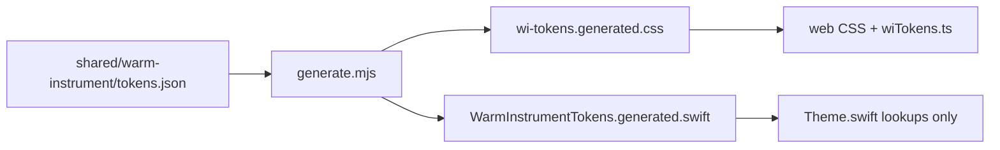

# Token SoT — one handwritten hex file

> Status: Current · Owner: Tech Lead · Verified: 2026-08-23

## Context

Sport and workout colors live in `tokens.json`, `Theme.swift` (three tables), web TS maps, and CSS hexes. #478 copied iOS hexes into JSON but left iOS still authoring. ADR 0005 already named the SoT — codegen never landed.

## Goal

`tokens.json` is the only file a human edits for sport / workout / palette hexes. Web and iOS compile from it. Sport vs workout stays two palettes (foundation-the-sport ≠ foundation-the-workout).

**Done when**

1. `node shared/warm-instrument/generate.mjs` is a no-op on a clean tree (`git diff --exit-code` on both generated files).
2. `Theme.swift` has no sport/workout hex literals (lines 75–88 and `WarmInstrument.Sport` hexes gone).
3. Web badge/timer/snapshot accent colors come from `wiTokens` / CSS vars — no leftover `#rrggbb` in `activities.ts`, `workouts.ts`, `WorkoutTimerWidgets.tsx`, `warmHomeSnapshots.ts` commitment accents.
4. `cd ui && npm run check` and `npx vitest run` green; iOS `ios-build` green.

## Phases

| id | files | deps | owner |
|---|---|---|---|
| A | `docs/plans/token-sot.md`, `shared/warm-instrument/tokens.json`, `shared/warm-instrument/generate.mjs`, `shared/warm-instrument/ios-token-mapping.md`, `ui/scripts/generate-wi-tokens.mjs`, `ui/scripts/build-data.mjs`, `ui/client/src/components/home-warm/wi-tokens.generated.css`, `ios/CoachHQ/CoachHQ/Views/WarmInstrumentTokens.generated.swift`, `ios/CoachHQ/CoachHQ/Views/Theme.swift`, `ios/CoachHQ/CoachHQ.xcodeproj/project.pbxproj` | — | one worker, both role docs |
| B | `ui/client/src/lib/wiTokens.ts`, `ui/tsconfig.json`, `ui/vite.config.ts`, `ui/vitest.config.ts`, `ui/scripts/bundle-widget-snapshots-api.mjs`, `ui/client/src/lib/activities.ts`, `ui/client/src/lib/workouts.ts`, `ui/client/src/components/workout-timer-warm/WorkoutTimerWidgets.tsx`, `ui/client/src/components/home-warm/warmHomeSnapshots.ts`, `ui/client/src/components/monthly-analytics/monthlyAnalyticsModel.ts`, `ui/client/src/components/home-warm/warm-instrument.css`, `ui/docs/reference-interactions/Widget Design Philosophy.md`, `ui/api/auth/_lib/generate-widget-snapshots-from-dashboard-snapshot.bundle.js`, `docs/plans/token-sot.md` (delete) | A | UI Expert |
| C | close #478 without merge (done at kickoff); `Fixes: #311` on B | B | Tech Lead |

## Looked at — not this stack

- Snapshot Codable in `WidgetSnapshots.swift` — ADR 0005, Swift decodes, TS computes. Leave it.
- `ChallengeV2` shim — already `docs/plans/ui-dashboard-rewiring.md`.
- `TrainingCategory` (ranked/league/friendly) — different grain than sports. Labels stay in TS.
- HR zones, SF Symbol map, `#310` SVG icons, splitting `Theme.swift` as a file.
- Generating `WarmSportId` — add `tennis` on web if it shows up; don't codegen three Swift enums.

**#478:** close it. Keep its hex choices in `tokens.json` (iOS `WarmInstrument.Sport` values). Redo consume as phase B on `main`.

**Phase A (2026-08-23):** `generate.mjs` emits CSS + Swift; `Theme.swift` sport/workout tables are `WITokens` lookups.
