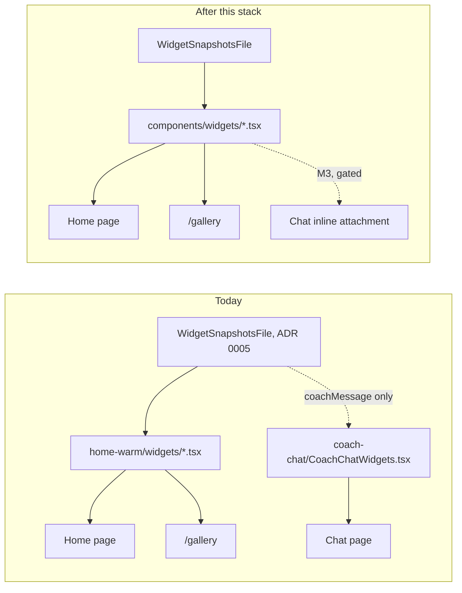

# Web widget modules

> Status: Draft · Owner: UI Expert · Verified: 2026-09-08
>
> Tracking: #930. Milestone and epic placement is a Tech Lead call — filed under `Later` to stay
> clear of the M3/M4 epic-parent gate, same as iOS's #928.

## Context

`coach-conversation-widgets-roadmap.md` M3 wants Coach to attach an allowlisted widget inline in
Chat. iOS's equivalent audit (#928, `ios-widget-modules.md`) found real forks: the same widget
hand-copied into three renderers, 44 stray colours, 984 lines of dead views. Web does not have
that problem.

**No structural blocker for M3.** All 11 Home cards (`home-warm/widgets/*.tsx`) are pure
`<section>`/`<article>` components that take one typed snapshot prop and hold no page-level
state, no fixed-grid assumptions, and no Home-only context. Proof: `WidgetGallery.tsx`
(`pages/WidgetGallery.tsx:1-17`) already renders all 11 outside `DesktopHomeGrid`, in a
different layout, from the same import — a second surface already exists and required zero
component changes. `pages/CoachChat.tsx:5,7` already imports `getActivityZoneLoad` and
`InstrumentHeader` from `home-warm/`, so cross-directory reuse is an established pattern, not a
new one. The data contract is cross-platform already (ADR 0005): `WidgetSnapshotsFile`
(`home-warm/snapshots.ts:281-309`) even carries `sizes.{engine,quest,commitments}` S/M variants
for glance surfaces. `ChatAttachment` (`coach-chat/coachChatModel.ts:43-45`) is already a
versioned, unknown-kind-safe union, tested (`coachChatModel.test.ts:294-313`) to ignore a kind it
doesn't recognise — the exact plumbing M3 needs to add a new attachment kind without touching
old clients.

What's real, but not a blocker: the 11 cards live under `home-warm/`, so Chat importing one reads
as a layering violation even though nothing stops it. Three sport→discipline switch statements
disagree in shape (not values) across `home-warm/`. Two duration formatters exist with different
conventions. ~90 hex colours sit outside the token file. One four-entry accent-colour block
computes and is never read. This plan cleans that up so the M3 build starts from one module per
widget, not from a nice-looking coincidence.

## Goal

Today's fork is *data reach*, not view code: Chat reads one field (`home.coachMessage`) off the
snapshot file by hand (`coachChatModel.ts:128-146`) instead of the `useWidgetSnapshots` hook
Home uses (`hooks/useWidgetSnapshots.ts`, consumed only by `pages/Home.tsx:9,14`). No card
component is duplicated. The work is: move the cards somewhere Chat can import without the
`home-warm` name, dedupe three small helpers, and pay down the colour-token debt — all
independent of M3's own trigger/catalog logic (out of scope here, per #930).

## What the full read found

| finding | evidence |
|---|---|
| Zero forked widget components | `grep -rln` for each of the 11 card names under `coach-chat/` returns nothing; `CoachChatWidgets.tsx` (653 lines) has no import from `home-warm/` |
| Cards already surface-portable | `WidgetGallery.tsx:1-17` renders all 11 from the same import, outside `DesktopHomeGrid`, in a `/gallery` list layout — a second surface already exists |
| Three sport→discipline mappings, one exact duplicate | `categoryToSport` (`warmHomeSnapshots.ts:58-75`) and `disciplineToSport` (`warmHomeSnapshots.ts:77-93`) differ in input type from `disciplineFor`, which is **byte-identical** between `currentWeekAdapter.ts:34-50` and `liveWeekContract.ts:32-48`; `mapDiscipline` (`currentWeekAdapter.ts:53-71`) is a fourth, narrower variant |
| Two duration formatters, different units and format | `formatMinutesLabel` (`home-warm/formatUtils.ts:13-18`, minutes → `"1H30"`) vs `formatDuration` (`lib/activities.ts:281-287`, seconds → `"1h 30m"`) — home-warm and coach-chat each format duration their own way |
| ~90 hex colours outside the token file | `grep -c "#[0-9a-fA-F]\{6\}"`: `warm-instrument.css` 34, `coach-chat.css` 50, `widget-gallery.css` 1, `warmHomeModel.ts` 4, `warmHomeSnapshots.ts` 1 (excludes `wi-tokens.generated.css`, the generated source; 40 in `home-warm/`, 50 in `coach-chat/`) |
| One dead accent-colour block | `CommitmentModel.accent` (`warmHomeModel.ts:303,314,326,335`, four hardcoded hex) is computed by `buildCommitments()` and never read — the live path (`buildCommitmentSnapshots`, `warmHomeSnapshots.ts:433-440`) recomputes `accent` from `sportHex()` independently; confirmed via `grep -rn "\.accent"` across both directories, one hit, in `SportCommitmentCard.tsx:68`, which reads the snapshot's field, not the model's |
| One dead export | `GOLDEN_SIZES` (`lib/goldenDataset.ts:21`) has zero importers anywhere in the repo |
| `sizes.*` S-variants have no web renderer | `WidgetSnapshotsFile.sizes` (glance-density snapshots for WidgetKit/iOS, ADR 0005) is unconsumed on web outside the type definition — `EngineCard`/`QuestCard` only accept the M/L shape. Two cards (`QuestCard`, `TrainingActivityCard`) already have a self-contained `compact` prop, which is the pattern a Chat-sized variant would extend |
| Naming: `atoms/` holds one file | `home-warm/atoms/SessionRow.tsx` is the entire `atoms/` directory — the split from `widgets/` no longer earns a second folder |
| No CSS class collision | `comm -12` on sorted top-level class selectors from `warm-instrument.css` (97) and `coach-chat.css` (81) — the one shared name, `.wi-shell`, is the intentional theme-token root both already load together in `pages/CoachChat.tsx:43,45` |

## PR stack

| PR | milestone | outcome | final base | files | owner | parallel with | result |
|---|---|---|---|---|---|---|---|
| U1 | Shared module | Move the 11 cards + `SessionRow` + `ActivityGlyph` + `formatUtils.ts` from `home-warm/` (and its lone `atoms/`) into `components/widgets/`; update the `WarmInstrumentWidgets.tsx` barrel and every importer (`WarmInstrumentHome.tsx`, `WidgetGallery.tsx`, `pages/CoachChat.tsx`) | `main` | `home-warm/widgets/*`, `home-warm/atoms/*`, `home-warm/ActivityGlyph.tsx`, `home-warm/formatUtils.ts`, `home-warm/WarmInstrumentWidgets.tsx`, `components/widgets/*` (new), `pages/WidgetGallery.tsx`, `pages/CoachChat.tsx` | UI Expert | — | `coach-chat/` can import a card without reading through `home-warm/`; zero visual change |
| U2 | One vocabulary | Collapse `categoryToSport`/`disciplineToSport`/`disciplineFor`(×2)/`mapDiscipline` into one canonical mapping in `components/widgets/sportMapping.ts`; reconcile `formatMinutesLabel` vs `formatDuration` into one shared duration formatter or two clearly-named, deliberately different ones | U1 | `home-warm/warmHomeSnapshots.ts`, `home-warm/currentWeekAdapter.ts`, `home-warm/liveWeekContract.ts`, `home-warm/formatUtils.ts`, `lib/activities.ts`, `components/widgets/sportMapping.ts` (new), `coach-chat/CoachChatWidgets.tsx` | UI Expert | — | One sport lookup, one documented duration convention |
| U3 | Dead code | Delete `CommitmentModel.accent` and its four hardcoded hex (confirmed unread); delete or wire up `GOLDEN_SIZES` (athlete's call, P2 below) | U1 | `home-warm/warmHomeModel.ts`, `lib/goldenDataset.ts` | UI Expert | U2 | `warmHomeModel.ts` computes nothing its caller discards |
| U4 | Token the colours | Move the ~78 stray hex values onto `wi-tokens.generated.css` custom properties (adding new ones in `shared/warm-instrument/tokens.json` where no existing token fits) so no component or CSS file outside the two token files hardcodes a hex | U2 | `home-warm/warm-instrument.css`, `home-warm/widget-gallery.css`, `home-warm/warmHomeSnapshots.ts`, `coach-chat/coach-chat.css`, `shared/warm-instrument/tokens.json` | UI Expert | — | `grep -rn "#[0-9a-fA-F]\{6\}"` over `ui/client/src/components/**`, excluding token files, is empty — issue #930 Done-when #3 |

**Gated, not in this stack.** A U5 (Chat inline widgets) would give Chat's `ChatAttachment` a new
kind that renders a `components/widgets/` card at reduced size, capped at two per message per the
roadmap's locked decisions. It needs M3's server-built candidate catalog first — building the
client renderer earlier means guessing key names the server will contradict, the same reasoning
iOS's plan gated its W7 on. `ChatAttachment`'s `.unknown`-safe union (`coachChatModel.ts:43-45`,
tested at `coachChatModel.test.ts:294-313`) means that day this is a new kind, not new plumbing.

## Done when

Maps 1:1 onto issue #930.

1. No widget is duplicated per-surface: after U1, `find ui/client/src/components/coach-chat -iname "*card.tsx"` returns nothing — Chat imports cards from `components/widgets/`, never redefines one.
2. One definition each of the duplicated helpers: after U2, `grep -rn "function disciplineFor\|function categoryToSport\|function disciplineToSport\|function mapDiscipline" ui/client/src` returns exactly one canonical mapping function.
3. `grep -rn "#[0-9a-fA-F]\{6\}" ui/client/src/components/**` (excluding token files) is empty after U4.
4. Concrete blocker list: delivered in this PR's Context section above — there are none.
5. `ui-tests.yml` green on every PR in the U1–U4 stack.

## Deferred

- **P2 — `atoms/` folding into `components/widgets/`.** One file doesn't need its own directory; U1 folds it in rather than preserving the split.
- **P2 — `GOLDEN_SIZES` dead export.** Either `/gallery` grows a size-variant demo that reads it, or U3 deletes it. Athlete's call which.
- **P2 — Chat-sized (`S`) variants for cards beyond `QuestCard`/`TrainingActivityCard`'s existing `compact` prop.** Needed before U5 can render a card small enough for a chat bubble, but which cards M3 actually requests is the roadmap's own call, not this plan's.
- **Needs an ADR** (Area: ui) alongside U1: shared widgets live in `components/widgets/`, keyed for reuse across Home, `/gallery`, and (once M3 lands) Chat. Enforces: no new Home card is defined inside `home-warm/` once U1 lands.
