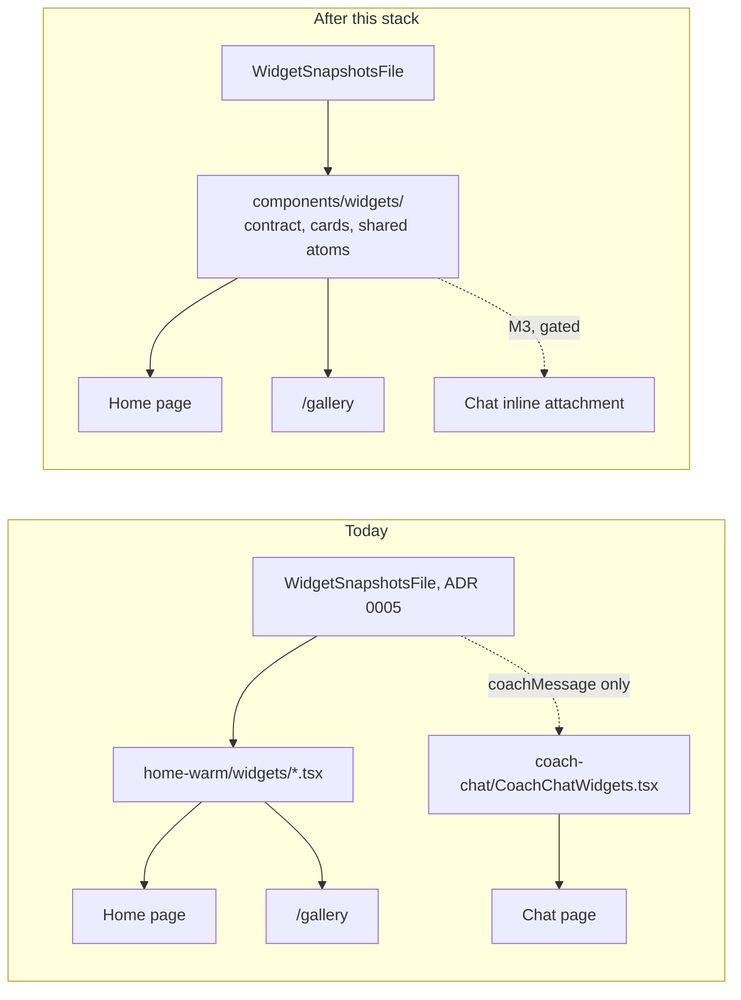
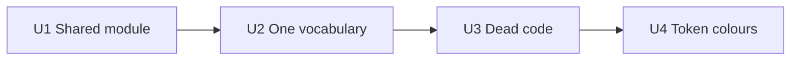

# Web widget modules

> Status: Draft · Owner: UI Expert · Verified: 2026-09-08
>
> Tracking: #930. Milestone and epic placement is a Tech Lead call — filed under `Later` to stay
> clear of the M3/M4 epic-parent gate, same as iOS's #928.

## Context

`coach-conversation-widgets-roadmap.md` M3 wants Coach to attach an allowlisted widget inline in
Chat. iOS's equivalent audit (#928, `ios-widget-modules.md`) found real forks: the same widget
hand-copied into three renderers, 44 stray colours, 984 lines of dead views. Web does not have
that problem.

**No structural blocker for M3.** Ten Home cards (`home-warm/widgets/*.tsx`) take one typed
snapshot prop and hold no page-level state or fixed-grid assumptions. Proof: `WidgetGallery.tsx`
(`pages/WidgetGallery.tsx:1-17`) already renders all 10 outside `DesktopHomeGrid`, in a different
layout, from the same import. The eleventh, `CoachMessageCard` (`widgets/CoachMessageCard.tsx`,
used only in `WarmInstrumentHome.tsx:86`), is absent from the gallery and worth naming. It's a
`wouter` `<Link>` to `/coach-chat` — Home's teaser pointing at the Chat thread, not a fact Chat
would attach to itself. It's excluded from M3's candidate set by its own logic, not because
anything blocks it. `pages/CoachChat.tsx:5,7` already imports
`getActivityZoneLoad` and
`InstrumentHeader` from `home-warm/`, so cross-directory reuse is an established pattern, not a
new one. The data contract is cross-platform already (ADR 0005): `WidgetSnapshotsFile`
(`home-warm/snapshots.ts:281-309`) carries `sizes.{engine,quest,commitments}` S/M variants
for glance surfaces. `ChatAttachment` (`coach-chat/coachChatModel.ts:43-45`) is already a
versioned, unknown-kind-safe union, tested (`coachChatModel.test.ts:294-313`) to ignore a kind it
doesn't recognise — the exact plumbing M3 needs to add a new attachment kind without touching
old clients.

What's real, but not a blocker: the 10 portable cards live under `home-warm/`, so Chat importing
one reads as a layering violation even though nothing stops it. Typed sport mappings intentionally
differ in recovery handling, while one category mapping is duplicated byte-for-byte. Two duration
formats intentionally serve different surfaces. ~90 hex colours sit outside the token file. One
four-entry accent-colour block computes and is never read. This plan cleans that up so the M3
build starts from one module per widget, not from a nice-looking coincidence.

## Goal

Today's fork is *data reach*, not view code: Chat reads one field (`home.coachMessage`) off the
snapshot file by hand (`coachChatModel.ts:128-146`) instead of the `useWidgetSnapshots` hook
Home uses (`hooks/useWidgetSnapshots.ts`, consumed only by `pages/Home.tsx:9,14`). No card
component is duplicated. This stack moves the shared contract and 10 portable cards somewhere
Chat can import without the `home-warm` name. It deduplicates one helper, names intentional
mapping and duration differences, and pays down colour-token debt. M3's trigger/catalog logic
remains out of scope here, per #930.

## What the full read found

| finding | evidence |
|---|---|
| Zero forked widget components | `grep -rln` for each of the 11 card names under `coach-chat/` returns nothing; `CoachChatWidgets.tsx` (653 lines) has no import from `home-warm/` |
| Cards already surface-portable | `WidgetGallery.tsx:1-17` renders 10 of 11 from the same import, outside `DesktopHomeGrid`, in a `/gallery` list layout — a second surface already exists. The 11th, `CoachMessageCard`, is a Home-only teaser `<Link>` to Chat and isn't a gallery/Chat candidate on its own logic |
| Typed mappings have different contracts; one implementation is duplicated | `categoryToSport` folds recovery into `WarmSportId.foundation`; `disciplineToSport` preserves recovery outside `WarmSportId`; `mapDiscipline` normalises free strings. Only `disciplineFor` is **byte-identical** between `currentWeekAdapter.ts:34-50` and `liveWeekContract.ts:32-48` |
| Two duration formats are intentional | `formatMinutesLabel` (`home-warm/formatUtils.ts:13-18`) accepts minutes and emits compact instrument text (`"1H30"`); `formatDuration` (`lib/activities.ts:281-287`) accepts seconds and emits spaced unit text (`"1h 30m"`) for activity rows |
| ~90 hex colours outside the token file | `grep -c "#[0-9a-fA-F]\{6\}"`: `warm-instrument.css` 34, `coach-chat.css` 50, `widget-gallery.css` 1, `warmHomeModel.ts` 4, `warmHomeSnapshots.ts` 1 (excludes `wi-tokens.generated.css`, the generated source; 40 in `home-warm/`, 50 in `coach-chat/`) |
| One dead accent-colour block | `CommitmentModel.accent` (`warmHomeModel.ts:303,314,326,335`, four hardcoded hex) is computed by `buildCommitments()` and never read — the live path (`buildCommitmentSnapshots`, `warmHomeSnapshots.ts:433-440`) recomputes `accent` from `sportHex()` independently; confirmed via `grep -rn "\.accent"` across both directories, one hit, in `SportCommitmentCard.tsx:68`, which reads the snapshot's field, not the model's |
| One dead export | `GOLDEN_SIZES` (`lib/goldenDataset.ts:21`) has zero importers anywhere in the repo |
| `sizes.*` S-variants have no web renderer | `WidgetSnapshotsFile.sizes` (glance-density snapshots for WidgetKit/iOS, ADR 0005) is unconsumed on web outside the type definition — `EngineCard`/`QuestCard` only accept the M/L shape. Two cards (`QuestCard`, `TrainingActivityCard`) already have a self-contained `compact` prop, which is the pattern a Chat-sized variant would extend |
| Naming: `atoms/` holds one file | `home-warm/atoms/SessionRow.tsx` is the entire `atoms/` directory — the split from `widgets/` no longer earns a second folder |
| No CSS class collision | `comm -12` on sorted top-level class selectors from `warm-instrument.css` (97) and `coach-chat.css` (81) — the one shared name, `.wi-shell`, is the intentional theme-token root both already load together in `pages/CoachChat.tsx:43,45` |

## PR stack

| PR | milestone | outcome | final base | files | owner | parallel with | result |
|---|---|---|---|---|---|---|---|
| U1 | Shared module | Move `WidgetSnapshotsFile`, the 10 gallery-rendered cards, `SessionRow`, `ActivityGlyph`, and `formatUtils.ts` into `components/widgets/`. Keep `CoachMessageCard` and `DesktopHomeGrid` in `home-warm/` | `main` | `components/widgets/*` (new); `home-warm/widgets/{BuildPhaseCard,CaloriesCard,CoachReadCard,EngineCard,QuestCard,RecentSessionsCard,SportCommitmentCard,TrainingActivityCard,Vo2Card,WeeklyPlanCard}.tsx`; `home-warm/atoms/SessionRow.tsx`; `home-warm/{ActivityGlyph,formatUtils,snapshots,WarmInstrumentWidgets}.{ts,tsx}`; `kdb/decisions/{0038-shared-web-widget-module.md,README.md}` | UI Expert | — | Chat can import the contract or a portable card from `components/widgets/`; zero visual change |
| U2 | One vocabulary | Extract only the duplicate `disciplineFor` into `home-warm/trainingMappings.ts` as `trainingCategoryToSessionDiscipline`. Keep `trainingCategoryToWarmSport`, `sessionDisciplineToSnapshotSport`, and `normaliseRuntimeDiscipline` separate. Rename duration helpers to `formatMinutesInstrumentLabel` and `formatSecondsDurationLabel` | U1 | `home-warm/{trainingMappings,warmHomeSnapshots,currentWeekAdapter,liveWeekContract}.ts`; `components/widgets/formatUtils.ts`; `lib/activities.ts`; `coach-chat/CoachChatWidgets.tsx`; affected tests | UI Expert | — | One Home data-mapping implementation; distinct mappings and duration formats stay behaviour-identical |
| U3 | Dead code | Delete unread `CommitmentModel.accent`, its four hardcoded hex values, and the unimported `GOLDEN_SIZES` export | U2 | `home-warm/warmHomeModel.ts`; `lib/goldenDataset.ts`; affected tests | UI Expert | — | Neither dead value remains; `warmHomeModel.ts` computes nothing its caller discards |
| U4 | Token the colours | Add missing tokens to `tokens.json`, run `generate.mjs`, and replace the remaining ~86 component hex values with generated CSS variables. Commit generated CSS; commit generated Swift only if its bytes change | U3 | `shared/warm-instrument/{tokens.json,generate.mjs}`; `home-warm/{wi-tokens.generated.css,warm-instrument.css,widget-gallery.css,warmHomeSnapshots.ts}`; `coach-chat/coach-chat.css`; `ios/CoachHQ/CoachHQ/Views/WarmInstrumentTokens.generated.swift` (only if changed) | UI Expert | — | The generator is reproducible and the issue #930 hex grep is empty |

U1 makes `components/widgets/` the canonical import path and adds the UI ADR. The existing
`home-warm/{WarmInstrumentWidgets,snapshots,ActivityGlyph,formatUtils}` files become explicit
compatibility barrels, so current Home, analytics, welcome, hook, model, and library importers do
not all churn in the move. New cross-surface code must import the canonical module.

The U1 ADR locks shared widgets to `components/widgets/`, keyed for Home, `/gallery`, and gated
Chat reuse. It prevents future portable cards from being defined inside `home-warm/`.

U2 keeps training mappings beside the Home adapters and models that consume them. Portable card
modules remain presentation-only.

U4 runs `node shared/warm-instrument/generate.mjs`. The script reads `tokens.json` and rewrites
both `wi-tokens.generated.css` and `WarmInstrumentTokens.generated.swift`; palette-only additions
may leave Swift byte-identical, in which case it stays out of the commit.

**Gated, not in this stack.** A U5 (Chat inline widgets) would give Chat's `ChatAttachment` a new
kind that renders a `components/widgets/` card at reduced size, capped at two per message per the
roadmap's locked decisions. It needs M3's server-built candidate catalog first — building the
client renderer earlier means guessing key names the server will contradict, the same reasoning
iOS's plan gated its W7 on. `ChatAttachment`'s `.unknown`-safe union (`coachChatModel.ts:43-45`,
tested at `coachChatModel.test.ts:294-313`) means that day this is a new kind, not new plumbing.

## Done when

These cover issue #930 and the stack's cleanup work.

1. After U1, the shared contract and 10 portable cards live in `components/widgets/`; only Home's `CoachMessageCard` and `DesktopHomeGrid` remain under `home-warm/widgets/`.
2. After U2, `trainingCategoryToSessionDiscipline` has one definition. Tests pin recovery→foundation for category→`WarmSportId`, recovery preservation for `SessionDiscipline`, free-string normalisation, and both duration outputs.
3. After U3, `GOLDEN_SIZES` and `CommitmentModel.accent` have no definitions or references.
4. `grep -rn "#[0-9a-fA-F]\{6\}" ui/client/src/components/**` (excluding token files) is empty after U4.
5. Concrete blocker list: delivered in this PR's Context section above — there are none.
6. `ui-tests.yml` green on every PR in the U1–U4 stack.

## Deferred

- **P2 — Chat-sized (`S`) variants for cards beyond `QuestCard`/`TrainingActivityCard`'s existing `compact` prop.** Needed before U5 can render a card small enough for a chat bubble, but which cards M3 actually requests is the roadmap's own call, not this plan's.
