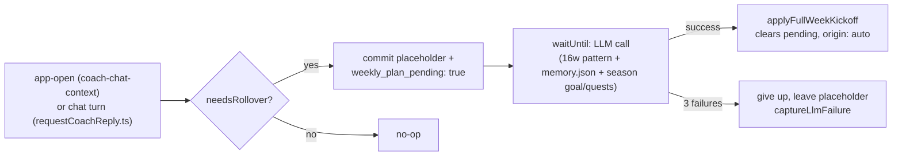

# Weekly plan auto-generation (HLD)

> Status: Plan · Owner: Tech Lead · Created: 2026-09-16

## Context

Lazy rollover (ADR 0049) only ever writes a placeholder week - the athlete still has to plan every
week by hand. Most athletes have a real weekday pattern (checked against Akash's and Skanda's
real repos: Akash's badminton is Monday/Thursday, 66% of his 256 sessions; Skanda's is a morning
habit most weekdays but barely happens on Monday). I want the backend to fill the placeholder
with a real plan using that pattern plus `memory.json` and the athlete's active season
goal/quests, so the plan serves what they're training toward, not just their habits. They then
only have to talk to Coach if they want to change something, not to get started.

## Decision

Extend the existing rollover check (`engine/lib/currentWeekRollover.mts`) with a second step. Once
a placeholder is committed, fire an async LLM call that fills it in for real, then commit through
the exact same validated path a chat-driven kickoff already uses -
`applyFullWeekKickoff`/`assertCurrentWeekCommitReady`. No new write path, no new UI.

Both trigger points share one check, same pattern `coach_since` (ADR 0018) already established -
cheap on every hit, rare real write:
- **Chat turn** - inside `buildTurnWrites.ts`'s existing `rolloverWrite` block.
- **App open** - `GET /api/coach-chat-context`, already hit once per session on both web and iOS.
  App-open reaches this first in practice, but the chat-turn check stays as a backup. The app-open
  warm-up call swallows its own fetch failures today (`prefetchCoachContext.ts`), so without a
  second check a failed warm-up would silently cost the athlete that week's auto-plan.

**Pattern source:** richer weekday histogram in `athlete_insights.json`, 16-week trailing window
(not 365 days - patterns drift) - per-weekday count, duration, time-of-day, same-day sport
pairing, and a sport-agnostic active-day rate. Computed from `start_date_local`/`moving_time` on
raw activities already loaded by `generate-athlete-insights.mjs`, plus three real bugs in that
loader fixed along the way (see LLD PR1) - no new data source needed.

**Goal alignment:** the LLM call also reads the athlete's active season `main_quest` and
`quests[]`, via `renderQuestContext` - the same helper the real chat-driven kickoff prompt already
uses. This is the athlete's own ask: the plan should reflect what they're training toward this
season, not just their habitual schedule.

**Idempotency:** `weekly_plan_pending: true` written in the same atomic commit as the placeholder,
before the LLM call starts - any other trigger that fires while it's set no-ops. Give up after 3
attempts (`FIRST_SESSION_BENCHMARK_MAX_ATTEMPTS` in `turnCompletion.ts` is the precedent), leave the
placeholder, `captureLlmFailure` with `outcome: "gave_up"`.

**Execution:** `waitUntil` (`@vercel/functions`, already used in `sentry.ts`) - real LLM latency
must not delay the athlete's own reply or the context-fetch response.

**Coach awareness:** `current_week.json` gets `origin: "auto" | "athlete"`. The next chat turn after
`origin` is `"auto"` lets Coach mention it once ("I set this week up based on your usual pattern");
any `week_update` edit flips it to `"athlete"` and it goes quiet. No new notification pipeline -
every turn already re-reads `current_week.json` fresh (same mechanism as
`coach-message-today-notes.md`).

## Done when

1. `athlete_insights.json` carries a 16-week weekday/duration/pairing/active-day histogram per
   sport, verified against two real repos' data, with the three loader bugs (sport-name
   collisions, timezone-naive "today", `elapsed_time`/`moving_time` mismatch) fixed.
2. A new week with no chat activity gets a real, validated plan within one LLM call cycle of
   either trigger firing, on a scratch/test repo. When an active season is set, the plan visibly
   reflects its `main_quest`, not just the weekday pattern.
3. Two triggers firing back-to-back (app-open then a chat reply) produce exactly one committed plan,
   never two, never a corrupted commit.
4. 3 failed attempts leave the placeholder in place, one Sentry event, no athlete-visible error.
5. Coach mentions the auto-plan once in its next reply, then never again once the athlete edits it.
6. Every PR in the stack has a live/manual verification note per its LLD row, not just unit tests.
7. `coach-skeleton` and all 5 real athlete repos are carved onto the same SHA as this stack, in one
   pass after the last code PR merges - not once per PR. Checked while planning this: all 6 were
   already 6 real `engine/`-affecting commits behind `main` before this stack even started.

## Deferred

- OpenRouter per-call-type API keys for cost visibility - filed separately, #1173, not blocking
  this stack.
- Cache tuning beyond the prefix/tail split - see the LLD's "Prompt caching (PR3)".
- Any confirmation/approval UI before the plan takes effect - the athlete explicitly wants chat
  editing as the only correction path.
- Splitting weekday pattern detection into a general-purpose scheduling engine - this stays scoped
  to feeding one LLM prompt.

See `docs/plans/weekly-plan-auto-generation-lld.md` for the PR stack, schemas, and file-level detail.
