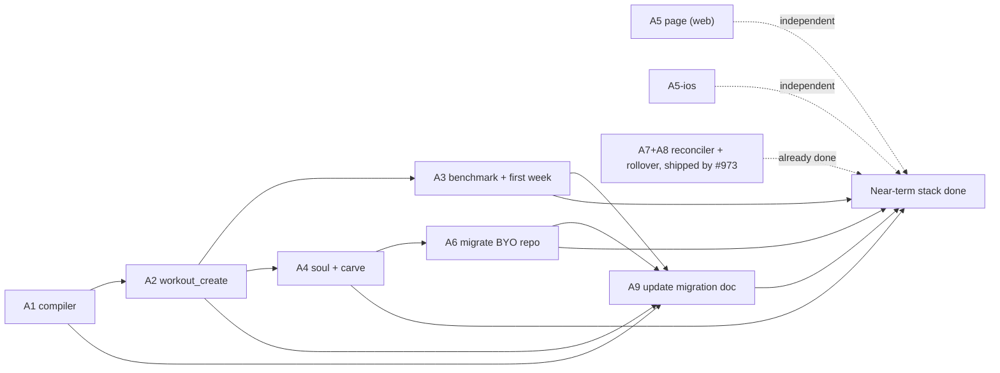

# Workouts: evidence and execution detail

> Status: Proposal · Owner: Tech Lead · Created: 2026-09-11 · Issue: #727
>
> Drill-down for [`workouts-redesign.md`](workouts-redesign.md). Merges and replaces
> `workouts-stack-a-lld.md`, Akash's original execution detail. Read this file's row for your PR
> and §1's mechanics; skip the rest unless your row cites it. Every claim checked against `main`
> at 94f0965 on 2026-09-11.
>
> **A7 and A8 are done, shipped by the Current Week stack (#973), not by this plan.** That stack's
> PRs #978 and #979 built exactly the reconciler and rollover described below, verified against
> real athlete data, and are green and ready to merge. See "A7 and A8: superseded" below instead
> of building either from scratch.

## Corrections folded into this merge

The original two documents disagreed with each other, and one claim in them was flat wrong. Both
are fixed here, not just noted, so nobody builds against the stale version.

| What was wrong | What's true, and reflected in this merge |
|---|---|
| The high-level doc said the create action needed its own separate commit. The low-level doc said the opposite and explained why the first claim was based on a bug that had since been fixed elsewhere in the codebase | The create action commits through the same single atomic commit every other action in a turn already uses. No special case. See A2 below. |
| A claim that no code reads the per-repo feature-flag file, used to justify budgeting extra work for whichever gated PR needs it first | `engine/lib/plugins.mjs`'s `isPluginEnabled` already reads it, already in use for the badminton plugin. Whichever gated PR needs the flag reuses this, no new helper needed. |
| iOS file paths cited without the app's doubled directory structure | Corrected below wherever iOS paths are named. |

## First Session and the new first-week scope

- **No week is written today.** First Session's closing step only asks whether the athlete wants a
  week plan or just to talk. The only writer of the week file is triggered by a later, separate
  conversation.
- **The template dump is automatic.** On the moment an athlete's profile becomes complete, a
  function scores and commits 4-6 library workouts for them. This is bug 1.
- **The carved starter templates are orphaned.** A freshly carved repo ships two starter workout
  files, but the manifest that every write path checks against doesn't list them, so they're
  invisible to editing or prescribing.
- **No structured availability exists.** Intake asks how often an athlete trains, but the answer
  lands as unstructured prose inside a note field, not anywhere a compiler could read it.

What A3's first-week compile needs, and where each input already lives:

| Input | Source today |
|---|---|
| Sports | the athlete's recorded sports list |
| Injuries | active injury flags |
| Goal and its shape | the season and its main goal |
| Workouts to draw from | the tagged workout library, already tagged by sport, equipment, goal, and level |
| Recent training volume | pipeline-generated insights, history-only |
| Days per week, and which days | **the one new field A3 adds** |

## Order and ownership



| PR | Branch | Owner | Base | Files it may touch |
|---|---|---|---|---|
| A5 | `feat/727-workouts-day-view-v2` | UI Expert | `main` | `ui/client/` only |
| A5-ios | `feat/ios-727-workouts-day-view-v2` | iOS Builder | `main`, after A5 | `ios/` only |
| A1 | `feat/727-compile-workout` (fresh, not a rebase of closed #732) | Bob | `main` | `engine/lib/`, `engine/scripts/` |
| A2 | `feat/727-workout-create` | Bob | A1 | `ui/api/coach-chat/_lib/gemini/`, `ui/api/coach-chat/_lib/decide/`, `ui/scripts/`, `ui/package.json` |
| A3 | `feat/727-first-session-benchmark` | Bob | A2 | `ui/api/coach-chat/_lib/decide/`, `ui/api/coach-chat/_lib/coachTurn.ts`, `shared/workout-library/` (deleted here) |
| A4 | `core/727-soul-carve` | Tech Lead | A2 | `platform/soul/`, `platform/`, `engine/scripts/` |
| A6 | `core/727-byo-migrate` | Tech Lead | A4 | the BYO athlete's repo, a PR against it |
| ~~A7~~ | shipped as `core/973-reconciler` (PR #978) | - | - | `engine/scripts/reconcile-current-week.mjs` |
| ~~A8~~ | shipped as `core/973-rollover` (PR #979) | - | - | `engine/scripts/rollover-current-week.mjs`, `.github/workflows/sync.user.yml` |
| A9 | `core/727-migration-doc` | Tech Lead | A1, A2, A3, A6 | `docs/plans/athlete-repo-migration-973.md` only |

A diff outside your file column fails review. Every PR: `Refs: #727`. Nothing in the near-term
stack closes #727 on its own. A7 and A8 no longer need a PR here - Refs: #973's stack already
closes them; see below.

## Worktree and PR mechanics

```bash
git fetch origin main
git worktree add -b feat/727-<brief> /tmp/wt-<brief> origin/main   # A5, A5-ios, A1
git worktree add -b feat/727-<brief> /tmp/wt-<brief> <base-branch>  # A2, A3, A4, A7, A8
# ... work, commit ...
git push -u origin feat/727-<brief>
git worktree remove /tmp/wt-<brief> --force
```

Never switch branches in the primary checkout. Commit prefix per `.github/CONVENTIONS.md`: `feat:`
for A1, A2, A3; `core:` for A4, A6, A9; `ui:` for A5; `ios:` for A5-ios. Each with `(#727)`.

---

## A1: `compileWorkout()` in `engine/`

**Goal:** a pure function that turns a minimal exercise list into timer-ready JSON. Nothing calls
it yet in this PR. #732 was this exact PR, unmerged since Aug 31 and now closed - read it for the
compiler's shape, but open this as a fresh PR against current `main`, not a rebase of it.

**Files:** `engine/lib/compileWorkout.mts` (new), `engine/lib/compileWorkout.test.mts` (new),
`engine/scripts/compile-dryrun.mts` (new, the verification tool referenced in the rollout section
of the HLD).

**Why `engine/`, not the API folder:** the server-side coach is already documented as a second
engine re-implementing Layer B rules in TypeScript. A compiler placed in the API folder repeats
that mistake specifically for workouts. It reaches `ui/api/` the same way the Current Week
validator does: a bundled shim added in A2, not a raw cross-folder import.

**Contract:**

```js
/** @typedef {{ name, type: "reps"|"timed", reps?, duration_secs?, sets,
 *              form_cue, why, both_sides?, optional?, progression_id? }} SpecExercise */
/** @typedef {{ name, exercises: SpecExercise[], circuit?, rounds?, coaching_note? }} SpecPhase */
/** @typedef {{ id, title, subtitle, workout_type, location, equipment,
 *              coaching_note, phases: SpecPhase[], progression_notes? }} WorkoutSpec */
export function compileWorkout(spec, opts = {}) // -> Workout
```

**Fills, deterministically:**

| Field | Rule |
|---|---|
| `num` | sequential from 1 across all phases, in order, no gaps |
| `prep_secs` | `timed` -> 5; `reps` -> omitted |
| `rest_between_sets_secs` | omitted when `sets === 1`; else 60 (`reps`) / 45 (`timed`) |
| `rest_after_exercise_secs` | 30; 0 on the last exercise of the last phase |
| `default_rest_secs` (phase) | max `rest_between_sets_secs` in the phase, else 30 |
| `duration` (phase) | `"<n> min"`, from the phase's computed seconds, rounded up |
| `estimated_duration_mins` | sum of phase seconds divided by 60, rounded up |

Work seconds per exercise: `timed` gives `duration_secs * sets * (both_sides ? 2 : 1)`; `reps`
gives `reps * 3s * sets`. Add rest time on top. `circuit` multiplies the whole phase by `rounds`.

Every default is overridable. A value already present in the spec is never recomputed.

**Tests:**
- A golden fixture compiles byte-identically to a checked-in expected JSON.
- Compiling the same spec twice deep-equals.
- Exercise numbering across three phases has no gaps after a skip.
- A known spec yields the expected estimated duration.
- A spec that sets `prep_secs: 0` on a timed exercise keeps 0.
- `both_sides` doubles work seconds without doubling `sets`.

**Dry-run tool:** reads every existing workout template, reduces it to a spec, recompiles,
diffs against the original, prints a per-file summary. Read-only, writes nothing. Existing
templates have hand-tuned rests, so the bar is explainable, not byte-identical to production
files. The golden fixture is the byte-identical test.

**Validate:** `cd ui && npm run test`, and the dry-run tool run against each of the four live
repos. **Done when:** tests are green, and the dry-run diff across all four repos is explainable
line by line. An unexplained diff blocks the merge.

---

## A2: `workout_create`, on ordinary turns

**Goal:** an athlete asks mid-conversation and a routine file is committed on that same turn.

**Files:** the response schema file, a new builder function beside the existing routine-editing
builders, an applier function, the pre-write invariant checker, and the prompt text file. Also a
new bundle shim exporting the compiler, a new script copying the existing bundling pattern, and
one new test file for the create path.

**No dedicated commit-path change is needed.** Every action a turn produces, including this new
one, assembles into one atomic commit the same way every other action field already does. There is
no special case, no separate commit call, and no closing-turn concept to work around, since that
concept doesn't exist in the current codebase at all.

**Schema.** Added beside the existing routine-editing action. Coach sends the spec, never timer
physics:

```
workout_create: { type: "object", properties: {
  title, workout_type, location, coaching_note: {type:"string"},
  equipment: {type:"array", items:{type:"string"}},
  phases: {type:"array", items:{type:"object", properties:{
    name: {type:"string"},
    exercises: {type:"array", items:{type:"object", properties:{
      name, type, form_cue, why: {type:"string"},
      reps, duration_secs, sets: {type:"number"},
      both_sides: {type:"boolean"}, progression_id: {type:"string"},
    }, required:["name","type","sets","form_cue","why"]}},
  }, required:["name","exercises"]}},
  injury_ack: {type:"array", items:{type:"object", properties:{
    flag: {type:"string"}, accommodation: {type:"string"},
  }, required:["flag","accommodation"]}},
}, required:["title","workout_type","phases"] }
```

**Turn wiring.** The new action is added to the same array that already gives a returning athlete
every other routine-editing action on every ordinary turn. Nothing else needs wiring: no new mode,
no second array for a special closing path. It's kept off the First Session action set, since A3
supersedes the First Session flow with the benchmark path below; this action is
returning-athlete-only in the near-term stack.

**Applier steps:**
1. Derive an id by slugifying the title, suffixing on collision with existing ids.
2. Invariant 7, injury acknowledgment: a generated routine carries no library tags, so the old
   injury-conflict filter can't be reused as-is. The applier reads active injury flags and throws
   unless every one has a matching entry in the spec's acknowledgment array. The acknowledgment
   field becomes required in the schema whenever any flag is active.
3. Invariant 1: every progression id referenced must already exist, or the applier throws.
4. Compile the spec, validate the structural result, write it to the existing routine storage
   path, no rename in this stack.
5. Append the new id to the manifest, in the same atomic commit.

**Tests:**
- The happy path writes a valid file.
- An id collision gets suffixed.
- An active flag with no acknowledgment throws.
- An acknowledged flag passes.
- An unknown progression id throws.
- Ordinary turn mode exposes the action.
- The committed file passes structural validation.
- A returning athlete still commits correctly, the case that used to silently no-op.

**Validate:** `cd ui && npm run test`, plus a manual turn asking for an upper-body workout.
**Done when:** a mid-conversation ask produces a committed, valid file the timer can open. This
kills bug 2.

---

## A3: benchmark, plus a compiled first week

**Goal:** first session ends with a benchmark, seeded progressions, and a real first week, not six
guessed workouts and an empty week.

**Files:**
- Delete the library-selection and template-generation functions from the workout files module.
- Rename the function that fires on profile completion to reflect what it now does.
- Add progression seeding, and delete the workout library directory and its test entirely.
- Add one new structured field to the athlete's memory record for training availability.
- Add a first-week compile step, plus new test files for the benchmark and the compile.

**Flow.** Coach asks during intake what the athlete can already do, and how many days a week and
which days they train, both already natural intake questions. The days-per-week answer now lands
in a structured field instead of only in prose. On the profile-complete transition, Coach emits
one `workout_create` spec tagged as the benchmark, covering 4-6 movement patterns, each exercise
carrying an easier and a harder alternative in its coaching cue. The same transition also triggers
a first-week compile: code places the benchmark and any other sport-appropriate anchor sessions
onto the athlete's stated training days, using the season's goal and the tagged workout library to
pick sport-appropriate sessions. The athlete picks their real entry level for the benchmark inside
the app; nothing branches in the timer.

**Progression seeding.** For each benchmarked movement pattern, write a progression record with an
id, name, current value, target, unit, and an empty history. `current: null` is legal and means
"not yet," so a true beginner and an athlete working around a flare-up use the same field.

**Invariant 2** is enforced here: a starting dose may not exceed the benchmarked value.

**Tests:**
- First Session's close writes exactly one benchmark file, with progressions seeded one per
  pattern.
- `current: null` is accepted, and a dose above the benchmark throws.
- No reference to the deleted workout library directory survives anywhere in the codebase.
- A first-week compile places sessions on the athlete's stated training days and nowhere else.
- An athlete who stated zero available days still gets a valid, if minimal, week, not an error.

**Validate:** `cd ui && npm run test`, plus a repo-wide grep confirming the deleted library has no
remaining references. **Done when:** a fresh athlete's first close writes a benchmark, populated
progressions, and a real compiled first week. This stops bug 1 recurring for every future athlete;
A5 is what fixes it for the four athletes who already have it.

---

## A4: soul and carve

**Goal:** Coach knows the new rules, and the BYO Claude Code path gets the compiler.

**Files:** the engine-rules soul layer, both composed soul builds (regenerated, never hand-edited),
one entry in the soul version history, a new thin command-line wrapper around the compiler, and
the carve script that seeds a fresh athlete repo.

**Soul edits:**
1. Retire the instruction that has Coach hand-write session files with exact timer physics.
   Delete the section that spells out rest-second and prep-second rules for the model to follow;
   the compiler owns that now.
2. Add one line: Coach may create a routine when none of the existing ones fit. This one line is
   the absence that caused bug 2.
3. Confirm every existing workout-storage path reference still resolves, since there's no rename
   in this stack.

**Order inside the PR:** edit the soul layer, run the compose script, commit the layer and both
generated builds together, then add the version history entry.

**Validate:** soul validation clean, plus an end-to-end check: carve a scratch repo and create a
routine through the new command-line wrapper. **Done when:** validation is clean and a freshly
carved repo can create a routine. This PR references the issue but does not close it.

---

## A5, A5-ios: three-band Workouts page

Rebuilt fresh rather than reopening #733 or #734 (both closed), since both hand-parse Current Week
fields in a shape #973 has already changed. The design contract from those two PRs is worth reading
before starting, even though neither merges as-is.

**Web goal:** today, this week, and library, read-only over data that already exists. No new
storage, no schema change, no backend change.

**Files:** a new pure selector module and its tests, a rewrite of the Workouts page component into
the three bands, reusing the existing session-row component for the week list. Do not reuse Home's
weekly plan widget, which is Coach's own draft and a different thing entirely.

**Rules:** not live, or missing, means no hero and the week band shows only logged activity for
that ISO week if any exists, else hides entirely. Live plus a session with a real routine means a
runnable card, whether or not it's already marked done. Live plus a day with no routine, like a
match or a hike, is a one-line mention, never "Rest." Live with nothing scheduled today is Rest.
Every day in the week list is either the plan's row, a logged activity that day, or blank; blank
means unplanned, not Rest. The library band is unchanged. "Today" is always computed from the
week's own timezone when live, or the athlete's known timezone otherwise, never the browser's.

**iOS goal:** the same three bands, fetching the week file the way the existing workout service
already fetches routine and session files. Files live under the app's own services and views
directories, not at the top level of the iOS folder. Duplicate the selector logic in Swift; don't
invent a shared package across languages for this.

**Validate:** `npm run test` and `npm run build` for web; `ios-build.yml` green for iOS.
**Done when:** each page opens on today plus this week, not an undifferentiated list of every
routine.

---

## A6: migrate the BYO athlete's repo

Carving updates the skeleton for future athletes, not anyone who already forked their own repo.
The athlete who reported bug 2 is on a repo carved before A4 exists, so A4 alone leaves their bug
unfixed. This PR opens against their repo specifically, carrying the recomposed soul build and the
compiler's command-line wrapper, nothing else.

**Done when:** that athlete, in their own repo, asks for an upper-body workout and gets one.

---

## A7 and A8: superseded by the Current Week stack (#973)

This plan and `current-week-redesign.md` were written the same day, both against the same live
bug (the week going dark on a quiet week) and the same fix (a deterministic reconciler plus a
scheduled rollover). `current-week-redesign.md`'s stack built and shipped both first. Their
original goals and behavior, as designed here, are unchanged - only where the work landed changed:

- **Reconciler**, originally scoped here as a new module in `ui/api/coach-chat/_lib/decide/`,
  shipped instead as `engine/scripts/reconcile-current-week.mjs` (PR #978, `core/973-reconciler`).
  Same rules as the table in the HLD: exact match marks done, a passed planned day with nothing
  matching becomes missed not skipped, an unmatched activity attaches as unplanned. Two plausible
  candidates, or an activity a day either side of plan, stay planned and flag for Coach instead.
  Every row has a regression test in `engine/scripts/reconcile-current-week.test.mjs`.
- **Rollover**, originally scoped here as a new sync-pipeline step, shipped instead as
  `engine/scripts/rollover-current-week.mjs` (PR #979, `core/973-rollover`), called from
  `.github/workflows/sync.user.yml`. Verified live against a real athlete repo: a week that had
  gone stale was correctly replaced with a placeholder frame for the real current week.

**What's left for this plan to do here:** nothing. #973 is merged. A3 (first-week compile) can call
the same reconciler/rollover machinery directly, and doesn't need to build any part of it. Treat
#973 as a dependency to pull in, not a PR to open under `feat/727-*`.

---

## A9: update the athlete repo migration doc

**Goal:** `docs/plans/athlete-repo-migration-973.md` currently describes only what #973 changed.
By the time this stack's near-term PRs land, athlete repos also need the workouts side migrated -
a new `routines/`/`compiled/` layout, `seasons.json` gaining `goal`/`duration`, and whatever A1-A6
add to the manifest or carve. Folding that into the same doc, in one pass, means an operator
migrating a repo later reads one doc for both stacks instead of two.

**Files:** `docs/plans/athlete-repo-migration-973.md` only. No code changes.

**Behavior:** once A1, A2, A3, and A6 are merged, audit each one's diff for anything a
pre-this-stack athlete repo would need. That means new files to re-carve, new manifest entries,
and any migration transform a stored field needs - the same way #973's stack needed a `discipline`
normalization step. Add a section to the doc per new thing found, in the same "what each repo
needs" format #973's section already uses.

**Validate:** re-check the doc's own "Repos in scope" table against all five real athlete clones,
same as #973's pass did, so it states real findings and not assumptions.

**Done when:** the doc covers every field and script both stacks introduce. The migration itself
stays deferred - nothing forces it until an athlete actually uses the app again.

---

## What happened to #732, #733, #734: the evidence

Checked directly with the GitHub CLI's diff and file views, and a real three-way merge attempt
against current `main` in a scratch worktree, not assumed from titles or the original plan's own
claims. All three are now closed; none are rebased or built on.

**#732, the compiler.** 10 files changed, roughly 812 lines added and 3 removed. Touches only the
new compiler module and its tests, the dry-run tool, and two lines of CI path-filter wiring. No
dependency anywhere in the diff on the week file's schema, and no conflict of substance against
`main` at the time it was checked. **Closed anyway** - A1 is a fresh PR against `main` once it
opens, not a rebase, so it never inherits whatever `main` has moved to underneath this branch by
then. The branch is worth reading for the compiler's shape, not worth merging as-is.

**#733, the web page.** 7 files changed, roughly 1390 lines added and 105 removed. Adds a new
selector module and rewrites the Workouts page into the three-band layout. Both new files import
the current week's runtime parser and read its session type directly - a shape #973 has since
changed underneath it. **Closed, kept as reference** for A5's rebuild: the layout and selector
shape are good starting points even though the data layer needs a rewrite regardless.

**#734, the iOS tab.** 3 files changed, roughly 763 lines added and 38 removed. Adds a hand-written
parser for the week file that reads the same fields as #733 read on web, now stale for the same
reason. **Closed, kept as reference** for A5-ios, for the same reason as #733, and because iOS is
sequenced after web regardless of this PR's state.

## Validation, all PRs

| PR | Evidence required |
|---|---|
| A1 | Byte-identical golden fixture; dry-run diff across all four live repos, explainable line by line |
| A2 | Eight-case test suite; one manual mid-conversation create |
| A3 | Five-plus test suite covering benchmark, progressions, and the first-week compile; a grep confirming the deleted library has no remaining references |
| A4 | Soul validation clean; an end-to-end carve-and-create check on a scratch repo |
| A5, A5-ios | `npm run test` and `npm run build` for web; `ios-build.yml` green for iOS |
| A6 | The reporting athlete's own repo, verified by hand that the ask now works |
| A7 | One test per reconciliation rule; a replay of one real athlete's sync history against the new rules |
| A8 | A quiet-week test; a manual check on one live repo |

Cross-cutting for every PR that touches the coach-chat prompt or schema: `npm run eval:coach-chat`
runs once, after A4, before the whole near-term stack merges, not per PR (ADR 0024). PRs that don't
touch the prompt or schema state that plainly rather than running the eval unnecessarily.
Live-test any coach-chat-facing change on `test/close-verification` in `coach-skanda-2003` before
calling it done. `bash platform/scripts/check.sh --quiet` after committing, since the prose gates
read the committed diff, not the working tree.
