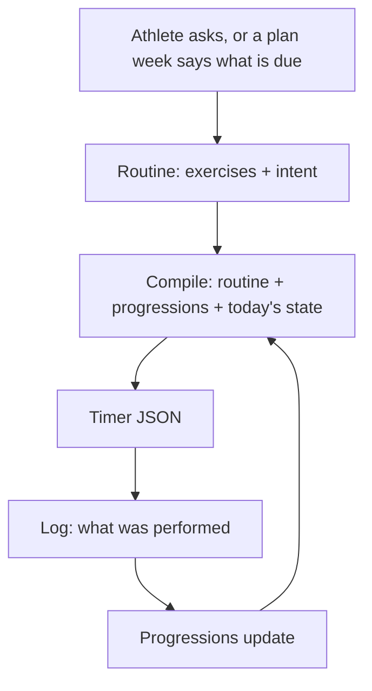

# Workouts: redesign

> Status: Proposal · Owner: Tech Lead · Created: 2026-09-11 · Issue: #727
>
> Execution detail, file paths, and test lists live in
> [`workouts-redesign-lld.md`](workouts-redesign-lld.md).
>
> This doc merges and replaces `workouts-season-model.md` and `workouts-stack-a-lld.md`, the
> original design written by Akash. His core idea, "compile from a routine, plan a season," is
> kept. What changes, and why, is explained below before the plan itself.
>
> **A7 and A8 (below) are done.** The Current Week stack (#973, PRs #974-980) built the
> deterministic reconciler and the scheduled rollover this plan called for, verified against real
> athlete data, and is green and ready to merge. Treat #973 as a dependency, not remaining work -
> see `workouts-redesign-lld.md`'s "A7 and A8: superseded" section.

## What's changing, and why

**The bug, plainly.** Right now Coach can only edit a workout that already exists in an athlete's
repo, or prescribe one straight from the existing library. There is no way for Coach to write a
brand new one. Two of four live athletes hit this in the same week. One got "a lot of random
workouts" dumped on them at signup that they never asked for. The other, on the BYO Claude Code
path, was told outright that Coach "could not" build an upper-body workout because no template
existed for it. Both are the same missing piece: a create path.

**The fix everyone should understand first.** Today, the language model is asked to act as both
the coach and the workout compiler. It has to decide sets and reps *and* work out rest timings,
exercise numbering, and phase durations, all in prose, inside `B_engine.md`. That second job is
mechanical and doesn't need judgment. The redesign draws a hard line: **Coach writes what a human
coach would actually say about a workout, exercise names, sets, reps, a coaching cue, and why.
Code turns that into the exact timer instructions.** A small function called a compiler takes
Coach's description and deterministically fills in every timing detail, the same way every time.
This is the same principle the Current Week redesign applies to the weekly plan, and it is the
throughline for this whole document.

**What's kept from the original design, unchanged.** The mental model above is exactly as Akash
designed it. So is the reconciliation policy: rules run automatically, and Coach only gets asked
about ambiguous cases. So is the invariant table, where code refuses an unsafe or invalid workout
rather than trusting Coach's judgment on facts a machine can check. Both are restated below with
the reasoning spelled out, not just copied as a bullet list.

**What's changing from the original sequencing, and why.**

1. **The reconciler and the automatic weekly rollover move out of the gated "periodization" work
   and into the near-term plan - and have since shipped, via the separate Current Week stack
   (#973), not this one.** The original design held both back behind an open question: whether a
   workout routine holds steady week to week, or changes shape every week. That question matters
   for periodization, the multi-week training arc. It has nothing to do with whether
   reconciliation should be automatic, or whether the week should refresh itself without a chat.
   Gating those two behind an unrelated question was keeping a live bug (the week going dark when
   an athlete doesn't chat) unfixed for no reason connected to the actual open question. #973's
   stack fixed it first, in `engine/scripts/reconcile-current-week.mjs` and
   `engine/scripts/rollover-current-week.mjs`, so A7 and A8 below are done, not upcoming work.
2. **The First Session benchmark is promoted from "later" to part of the initial landing, and
   gains one new capability.** The original plan already designed a good First Session flow: Coach
   asks what the athlete can already do, and writes one benchmark workout instead of guessing six.
   That alone fixes the dump for new athletes. This version goes one step further: with one small
   addition, a structured field for how many days a week and which days, the same First Session
   conversation can also produce the athlete's actual first week, not just a benchmark session.
   Sports, injuries, the goal, and a tagged workout library are all already captured during intake.
   Days-per-week was the only missing input.
3. **A handful of defects in the original documents are fixed, not just noted.** The most serious
   one: the original high-level and low-level documents contradicted each other about how the new
   create action should commit its data. An agent following the standard instruction, "read your
   PR's row and nothing else," would have landed on the stale, wrong instruction. That kind of
   contradiction only happens because a design lived in two separate files that could drift.
   Merging into one document removes the class of bug, not just this instance of it.

**What's explicitly not changing.** The core architecture, the vocabulary, the storage layout, and
the invariant table are all kept as designed. This is a resequencing and a bug fix on a good
design, not a redesign of the design itself.

## The mental model



**Coach writes exercises, code writes timer physics.** Coach emits a name, sets, reps or
duration, a form cue, and why. The compiler fills in exercise numbering, rest values, and phase
durations. Today's system asks a language model to be a compiler, in prose. That's the core defect
this whole plan removes.

**Only tracked exercises need identity.** A cool-down foam roll never progresses; a tuck hold
does. The registry is the 10-15 movements an athlete actually tracks, and the progression id is
the exercise's identity. Untracked exercises carry their sequence number inline, with nothing else
to track. This is why no separate movement catalog is needed.

**The benchmark is a conversation, not a guess.** Coach asks what the athlete can already do, "I
do pull-ups, six to eight," and sets the entry level from the answer. The session then confirms
rather than discovers: it shows one easier and one harder option per movement, so a wrong guess
costs nothing. "Can't do this pain-free" is a legitimate answer, recorded as `current: null`. A
beginner and an athlete working around an old injury use the same mechanism, not two.

**Vocabulary.** `session` is retired: it used to mean both a prescription and a thing actually
performed, and performed work already lives in `user_data/activities/`. `template` becomes
`routine`, because what it means changed: it is now compiled from a description, not copied
wholesale from a library.

## Storage

```
user_data/ledger/
  seasons.json        gains goal, duration and (gated) blocks - NOT a second season file
  current_week.json   same path; field changes are owned by the Current Week redesign, not here
  progressions.json   exists - baselines and history, filled for some athletes, empty for others
  plugins.json        exists - the per-repo enablement flag
user_data/activities/workout_plans/
  templates/          -> routines/   (renamed last, dual-read first)
  sessions/           -> compiled/   (same)
```

**`current_week.json` keeps its name and path here.** Whether individual fields get dropped is a
decision this doc doesn't make. `current-week-redesign.md` owns that question, gated on a
consumer audit. If you read both docs and the storage sections seem to disagree, that's why:
this one describes the folder layout workouts live in, not the week schema.

**Blocks extend `seasons.json`, when that gated work happens.** `platform/soul/B_engine.md` says a
season has a name, start, end, and status only, no phase or block underneath it, so adding blocks
is a soul change either way. A second file named something like `season_plan.json` would just be a
second season object with the same name, which is worse. This is part of the gated periodization
work, stated out loud so nobody builds it early by accident.

**Compiled files are disposable.** They're committed so the timer and iOS can read them offline,
but they are never treated as truth and never hand-edited. Delete the directory and the next
compile rebuilds it exactly.

## Reconciliation

**Rules run automatically. Coach only sees the row that's genuinely ambiguous.** Putting a
week-override question into every single activity sync would grow the sync prompt for a case
that's actually rare.

| Situation | Result |
|---|---|
| Activity on a planned day, type matches | `done`, completion id appended |
| Planned day passes, no matching activity | `missed`, not `skipped`. Skipping is a decision, not an absence |
| Activity with no planned match | attached to the day as unplanned |
| Two candidates, or an activity a day either side of plan | stays `planned`, flagged to Coach |

The case that earns Coach's attention is self-adjustment. An athlete who moves Tuesday's session
to Thursday without saying so reads as a missed anchor plus an unexplained extra, when the truth
is one moved session. Coach sets `original_date` to record the move.

**Who writes progressions.** The reconciler does, on a matched completion, never Coach noticing on
its own (ADR 0023). Coach may propose a level change in conversation; code applies it and
rate-limits how often it can move. A number nothing but Coach's judgment maintains is a number
that drifts.

## What the Workouts page shows

Three bands, the same on web and iOS, built entirely from data that already exists:
`current_week.json`, `templates/`, `sessions/`, and synced activity history. No new storage.

1. **Today.** The only place with a timer button. Shows the coach-adjusted session file if one
   exists, otherwise the base routine. A day with no template, like a badminton match or a hike,
   is a plain line with a title and duration, not a card. It's never labeled "Rest." No live plan
   at all means one line saying so, with no big hero element.
2. **This week.** A simple list, one row per day: the planned session if the week is live,
   otherwise a logged activity from that day if one exists, otherwise blank. Blank means
   unplanned, not Rest. This is deliberately not Home's weekly plan widget, which is Coach's own
   draft and should never be backfilled from raw activity history. Hide this band entirely only
   when there's no live plan and nothing logged this week either.
3. **Library.** The existing grouped list, unchanged, for ad-hoc or physio work. Links to a
   workout's detail page as it does today. Compiling on demand from the library isn't part of this
   landing.

A pure read of existing data, not a new state machine. The week-level question is just "is there a
live plan or not," and today's question is just "which row is today."

## The contract

**Coach supplies judgment as typed values. Code enforces invariants.**

| # | Invariant | Enforced in |
|---|---|---|
| 1 | A `progression_id` referenced exists in `progressions.json`; Coach references, never invents | write path |
| 2 | A starting dose never exceeds the benchmarked value | write path |
| 3 | A progression bumps at most once a week | write path |
| 4 | Timer physics are filled by the compiler, never the model | compiler |
| 5 | Every compiled file passes structural validation before commit | compiler |
| 6 | A day marked `done` references a real synced activity id | reconciler |
| 7 | Every active injury flag is addressed before a routine is written | write path |

Invariant 7 exists because the old library selector filtered out any workout that conflicted with
an active injury flag. A model-written routine carries no library tags, so that filter can't carry
over as-is. Instead, the routine Coach sends must include one acknowledgment per active flag,
explaining how the routine accounts for it, and the write path refuses to save a routine that
leaves any active flag unaddressed. Code can't judge whether a routine is actually safe, but it can
refuse to save one where Coach never considered a known flag at all, and that refusal is auditable
afterward.

**The compiler lives in `engine/`, not in the Vercel API code.** The server-side coach is already
documented elsewhere as a second engine re-implementing the same rules in a different language. A
compiler placed in the API folder would repeat that mistake for workouts specifically. It reaches
the compiler the same way it already reaches the Current Week validator: a small bundled shim, not
a raw cross-folder import. The BYO Claude Code path calls a thin command-line wrapper around the
same module. One module, two thin hosts.

## The plan

Two stacks. The near-term stack fixes both live bugs and ships the benchmark, the reconciler, and
the automatic rollover. The gated stack is periodization: multi-week training blocks, and a week
that compiles itself from those blocks instead of Coach writing it by hand. The gate is explained
at the end of this section.

### Near-term stack

| # | Outcome | Base | Owner | Done when |
|---|---|---|---|---|
| A1 | `compileWorkout()` in `engine/` | `main` | Bob | A byte-identical golden fixture, and a dry run across all four live repos with every diff explainable line by line |
| A2 | `workout_create` action, available on any ordinary turn | A1 | Bob | A returning athlete's mid-conversation request writes a valid routine file in that same turn |
| A3 | First Session writes a benchmark, and a compiled first week | A2 | Bob | A fresh athlete's first close writes a benchmark, populated progressions, and a real first week, not a template dump |
| A4 | Soul and carve updated for the new rules | A2 | Tech Lead | Soul validation is clean, and a freshly carved repo can create a routine |
| A5 | Three-band Workouts page, web | `main` | UI Expert | Today, this week, and library all render from a live repo |
| A5-ios | Same three bands, iOS | `main`, after A5 | iOS Builder | The Workouts tab shows the same three bands from live repo data |
| A6 | Recomposed soul and the compiler CLI, into the BYO athlete's own repo | A4 | Tech Lead | That athlete asks for an upper-body workout in their own repo and gets one |
| ~~A7~~ | ~~Deterministic reconciler~~ - **done**, shipped as PR #978 in the #973 stack | - | - | Every row of the reconciliation table above has a test in `engine/scripts/reconcile-current-week.test.mjs` |
| ~~A8~~ | ~~Weekly rollover with no chat required~~ - **done**, shipped as PR #979 in the #973 stack | - | - | Verified live: a stale week was replaced with a real current-week frame with no chat involved |

A1, A5, and A5-ios can start at the same time, since they touch disjoint files. A5 and A5-ios are
resequenced: see "What happens to #732, #733, and #734" below before building either.

### Gated stack: periodization

| # | Outcome | Base | Done when |
|---|---|---|---|
| B1 | Goal, duration, and training blocks extend `seasons.json` | A4 | A goal conversation writes blocks and scheduled benchmarks |
| B2 | The week compiles itself from block intent | B1 | A kick-off conversation compiles a full week automatically |
| B5 | Both old and new storage paths read at once | B2 | Old and new paths both serve the timer during the transition |
| B6 | Old paths retired, in every athlete repo | B5 | All four repos migrated, no old path reference left anywhere |

**Why this stays gated.** Someone investigating the original design reported that a routine's
exact content churns week to week, while the *slot* it fills, like "A day" or "leg day," is what
actually stays stable. If true, that would make "one immutable routine with adjustable numbers"
the wrong shape for periodization. That finding has never been checked against the four real
athlete repos, and the operator's own experience is the opposite: a routine holds for weeks and
only the numbers move. Nothing here should be restructured around an unverified claim in either
direction. Settle it with real evidence before B1 is scoped, not as part of scoping B1.

## What happens to #732, #733, and #734

Three PRs already exist from the original design, dated Aug 31. Each was checked directly against
its diff and a real merge attempt against current `main`, not assumed from its title.

| PR | What it is | Verdict |
|---|---|---|
| #732, the compiler | `engine/lib/compileWorkout.mts` and its tests | **Rebase and keep.** Self-contained, no dependency on the week schema or anything else this plan changes. Only a trivial conflict, a shared table row in a doc. |
| #733, the web page | The three-band Workouts page | **Close, keep the branch as reference.** It reads Current Week fields directly in a way that will need rework once the Current Week schema changes, and it also has a real, if small, merge conflict from unrelated changes since it was opened. The layout and the page's selector logic are worth reading before rebuilding A5, not worth merging as-is. |
| #734, the iOS tab | The same three bands on iOS | **Close, keep the branch as reference.** Same reasoning as #733, and iOS is sequenced after web regardless. |

## Rolling out to athlete repos

Four live athletes, and full repo access to all of them. That's enough to verify directly rather
than stage a gradual rollout.

**The near-term stack ships unflagged**, because nothing in it changes what a live athlete
currently sees without them asking for it. The compiler is a pure function nothing calls until A2.
A2 itself is purely additive. A3 changes first-session onboarding, and all four athletes are
already past that stage. A4 only reaches an athlete's repo the next time it's carved. A flag here
would cost real complexity and buy nothing.

**Verify against the real four before every merge.**

1. Dry-run the compiler across all four repos: every existing workout in, timer JSON out, diffed
   against what the athlete has today. A1 doesn't merge until every diff is explainable line by
   line.
2. Replay one real week offline: take an athlete's last kick-off, sync, and a missed day, run them
   through the new path, and check the result against what actually happened.
3. Merge, then read Sentry the same day. The first thing to check is that compile failures are
   zero.

**The gated stack is where a flag earns its place**, because that's where an existing athlete's
behavior changes without them asking: B2 generates their week automatically, and B6 moves storage
paths under a running app. `plugins.json` is the file to gate on; it already exists in every repo,
and `engine/lib/plugins.mjs`'s `isPluginEnabled` already reads it for the badminton plugin, so
whichever gated PR needs the flag first reuses that helper rather than building one. Rollback for
any of this is a single revert, since the athlete's own repo is the
datastore and nothing partial survives a revert.

## Done when

- An athlete asks mid-conversation for a new workout and gets one, committed in that turn.
- The Workouts page, on web and iOS, shows today, this week, and library, not a dump of every
  template.
- A new athlete's first session ends with a real benchmark and a real first week, not six guessed
  workouts.
- Changing a progression changes the next compile automatically, with no edit to any routine file.
- An athlete with an active injury flag is never offered a routine that conflicts with it.
- Every invariant above has a test that fails when it's violated.
- All four live repos, BYO included, keep working throughout.

## Alternatives considered

**Leave the benchmark and the reconciler where the original design put them, deferred.** Smaller
footprint per landing, and closer to the original plan's shape. But the week keeps going dark on a
quiet week, and new athletes keep getting the template dump, for no reason tied to the actual open
question about periodization.

**Skip the near-term stack, design the periodization version first.** Not recommended. It designs
on the unverified churn question the gated stack itself refuses to design around, and both live
bugs stay open for the entire build.

## Deferred

- Training blocks and periodization, until the churn question has real evidence.
- The `templates/` to `routines/` rename, cosmetic and not urgent on its own.
- A superseding architecture decision for the routine/session model, once this lands.
- Widgets and moving `coach_read`, a separate product surface.
