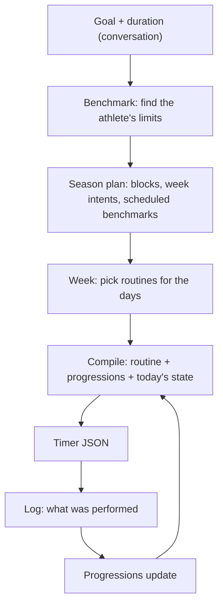

# Workouts: season plan, benchmark, compiled weeks

> Status: Current · Owner: Tech Lead · Verified: 2026-08-30

Replaces the template/session model with a season plan, a benchmark, and compiled weeks.
Two pages by request — deeper mechanics belong in a `-lld.md` if this grows again.

## 1. Context

Two of the four live athletes hit this in one week. One sees "a lot of random workouts" they never asked
for. On the BYO Claude path, Coach said it *could not* build an upper body workout because
"there is no template in this repo."

Both are one bug. `turnWrites/workoutWrite.ts` has exactly two write paths, `template_edit` and
`session_plan`, and both require an existing `template_id` gated by
`validTemplateIdsFromManifest`. There is no create path, so an athlete's workout set is frozen at
signup. Onboarding compensates by pre-selecting 4–6 library entries (`selectTemplates`), which is
where the random ones come from.

The deeper problem: "template" and "session" were one athlete's filenames, not a model. Nothing
ties a workout to a goal, and no number carries forward. `progression_notes` is free text no code
reads, while `progressions.json` — which already has `{ current, target, history[] }` — sits
empty.

## 2. The model



Three rules keep it from rotting.

**Weeks hold intent, not content.** A block says "volume, 4 days, upper emphasis, top sets at
RPE 8" — never a fixed exercise list twelve weeks out. Content pinned that far ahead is wrong by
week three; intent survives adjustment. Exercises change only at block boundaries. Most weeks move
doses, not movements.

**Every new athlete is benchmarked.** It is how `progressions.json` gets real numbers instead of
`inferLevel`'s guess from free text, and the plan schedules it again at season end so the delta is
measurable. It is limit-finding, not max-testing: a total beginner needs it as much as an athlete
with arthritis, and Coach varies the probe. `current: null` is a legitimate state meaning "not
yet".

**Only tracked exercises need identity.** A cool-down foam roll never progresses; a tuck hold
does. So the registry is the 10–15 movements an athlete actually tracks, and the progression id
*is* the exercise identity. Untracked exercises carry their numbers inline. This is the whole
reason no movement catalog is required.

## 3. Nouns — template and session are both retired

| Old | New | Why |
|---|---|---|
| `templates/<id>.json` | `routines/<id>.json` | the athlete's durable workout; edited rarely |
| `sessions/<date>_<id>.json` | `compiled/<date>_<id>.json` | disposable output, regenerable, never hand-edited |
| `current_week.json` | `week.json` | simpler; see §4 |
| — | `season_plan.json` | new; the only genuinely new storage |

"Session" is retired outright rather than reused, because it currently means both *a prescription*
and *a thing the athlete performed*. Performed work is an activity, and already lives in
`user_data/activities/`.

## 4. Storage

Athlete repo. Bands per ADR 0011; ledger data under `user_data/ledger/`.

```
user_data/ledger/
  seasons.json        exists — gains goal + duration on the active season
  season_plan.json    NEW — blocks, week intents, scheduled benchmarks
  week.json           REPLACES current_week.json
  progressions.json   exists, near-empty — baselines, benchmark history
user_data/activities/workout_plans/
  routines/<id>.json  REPLACES templates/
  compiled/<date>_<routine>.json  REPLACES sessions/
```

**`season_plan.json`** — small, athlete-visible, regenerable at a season boundary.

```json
{ "schema_version": 1, "season_id": "s3", "goal": "front lever", "start_date": "2026-09-01",
  "end_date": "2026-11-24",
  "blocks": [{ "name": "base", "weeks": [1,2,3,4], "days_per_week": 4,
               "emphasis": ["pull","core"], "intensity": "RPE 6-7", "intent": "..." }],
  "benchmarks": [{ "week": 1, "kind": "baseline" }, { "week": 12, "kind": "closing" }],
  "_meta": { "updated_at": "", "updated_by": "model", "trace_id": "" } }
```

Benchmarks are **scheduled by the plan**, not left to Coach remembering — otherwise the closing
one is skipped and the measurement story is lost.

**`week.json`** — `current_week.json` carries 8 fields this model does not need
(`data_status`, `coach_read`, `coach_comments`, `origin`, `discipline`, `kind`, `planned_load`,
`session_file`). `status`, `completion_activity_ids` and `original_date` **stay** — they are how
reconciliation works (§6), and `original_date` is exactly how a self-adjusted session is recorded. The replacement keeps only what
renders or drives behaviour:

```json
{ "schema_version": 1, "week_of": "2026-09-01", "plan_week": 3, "block": "base",
  "focus": "...", "guardrails": ["..."],
  "days": [{ "date": "2026-09-01", "routine_id": "upper_a", "priority": "anchor",
             "status": "planned", "status_source": "rules",
             "completion_activity_ids": [], "original_date": null }],
  "_meta": { "updated_at": "", "updated_by": "model", "trace_id": "" } }
```

`priority` is kept verbatim from today's schema — `anchor | support | optional` is exactly the
ranking a shortened week needs, and it already exists. `coach_read` and `coach_comments` are not
deleted, they **move** to the coach-message surface (ADR 0029); the UI reads them from there.

**Compiled files are disposable.** They are committed so the timer and iOS can read them offline,
but nothing treats them as truth: delete the directory and the next compile rebuilds it. They are
never hand-edited, and never the place a coaching decision is recorded.

## 6. Reconciling plan with reality

**Rules propose, Coach may override, invariants bound both.** The sync turn already runs a Coach
call, so using it costs nothing extra — but status drives the UI and the drift signal, so it
cannot be a free-text judgment either.

**Tier 1 — rules, in the backend.** Deterministic, tested, and correct even when the model is
down:

| Situation | Result |
|---|---|
| Activity on a planned day, type matches the routine | `done`, `completion_activity_ids` appended |
| Planned day passes with no matching activity | `missed` — not `skipped`; skipping is a decision, missing is an outcome |
| Activity with no planned match | attached to the day as unplanned |
| Two plausible candidates, or an activity a day either side | left `planned` and flagged for tier 2 |

**Tier 2 — Coach, on the same sync turn it already runs.** It receives the reconciled week plus
the flagged cases and may do three things: resolve a flag, override a status with a reason, or
record a **self-adjustment**. That last one is why Coach belongs here at all. An athlete who moves
Tuesday's upper day to Thursday and says nothing produces two wrong facts under rules alone — a
missed anchor and an unplanned session — when the truth is one moved session. Coach sets
`original_date` and the day reads as done. Recognising a moved or substituted session as the same
intent is pattern-matching over intent, and no rule table will do it.

**Tier 3 — invariants, on both.** Coach cannot mark a day `done` without referencing a real synced
activity id, so a completion can never be hallucinated (§9, invariant 6). Every status carries
`status_source: "rules" | "coach"`, which makes disagreement auditable: if Coach overrides often
and is right, the rules are wrong and should be improved; if it overrides often and is wrong, that
is a prompt bug we can see. If the model errors or times out, the tier-1 result stands and the
sync still completes.

`week.json` is therefore updated **on sync**, not on a schedule and not by the timer.

**Week rollover is where plan meets reality.** At the week boundary the next week compiles from
block intent *plus what actually happened* — missed anchors inform the next week rather than
silently rolling over. Two consecutive weeks under target is the drift signal that opens a
re-planning conversation (§12). Nothing is auto-rewritten.

## 7. What the Workouts page shows

One page, five states. Every state must be reachable in a test.

| State | Shows |
|---|---|
| Planned day, compiled | The day's workout: title, phases, duration, priority, Coach's note, start-timer CTA |
| Planned day, already done | Same card marked done, linked to the matched activity |
| Rest day | "Rest" plus the next session and its date — never an empty page |
| Unplanned activity logged | The activity as a completed card, no routine attached |
| No plan yet (new athlete) | The benchmark, as the single call to action |
| Compile failed | Last good compiled file plus a quiet notice; never a partial workout |

**The athlete's routines are always on the page**, below the day — their full set, readable in
detail. Three reasons it cannot live behind a chat turn: they want to train ad-hoc on an
unplanned day, they want to look up what a routine actually contains, and they want to show it to
someone (a physio, a training partner). Starting a routine ad-hoc compiles it on demand for
today, exactly as a planned day would.

The "lot of random workouts" report is a rendering symptom of the storage bug: today the page
lists every template the athlete owns, with no notion of *today*. The new page is day-first — the
athlete's own routines stay reachable, but behind the day.

## 8. How Coach's behaviour changes

Coach behaviour lives in two places and both change per PR: the soul layer
(`platform/soul/B_engine.md`, composed into both builds) and the API's action-field surface
(`coachReplySchema.ts`, `coachPromptText.ts`). Every soul edit needs a compose run and a
`SOUL_HISTORY.md` entry per `AGENTS.md` § Doc upkeep.

| PR | Soul change | Action-field change |
|---|---|---|
| 1 | Retire "Persisting Session Files" §; Coach emits an exercise list, never timer physics | new `workout_create` |
| 2 | First Session Protocol closes with a benchmark, not a template hand-out; limit-finding, not max-testing | benchmark write seeds `progressions.json` |
| 3 | Coach may create a routine when none fits — the line whose absence caused bug 2 | — (BYO path) |
| 4 | New §: season planning conversation — goal, duration, blocks, scheduled benchmarks | new `season_plan` |
| 5 | Weekly Kick-off Ritual rewritten: pick routines for days from block intent | `week_plan` reshaped |
| 8 | Every `templates/` and `sessions/` path reference updated | — |

`validate-soul.mjs` checks soul path references against the carve on every PR, so a missed
rename fails CI rather than reaching an athlete.

## 5. Rendering — UI and widgets

Both new files must reach the dashboard the same way everything else does.

1. `engine/scripts/build-dashboard-snapshot.mjs` reads `season_plan.json` and `week.json` into
   `gen/dashboard_snapshot.json` under new `season_plan` / `week` keys, replacing the `workouts`
   key's `{templates, sessions}` shape with `{routines, compiled}`. Bump `SCHEMA_VERSION` and
   `SUPPORTED_SCHEMA_VERSION` in `ui/client/src/hooks/useRepoData.ts` together.
2. Keep both payloads scalar and small per ADR 0020 — the season plan is intent text and small
   arrays, so it projects cleanly.
3. Widgets follow ADR 0005: the TS model in `ui/client/src/components/home-warm/` is the source of
   truth, `ui/scripts/generate-widget-snapshots.ts` emits `gen/widget_snapshots.json`, and
   `ui/scripts/build-data.mjs` copies it to `ios/CoachHQ/CoachHQ/Resources/`. Two snapshot entries
   earn their place: **season progress** (week N of M, block, next benchmark) and **this week**
   (days, priority, done/planned).
4. `shared/golden-dataset/` needs fixtures for both files or local `npm run dev` renders empty.

## 9. The contract

> **Coach supplies judgment as typed values. Code enforces invariants.**

Not "code computes the answer" — that framing is what drags this design toward a movement catalog
and a percentage-of-max rules engine, and neither earns its cost. Determinism comes from enforced
invariants:

| # | Invariant | Enforced in |
|---|---|---|
| 1 | A `progression_id` on an exercise exists in `progressions.json`. Coach references, never invents | write path |
| 2 | A starting dose never exceeds the benchmarked max | write path |
| 3 | A progression bumps at most once per week, and not within N days of its last bump | write path |
| 4 | Timer physics (`num`, `prep_secs`, rest values, phase durations) are filled by the compiler, never the model | compiler |
| 5 | Every compiled file passes `validateWorkout` before commit | compiler |
| 6 | A day marked `done` references at least one real synced activity id — Coach cannot invent a completion | reconciler |

Each invariant gets a test that fails when it is violated. That is the whole reason this is
cheaper than the alternatives.

**Where compile runs:** server-side in `ui/api/coach-chat/`, on the turn that changes something.
BYO Claude runs the same module via a thin Node CLI, so there is one compiler, not two.

**When compile fails:** the athlete keeps the last good compiled file, and Coach is told why in
the turn. The timer never renders a partially-built workout.

## 10. Execution

Milestones are the outcome layer; each has one exit test. `final base` gives merge order.

| PR | milestone | outcome | final base | files | owner | parallel with | done when |
|---|---|---|---|---|---|---|---|
| 1 | M1 unblock | compiler + `workout_create`: Coach emits a minimal exercise list, code fills timer physics | main | `ui/api/coach-chat/_lib/` (new compiler, reply schema, `turnWrites/`) | UI Expert | — | a chat request writes a schema-valid routine |
| 2 | M1 unblock | benchmark replaces library selection at first-session close; seeds `progressions.json` | PR 1 | `coachWorkoutFiles.ts`, `coachTurn.ts` | UI Expert | PR 3 | a fresh athlete gets a benchmark, not 6 workouts |
| 3 | M1 unblock | BYO Claude unblocked: carve the routines the soul names, allow Coach to write new ones | main | `platform/scripts/carve-skeleton.mjs`, `platform/soul/B_engine.md`, composed builds | Tech Lead | PR 2 | `validate-soul.mjs` clean on the two baselined template findings |
| 4 | M2 plan | `season_plan.json` + write path + season-boundary generation | PR 2 | `ui/api/coach-chat/_lib/`, `platform/scripts/carve-skeleton.mjs` | UI Expert | — | a goal conversation writes a plan with scheduled benchmarks |
| 5 | M2 plan | `week.json` replaces `current_week.json`; two-tier reconciler: rules in code, Coach override on the sync turn; `coach_read` moves to the message surface | PR 4 | `engine/lib/current-week.mts`, `engine/scripts/validate-current-week`, `coachWeekFiles.ts`, `activitySyncTurn.ts` | Bob | — | week compiles from plan intent; every tier-1 row in §6 covered by tests; a Coach override is recorded with `status_source`; validator green |
| 6 | M3 render | dashboard snapshot keys + day-first Workouts page with the routine library and ad-hoc start | PR 5 | `engine/scripts/build-dashboard-snapshot.mjs`, `ui/client/src/`, `shared/golden-dataset/` | UI Expert | PR 7 | all six page states in §7 render from real repo data |
| 7 | M3 render | widget snapshots + iOS decode; `BundledTemplates.swift` becomes a cache | PR 5 | `ui/scripts/generate-widget-snapshots.ts`, `ios/CoachHQ/` | iOS Builder | PR 6 | `ios-build.yml` green; widget shows week N of M |
| 8 | M4 cleanup | delete the library and the old nouns; supersede the ADR | PR 7 | `shared/workout-library/`, `platform/skeleton-templates/`, `engine/lib/repo-layout.mjs`, `kdb/decisions/` | Tech Lead | — | no reference to `templates/` or `sessions/` remains; ADR merged |

**Migration for the four live athletes** rides in PR 8: one idempotent script, run per repo,
renaming `templates/` → `routines/`, dropping `sessions/`, and rewriting `current_week.json` to
`week.json`. Progressions are seeded from each athlete's next benchmark, never backfilled with
guesses. Nobody loses a workout. The script opens **a PR per athlete repo** rather than pushing to
`main` — four diffs to read before anything lands in someone's training data — and ships with a
dry-run mode.

## 11. Done when

- An athlete asks for an upper body workout in chat and gets one. (Bug 2)
- A new athlete's first screen shows a benchmark, not six guessed workouts. (Bug 1)
- `progressions.json` in a live repo holds benchmarked values with dated history.
- Changing a progression changes the next compile with no edit to any routine file.
- The season plan and the current week both render on web and in a widget.
- Every invariant in §9 has a failing-when-violated test.
- All four live repos keep working throughout, BYO Claude included.

## 12. Open and deferred

- **Plan drift:** code detects (adherence, stalled progressions), Coach opens the conversation —
  never an automatic rewrite. Tone rule lives in the soul layer, not code.
- **Mid-season re-check** for seasons long enough that week-one numbers go stale.
- **Movement catalog** with contraindication tags — only if substitution ("a different exercise
  for the same thing") proves necessary. Drop-and-scale may well be enough, and §2's identity rule
  is what lets us defer this safely.
- **Unattended compile:** athlete opens the timer having said nothing, and gets the planned week
  unchanged. No adjustment without a conversation.
- **Retention:** a closed season's plan moves to `user_data/coach/archive/seasons/` per
  `engine/lib/repo-layout.mjs`'s existing `seasonsDir`.
- **Old-layout branches** in `repo-layout.mjs` (`training/…`) are untouched here; fold them into
  PR 8 only if a live repo still needs them.
