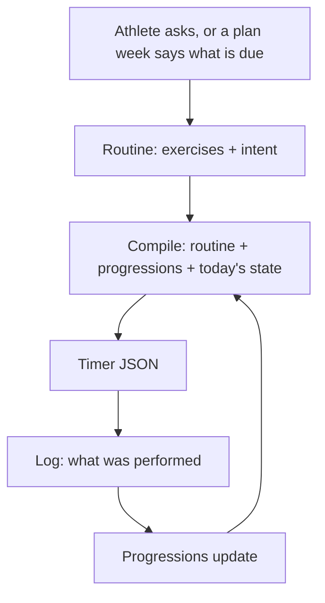

# Workouts: compile from a routine, plan a season

> Status: Current · Owner: Tech Lead · Verified: 2026-08-31

Two stacks. **A** is a hotfix that kills both live bug reports in days. **B** is periodization,
and it is gated on evidence we do not have yet. Do not start B before the gate in §12.

## 1. Context

Two of the four live athletes hit this in one week. One sees "a lot of random workouts" they never
asked for. On the BYO Claude path, Coach said it *could not* build an upper body workout because
"there is no template in this repo."

Both are one bug. `turnWrites/workoutWrite.ts` has two write paths, `template_edit` and
`session_plan`; both require an existing `template_id` gated by `validTemplateIdsFromManifest`.
There is no create path, so an athlete's workout set is frozen at signup, and onboarding
compensates by pre-selecting 4–6 library entries (`selectTemplates`). That is where the random
ones come from.

Worse, `responsePropertiesFor` (`coachReplySchema.ts`) gives an ordinary non-first-session turn
**no action fields at all**. Even with a create path, "ask in chat and get a workout" needs the
turn to be a closing one. Both facts have to change together.

## 2. The model



**Coach writes exercises, code writes timer physics.** Coach emits a name, sets, reps or duration,
a form cue and a why. The compiler fills `num`, `prep_secs`, rest values and phase durations. We
currently ask a language model to be a compiler, in prose, in `B_engine.md`.

**Only tracked exercises need identity.** A cool-down foam roll never progresses; a tuck hold
does. The registry is the 10–15 movements an athlete actually tracks, and the **progression id is
the exercise identity**. Untracked exercises carry their numbers inline. This is the whole reason
no movement catalog is needed.

**The benchmark is a conversation first.** Coach asks what the athlete can already do — "I do
pull-ups, six to eight" — and sets the entry level from the answer. The session then *confirms*
rather than discovers, showing one easier and one harder option per movement so a wrong guess
costs nothing. "Can't do this pain-free" is a legitimate result: `current: null`. A beginner and
an athlete with arthritis need the same mechanism, not two.

## 3. Nouns

`session` is retired: it means both *a prescription* and *a thing performed*, and performed work
already lives in `user_data/activities/`. `template` becomes `routine`, because the thing changed
meaning — it is now compiled from, not copied.

**`current_week.json` keeps its name, path, and fields.** Renaming it costs soul, carve, iOS,
validators and the snapshot, and buys nothing. No field is dropped in this stack (§4).

## 4. Storage

```
user_data/ledger/
  seasons.json        gains goal, duration and (Stack B) blocks — NOT a second season file
  current_week.json   same path, same fields
  progressions.json   exists — baselines and history (filled for some athletes, empty for others)
  plugins.json        exists — the per-repo enablement flag (§11)
user_data/activities/workout_plans/
  templates/          → routines/   (renamed LAST, dual-read first — §11)
  sessions/           → compiled/   (same)
```

**Blocks extend `seasons.json`.** `platform/soul/B_engine.md:36` says "a season has a name, start,
end, and status — no phase or block underneath it", so adding blocks is a soul change either way.
A second file named `season_plan.json` would be a second season object with the same name — worse.
Superseding that soul line is part of Stack B, stated out loud.

**`current_week.json` is not slimmed.** Out of scope. Four drop proposals were each wrong
against a real repo.

- `completion_activity_ids` — reconciliation
- `original_date` — self-adjustment
- `timezone` — `current-week.mts:554` decides "today"
- `discipline`, `kind`, `title`, `planned_duration_min`, `data_status` — null-template days
  and `getAvailability()`

A field is dropped only after someone has read every consumer. Nobody has.

**Compiled files are disposable.** Committed so the timer and iOS read them offline, never treated
as truth, never hand-edited. Delete the directory and the next compile rebuilds it.

## 5. Reconciliation

**Rules always. Coach only on a flagged row.** Putting a week-override into every sync grows every
sync prompt for a case that is rare.

| Situation | Result |
|---|---|
| Activity on a planned day, type matches | `done`, `completion_activity_ids` appended |
| Planned day passes, no matching activity | `missed` — not `skipped`; skipping is a decision |
| Activity with no planned match | attached to the day as unplanned |
| Two candidates, or an activity a day either side | `planned` + flagged → Coach |

Coach sees only the flagged rows. The case that earns it is self-adjustment. An athlete who
moves Tuesday to Thursday without saying so reads as a missed anchor plus an orphan. The truth
is one moved session. Coach sets `original_date`. The `session_reconcile` action already exists
in `RETURNING_CLOSE_ACTIONS`.

**Who writes progressions (ADR 0023).** The reconciler, on a matched completion — not Coach
noticing. Coach may *propose* a level change; code applies and rate-limits it. A signal nothing but
Coach maintains is a signal that rots.

## 6. What the Workouts page shows

Three bands. Same on web (A5) and iOS (A5-ios). Today's schemas only — `current_week.json`,
`templates/`, `sessions/`, hist on the snapshot. No new storage.

1. **Today** — the only timer CTA. Session file if one exists, else the routine. A
   `template_id: null` day (badminton, hike, ladder) is a line — title + duration — not a card
   and not "Rest." No live plan → one line, "No plan this week," no hero.
2. **This week** — a `SessionRow`-style list (date · sport tick · title), not Home's
   `WeeklyPlanCard` (that widget is the Coach draft; do not backfill it from HealthKit). For each
   day: `current_week` row if live, else a hist activity that day, else blank. Blank is unplanned,
   not Rest. Hide the band only when there is no live plan *and* nothing logged this week.
3. **Library** — always below, the existing grouped list. Ad-hoc / physio. Links to `/workouts/:id`
   as today; compile-on-demand is not in A5.

A pure selector, not a state machine. Week-level is `live` vs `none`; today is which row is today.

## 7. The contract

> **Coach supplies judgment as typed values. Code enforces invariants.**

| # | Invariant | Enforced in |
|---|---|---|
| 1 | A `progression_id` exists in `progressions.json` — Coach references, never invents | write path |
| 2 | A starting dose never exceeds the benchmarked value | write path |
| 3 | A progression bumps at most once per week | write path |
| 4 | Timer physics are filled by the compiler, never the model | compiler |
| 5 | Every compiled file passes `validateWorkout` before commit | compiler |
| 6 | A day marked `done` references a real synced activity id | reconciler |
| 7 | Every active injury flag is addressed in the spec's `injury_ack` before a routine is written | write path |

Invariant 7 is a **regression guard**: `selectTemplates` filters on active flags today
(`conflictsWithActiveInjuries`), and removing it without a replacement would let an athlete with a
shoulder flag receive a pulling day. A generated routine carries no library tags, so the check
cannot be ported as-is. Instead the spec carries `injury_ack` — one entry per active flag, saying
how this routine accommodates it — and the write path refuses a routine that leaves any active
flag unaddressed. Code cannot judge whether a routine is safe; it can refuse one where Coach did
not consider each flag, and that is auditable afterwards.

**The compiler lives in `engine/`, not `ui/api/`.** `scaling-plan.md` §2.2 already names the
server coach as "a *second* engine" re-encoding Layer B in TS. A compiler in the Vercel folder
repeats exactly that. `ui/api` reaches it the way it already reaches `engine/lib/current-week.mts`
— a `.bundle.d.ts` shim, not a raw relative import across the Vercel root. BYO calls a CLI
wrapper. One module, two thin hosts.

## 8. Stack A — hotfix (days)

Kills both bug reports. HQ PRs add no new files to athlete repos; A6 is a follow-up PR on the BYO repo.

**A5 / A5-ios are what the four live athletes see.** They start with A1 (disjoint files). A3 is
P1-next — no live athlete is blocked on FSP. A4 bases on A2; A6 is a PR against the BYO athlete
repo, not HQ.

| PR | outcome | base | files | owner | done when |
|---|---|---|---|---|---|
| A5 | Three-band Workouts page (§6) | main | `ui/client/` | UI Expert | today + this week + library render from a live repo; no-plan hides the week unless hist has work |
| A5-ios | Same three bands on iOS | main | `ios/` | iOS Builder | `ios-build.yml` green; `WorkoutListView` reads `current_week.json` |
| A1 | `compileWorkout()` in `engine/` | main | `engine/lib/`, `engine/scripts/`, `ui/vitest.config.ts`, `.github/workflows/ui-tests.yml` | Bob | golden-fixture byte-identical; dry-run diffs across the four repos explainable |
| A2 | `workout_create` on ordinary turns, **own `commitFilesAtomic`** | A1 | `ui/api/coach-chat/`, bundle shim | Bob | a returning athlete's mid-conversation ask writes a schema-valid routine |
| A4 | Soul + carve the compiler CLI | A2 | `platform/soul/`, `platform/`, `engine/scripts/` | Tech Lead | `validate-soul.mjs` clean; freshly carved repo can create a routine |
| A6 | Recomposed SOUL + CLI into the BYO athlete repo | A4 | that athlete's repo | Tech Lead | that athlete asks for an upper body workout and gets one |
| A3 | FSP benchmark instead of library dump | A2 | (P1-next, not today) | Bob | a fresh athlete gets a benchmark, not six workouts |

**Commit rule — `workout_create` gets its own `commitFilesAtomic`.** Same pattern as
`generateTemplatesAfterCompletion` (`coachTurn.ts:573`). Do **not** append to
`commitOrdinaryTurn`'s `writes` — that array is `fspIncrementalWrites` and is `[]` once
`wasProfileComplete` is true, which is every live athlete. Following the LLD's old "append"
sentence would make A2 a silent no-op in production. HLD and LLD both say: own commit, message
`coach: workout created`.

**Paid gate (ADR 0024):** `npm run eval:coach-chat` once after A4, not per PR. A2 touches prompt
and schema. A1 / A5 / A5-ios / A6 skip it.

**Deliberately not in A:** blocks, week compile, the path rename, widgets, moving `coach_read`.
None of them fix "Coach can't create an upper body workout."

## 9. Stack B — periodization (after the gate)

| PR | outcome | base | owner | done when |
|---|---|---|---|---|
| B1 | goal + duration + blocks extend `seasons.json` | A4 | Bob (soul line → Tech Lead) | a goal conversation writes blocks and scheduled benchmarks |
| B2 | week compiles from block intent; `season_start` path for returning athletes. **Do not slim `current_week.json`** | B1 | Bob | kick-off compiles a full week; `session_plan`'s today-only stamp lifted |
| B3 | deterministic reconciler + progression writes on completion | B2 | Bob | every row of §5 covered by tests |
| B4 | **non-chat compile trigger** — week-boundary roll, owned by the sync workflow | B3 | Bob | a quiet Monday still has a compiled week; the timer is never empty |
| B5 | dual-read `templates/`+`routines/` and `sessions/`+`compiled/`; iOS reads both | B4 | iOS Builder | `ios-build.yml` green; old and new paths both serve the timer |
| B6 | rename in athlete repos; delete old paths only after B5 has shipped to devices | B5 | Tech Lead | four repos migrated; no path reference left |

B4 is not optional. Compiling "on the turn that changes something" means an athlete who does not
chat on Sunday opens an empty timer on Monday. `ios-build.yml` and `ui-tests.yml` are the CI
evidence for B5.

## 10. Rolling out to athlete repos

Four athletes, full repo access. That is enough to **verify directly**, so the discipline here is
evidence rather than gating — a flag tells you when to look, a dry-run tells you whether it is
right.

**Stack A ships unflagged, because nothing in it changes what a live athlete sees.** A1 is a pure
function nothing calls. A2 is a new capability, purely additive. A3 changes first-session
onboarding, and all four athletes are past FSP. A4 only reaches a repo on re-carve. Wrapping any
of this in a flag would buy nothing and cost a branch in the test matrix.

**Verify against the real four before each merge.** With full access this beats any staged
rollout:

1. **Dry-run the compiler across all four repos** — every existing workout in, timer JSON out,
   diffed against what the athlete has today. A1 does not merge until that diff is explainable
   line by line.
2. **Replay a real week.** Take one athlete's last kick-off, sync and missed day, run them through
   the new path offline, and check the result against what actually happened.
3. **Then merge**, and read Sentry (ADR 0032) the same day. First check is that compile failures
   are zero.

**The flag earns its place in three Stack B spots**, where an existing athlete's behaviour
changes. B2 generates their week. B4 writes without them asking. B6 moves paths under a running
app. There, `plugins.json` + `isPluginEnabled` gates it. Enablement is a **one-line PR per
repo**. Rollback is a single revert — the repo *is* the datastore, so nothing partial survives.

**Data moves in three steps, never one — and this applies to fields, not just folders.**
Dual-read → write new → delete old.

- *Folders* (B5/B6): `WorkoutService.swift:46,90` lists `templates/` and `sessions/` by path, so a
  mid-stack rename takes the timer away from four live athletes. The iOS release ships between
  steps two and three.
- *Fields:* no field is dropped in this stack (§4). If a later PR ever drops one, readers tolerate
  the absence *before* the writer stops emitting it.

**`SCHEMA_VERSION` is a flag day.** `build-dashboard-snapshot.mjs` and `useRepoData.ts` bump
together, and old app builds strand when it moves. Do it in B5 alongside the iOS release, never in
Stack A.

**Athlete-repo `validate-data.yml`** is JSON-parse-only today. Any new contract needs a real check
there, or Gemini writes garbage and the workflow commits it.

## 11. Done when

- An athlete asks mid-conversation for an upper body workout and gets one, committed on that turn. (Bug 2)
- The Workouts page (web and iOS) shows today + this week + library, not a dump of every template. (Bug 1 — A5 / A5-ios)
- A new athlete's first screen is a benchmark, not six guessed workouts. (Bug 1, for the next athlete — A3)
- Changing a progression changes the next compile with no edit to any routine file.
- An athlete with an active injury flag is never offered a routine that conflicts with it.
- A quiet Sunday still produces a compiled Monday. (B4)
- Every invariant in §7 has a test that fails when it is violated.
- All four live repos keep working throughout, BYO included.

## 12. The gate, and what is deferred

**Stack B stays on paper, and not because of the churn claim.** An investigating agent reported
that routines churn week to week while the *slot* (A day, B day, sport day) persists — which
would make B1–B3's "immutable routine with dose knobs" the wrong shape. **That finding is
unverified.** Nobody here has audited it, and the operator's own experience is the opposite: the
workout holds for weeks and the numbers move. Do not restructure B around it.

B waits for the plainer reason: nothing in it is needed for either live bug, and its first PR
should not be designed on an open question. Settle churn-vs-stable against the four repos *with
the evidence written down* before B1 is scoped.

Deferred: widgets and the `coach_read` move to ADR 0029 (a separate product, cut from both
stacks) · mid-season re-check · plan drift detection, where code detects and Coach opens the
conversation, never an automatic rewrite · a movement catalog with contraindication tags, only if
substitution proves necessary · benchmark ladders as content, only if Coach's reasoning proves
too loose · a superseding ADR for the template/session model, in B6.
