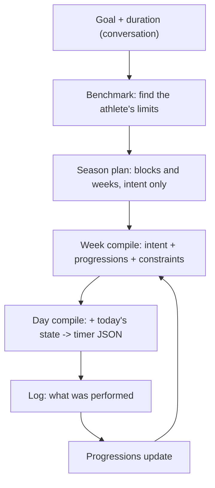

# Workouts: season plan, benchmark, compiled weeks

> Status: Current · Owner: Tech Lead · Verified: 2026-08-30

## Context

Two live athletes hit this in one week. One sees "a lot of random workouts" they never asked
for. On the BYO Claude path, Coach said it *could not* build an upper body workout because
"there is no template in this repo."

Both are the same bug. `turnWrites/workoutWrite.ts` has exactly two write paths, `template_edit`
and `session_plan`, and both require an existing `template_id` gated by
`validTemplateIdsFromManifest`. There is no create path, so an athlete's workout set is frozen at
signup. Onboarding compensates by grabbing 4–6 library entries up front (`selectTemplates`), which
is where the random ones come from.

The deeper problem is that "template" and "session" were one athlete's filenames, not a model.
Nothing connects a workout to a goal, and nothing carries a number forward: `progression_notes`
is free text that no code reads, while `progressions.json` — which already has
`{ current, target, history[] }` — sits nearly empty.

## The model

The loop closes — that is what today's system lacks. Two rules keep it from rotting:

**Weeks hold intent, not content.** A week says "volume block, 4 days, upper emphasis, top sets
at RPE 8", never a fixed exercise list. Content that is pinned twelve weeks out is wrong by week
three; intent survives adjustment. Exercises change only at block boundaries — most weeks move
doses, not movements.

**Every new athlete is benchmarked.** It is how `progressions.json` gets real starting numbers
instead of `inferLevel`'s guess from free text, and it is scheduled again at season end so the
delta is measurable. It is limit-finding, not max-testing: a total beginner needs it as much as
an athlete with arthritis, and Coach varies the probe. `current: null` is a legitimate state
meaning "not yet".

## Where the data lives

Most of this exists already and is merely disconnected.

| Thing | Home | Change |
|---|---|---|
| Goal + duration | `user_data/ledger/seasons.json` | two fields |
| Season plan (blocks, week intents) | **new file** | the only new storage |
| Baselines and current doses | `user_data/ledger/progressions.json` | populate; it is near-empty today |
| Benchmark result | `progressions.json`, first `history[]` entry | no new file |
| This week's workouts | `user_data/ledger/current_week.json` | becomes derived, not authored |
| Timer JSON | compiled artifact | not committed as truth |
| Constraints | `user_data/coach/injuries.json` + daily state | unchanged |

## The contract

> **Coach supplies judgment as typed values. Code enforces invariants.**

Not "code computes the answer" — that framing is what pushes this design toward a movement
catalog and a percentage-of-max rules engine, and neither earns its cost. Determinism comes from
enforced invariants:

1. A `progression_id` on an exercise must already exist in `progressions.json`. Coach references,
   never invents. Same shape of check the code already applies to template ids.
2. A starting dose may not exceed the benchmarked max.
3. A progression bumps at most once per week, and not within N days of its last bump.
4. Timer physics — `num`, `prep_secs`, rest values, phase durations — are filled by the compiler,
   never by the model.

**Only tracked exercises need identity.** A cool-down foam roll never progresses; a tuck hold
does. So the registry covers the 10–15 movements an athlete is actually tracking, and the
progression id *is* the exercise identity. Untracked exercises carry their numbers inline. This
is the whole reason no catalog is required.

## What this deletes

`shared/workout-library/` (18 templates + `index.json`), `selectTemplates`,
`adjustTemplatesWithGemini`, `templates/_manifest.json`, `platform/skeleton-templates/`, and both
the words *template* and *session*. The first PR should be net-negative.

## Done when

- An athlete asks for an upper body workout in chat and gets one. (Bug 2)
- A new athlete's first screen shows a benchmark, not six guessed workouts. (Bug 1)
- `progressions.json` in a live repo holds real benchmarked values with dated history.
- A workout's doses come from `progressions.json`; changing a progression changes the next
  compile with no edit to any workout file.
- Each invariant above has a test that fails when it is violated.
- The BYO Claude path still works for the athlete on it today.

## First slice

Smallest change that kills both reports. Not yet a full PR stack — the season plan and week
compile are scoped after this lands.

| PR | outcome | files | done when |
|---|---|---|---|
| 1 | Coach can create a workout from a minimal exercise list; compiler fills timer physics | `ui/api/coach-chat/_lib/` (new compiler + reply schema + write path) | a chat request for a new workout writes a schema-valid workout |
| 2 | Benchmark replaces library selection at first-session close; seeds `progressions.json` | `coachWorkoutFiles.ts`, `coachTurn.ts`, delete `shared/workout-library/` | a fresh athlete gets a benchmark and populated progressions |
| 3 | BYO Claude unblocked: carve the templates the soul names, allow Coach to write new ones | `platform/scripts/carve-skeleton.mjs`, `platform/soul/B_engine.md` | `node platform/scripts/validate-soul.mjs` clean on the two baselined template findings |

## Deferred

- **Busy-week adjustment** needs no priority ranking in the data: chat is the only trigger, so
  Coach decides what to drop and passes it into the compile. Unattended (athlete opens the timer
  having said nothing) returns the planned week unchanged — no adjustment without a conversation.
- **Plan drift:** code detects (adherence, stalled progressions), Coach opens the conversation.
  Never an automatic rewrite. The tone rule lives in the soul layer, not in code.
- **Mid-season re-check** for seasons long enough that week-one numbers go stale.
- **Movement catalog** with contraindication tags — only if substitution ("give me a different
  exercise for the same thing") turns out to be needed. Drop-and-scale may well be enough.
- A superseding ADR for the template/session model, written when the first slice lands.
