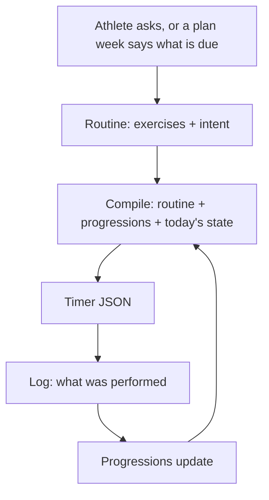

# Workouts: compile from a routine, plan a season

> Status: Current · Owner: Tech Lead · Verified: 2026-08-30

Two stacks. **A** is a hotfix that kills both live bug reports in days. **B** is periodization,
and it is gated on evidence we do not have yet. Do not start B before the gate in §13.

## 1. Context

Two of the four live athletes hit this in one week. One sees "a lot of random workouts" they never
asked for. On the BYO Claude path, Coach said it *could not* build an upper body workout because
"there is no template in this repo."

Both are one bug. `turnWrites/workoutWrite.ts` has two write paths, `template_edit` and
`session_plan`; both require an existing `template_id` gated by `validTemplateIdsFromManifest`.
There is no create path, so an athlete's workout set is frozen at signup, and onboarding
compensates by pre-selecting 4–6 library entries (`selectTemplates`). That is where the random
ones come from.

Worse, `responsePropertiesFor` (`coachReplySchema.ts`) gives an ordinary non-first-session turn
**no action fields at all**. Even with a create path, "ask in chat and get a workout" needs the
turn to be a closing one. Both facts have to change together.

## 2. The model



**Coach writes exercises, code writes timer physics.** Coach emits a name, sets, reps or duration,
a form cue and a why. The compiler fills `num`, `prep_secs`, rest values and phase durations. We
currently ask a language model to be a compiler, in prose, in `B_engine.md`.

**Only tracked exercises need identity.** A cool-down foam roll never progresses; a tuck hold
does. The registry is the 10–15 movements an athlete actually tracks, and the **progression id is
the exercise identity**. Untracked exercises carry their numbers inline. This is the whole reason
no movement catalog is needed.

**The benchmark is a conversation first.** Coach asks what the athlete can already do — "I do
pull-ups, six to eight" — and sets the entry level from the answer. The session then *confirms*
rather than discovers, showing one easier and one harder option per movement so a wrong guess
costs nothing. "Can't do this pain-free" is a legitimate result: `current: null`. A beginner and
an athlete with arthritis need the same mechanism, not two.

## 3. Nouns

`session` is retired: it means both *a prescription* and *a thing performed*, and performed work
already lives in `user_data/activities/`. `template` becomes `routine`, because the thing changed
meaning — it is now compiled from, not copied.

**`current_week.json` keeps its name and path.** It is the same object, slimmer. Renaming it costs
soul, carve, iOS, validators and the snapshot for eight unused fields, and buys nothing.

## 4. Storage

```
user_data/ledger/
  seasons.json        gains goal, duration and (Stack B) blocks — NOT a second season file
  current_week.json   same path, slimmer schema
  progressions.json   exists, near-empty — baselines and history
  plugins.json        exists — the per-repo enablement flag (§11)
user_data/activities/workout_plans/
  templates/          → routines/   (renamed LAST, dual-read first — §11)
  sessions/           → compiled/   (same)
```

**Blocks extend `seasons.json`.** `platform/soul/B_engine.md:36` says "a season has a name, start,
end, and status — no phase or block underneath it", so adding blocks is a soul change either way.
A second file named `season_plan.json` would be a second season object with the same name — worse.
Superseding that soul line is part of Stack B, stated out loud.

**`current_week.json` slimming.** Drop `data_status`, `coach_read`, `coach_comments`, `origin`,
`discipline`, `kind`, `planned_load`, `session_file`. **Keep `timezone`** — `current-week.mts:554`
uses `formatDateInTimeZone(now, data.timezone)` to decide what "today" is, and without it every
athlete outside UTC gets the wrong day. Keep `status`, `priority`, `completion_activity_ids` and
`original_date`: they are how reconciliation works (§6).

**Compiled files are disposable.** Committed so the timer and iOS read them offline, never treated
as truth, never hand-edited. Delete the directory and the next compile rebuilds it.

## 5. Reconciliation

**Rules always. Coach only on a flagged row.** Putting a week-override into every sync grows every
sync prompt for a case that is rare.

| Situation | Result |
|---|---|
| Activity on a planned day, type matches | `done`, `completion_activity_ids` appended |
| Planned day passes, no matching activity | `missed` — not `skipped`; skipping is a decision |
| Activity with no planned match | attached to the day as unplanned |
| Two candidates, or an activity a day either side | `planned` + flagged → Coach |

Coach sees only the flagged rows, and the case that earns it is self-adjustment: an athlete who
moves Tuesday's session to Thursday without saying so reads as a missed anchor plus an orphan under
rules alone, when the truth is one moved session. Coach sets `original_date`. The
`session_reconcile` action already exists in `RETURNING_CLOSE_ACTIONS`.

**Who writes progressions (ADR 0023).** The reconciler, on a matched completion — not Coach
noticing. Coach may *propose* a level change; code applies and rate-limits it. A signal nothing but
Coach maintains is a signal that rots.

## 6. What the Workouts page shows

Six states, each reachable in a test.

| State | Shows |
|---|---|
| Planned day, compiled | The workout: phases, duration, priority, Coach's note, start CTA |
| Planned day, done | Same card marked done, linked to the matched activity |
| Rest day | "Rest", plus the next session and its date — never an empty page |
| Unplanned activity | The activity as a completed card, no routine attached |
| No plan yet | The benchmark, as the single call to action |
| Compile failed | Last good compiled file plus a quiet notice; never a partial workout |

**The athlete's routines are always on the page**, below the day. They want to train ad-hoc, look
up what a routine contains, and show it to a physio. Ad-hoc start compiles on demand.

## 7. The contract

> **Coach supplies judgment as typed values. Code enforces invariants.**

| # | Invariant | Enforced in |
|---|---|---|
| 1 | A `progression_id` exists in `progressions.json` — Coach references, never invents | write path |
| 2 | A starting dose never exceeds the benchmarked value | write path |
| 3 | A progression bumps at most once per week | write path |
| 4 | Timer physics are filled by the compiler, never the model | compiler |
| 5 | Every compiled file passes `validateWorkout` before commit | compiler |
| 6 | A day marked `done` references a real synced activity id | reconciler |
| 7 | A routine is checked against active injury flags before it is offered | write path |

Invariant 7 is a **regression guard**: `selectTemplates` filters on active flags today
(`conflictsWithActiveInjuries`), and removing it without a replacement would let an athlete with a
shoulder flag receive a pulling day. It survives the library.

**The compiler lives in `engine/`, not `ui/api/`.** `scaling-plan.md` §2.2 already names the
server coach as "a *second* engine" re-encoding Layer B in TS. A compiler in the Vercel folder
repeats exactly that. One module in `engine/`, two thin hosts: coach-chat imports it, BYO calls a
CLI wrapper.

## 8. Stack A — hotfix (days)

Kills both bug reports. Touches no athlete-repo paths, adds no new files to their repos.

| PR | outcome | base | files | owner | done when | trust it buys |
|---|---|---|---|---|---|---|
| A1 | `compileWorkout()` in `engine/` — minimal exercise list in, timer JSON out | main | `engine/lib/`, tests | Bob | golden-fixture test: same input → byte-identical output | a pure function with tests; nothing user-facing can break |
| A2 | `workout_create` action + compiler wired into coach-chat; **workout actions available on ordinary turns** | A1 | `ui/api/coach-chat/_lib/`, `coachReplySchema.ts` | UI Expert | a mid-conversation ask writes a schema-valid routine | **bug 2 dies**; athlete asks and gets one |
| A3 | FSP closes with a benchmark instead of a library dump; seeds `progressions.json`; injury gate preserved (invariant 7) | A2 | `coachWorkoutFiles.ts`, `coachTurn.ts`, `platform/soul/B_engine.md` | UI Expert | a fresh athlete gets a benchmark, not six workouts | **bug 1 dies** for new athletes |
| A4 | BYO: compiler CLI carved into the skeleton, in the same PR the soul starts emitting exercise lists | A3 | `platform/scripts/carve-skeleton.mjs`, `engine/scripts/`, soul | Tech Lead | `validate-soul.mjs` clean; BYO athlete creates a routine end to end | BYO stops being a dead end |

**Paid gate (ADR 0024):** `npm run eval:coach-chat` runs once at the end of A2–A4, not per PR —
A2 and A3 both touch prompt construction and the response schema, so it can actually fail there.

**Deliberately not in A:** blocks, week compile, the path rename, widgets, moving `coach_read`.
None of them fix "Coach can't create an upper body workout."

## 9. Stack B — periodization (after the gate)

| PR | outcome | base | owner | done when |
|---|---|---|---|---|
| B1 | goal + duration + blocks extend `seasons.json`; supersede the soul's "no block underneath" line | A4 | UI Expert | a goal conversation writes blocks and scheduled benchmarks |
| B2 | `current_week.json` slimmed; week compiles from block intent; `season_start` path for returning athletes | B1 | Bob | kick-off compiles a full week; `session_plan`'s today-only stamp lifted |
| B3 | deterministic reconciler + progression writes on completion | B2 | Bob | every row of §5 covered by tests |
| B4 | **non-chat compile trigger** — week-boundary roll, owned by the sync workflow | B3 | Bob | a quiet Monday still has a compiled week; the timer is never empty |
| B5 | dual-read `templates/`+`routines/` and `sessions/`+`compiled/`; iOS reads both | B4 | iOS Builder | `ios-build.yml` green; old and new paths both serve the timer |
| B6 | rename in athlete repos; delete old paths only after B5 has shipped to devices | B5 | Tech Lead | four repos migrated; no path reference left |

B4 is not optional. Compiling "on the turn that changes something" means an athlete who does not
chat on Sunday opens an empty timer on Monday. `ios-build.yml` and `ui-tests.yml` are the CI
evidence for B5.

## 10. Rolling out to athlete repos

The part that must be decisive. Four rules:

1. **Ship dark.** Every HQ PR lands with the behaviour behind a `plugins.json` flag
   (`engine/lib/plugins.mjs`, `isPluginEnabled`). Merging changes nothing for anyone until a flag
   flips.
2. **Dogfood first, one week.** Enable on the operator's own repo and run a full week — a
   kick-off, a sync, a missed day, a benchmark — before anyone else sees it.
3. **One flag, one PR, one repo.** Enablement is a one-line diff to `plugins.json`, opened as a PR
   against that athlete's repo, never a push to `main`. A one-line diff is reviewable in seconds
   and reversible in one revert. Never bundle a flag flip with a data change.
4. **Data moves in three steps, never one.** Dual-read → write new → delete old, with the iOS
   release shipped between steps two and three. `WorkoutService.swift:46,90` lists `templates/` and
   `sessions/` by path today; a mid-stack rename takes the timer away from four live athletes.

**Rollback** is `git revert` on that repo's flag PR. The repo *is* the datastore, so a revert is
complete — no partial state to clean up. **Watch** is Sentry per ADR 0032, and the first check on
enablement day is that compile failures are zero.

**`SCHEMA_VERSION` is a flag day.** `build-dashboard-snapshot.mjs` and `useRepoData.ts` bump
together, and old app builds strand when it moves. With four live apps, do it in B5 alongside the
iOS release — never in Stack A.

**Athlete-repo `validate-data.yml`** is JSON-parse-only today. Any new contract needs a real check
there, or Gemini writes garbage and the workflow commits it.

## 11. Done when

- An athlete asks mid-conversation for an upper body workout and gets one. (Bug 2)
- A new athlete's first screen is a benchmark, not six guessed workouts. (Bug 1)
- Changing a progression changes the next compile with no edit to any routine file.
- An athlete with an active injury flag is never offered a routine that conflicts with it.
- A quiet Sunday still produces a compiled Monday. (B4)
- Every invariant in §7 has a test that fails when it is violated.
- All four live repos keep working throughout, BYO included.

## 12. The gate, and what is deferred

**Before Stack B starts**, run the repo investigation across all four athlete repos: do routines
stay stable week to week, or churn? §2 assumes stable. If they churn, B1–B3 are the wrong shape
and the plan needs revisiting. Stack A does not depend on the answer — start it now.

Deferred: widgets and the `coach_read` move to ADR 0029 (a separate product, cut from both
stacks) · mid-season re-check · plan drift detection, where code detects and Coach opens the
conversation, never an automatic rewrite · a movement catalog with contraindication tags, only if
substitution proves necessary · benchmark ladders as content, only if Coach's reasoning proves
too loose · a superseding ADR for the template/session model, in B6.
