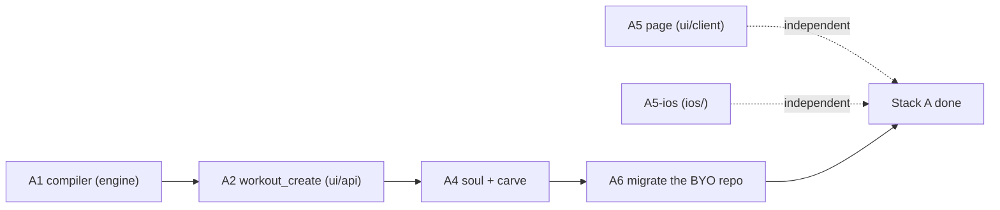

# Stack A — LLD

> Status: Current · Owner: Tech Lead · Verified: 2026-08-31

Execution detail for Stack A in [`workouts-season-model.md`](workouts-season-model.md) §8. That
doc holds the *why*; this one is what an agent follows. Stack B is gated (§12 there) and is not in
this file.

**Read before starting:** `AGENTS.md`, your role doc, this file, and the §8 row for your PR.
Do not read the rest of the design unless your row cites it.

`validate_kdb.py` warns that eight paths here do not exist. That is correct — they are the files
Stack A creates, marked `(new)` below. The warnings clear as the PRs land.

## 0. Order and ownership



| PR | Branch | Owner | Base | Files it may touch |
|---|---|---|---|---|
| A5 | `feat/727-workouts-day-view` | UI Expert | `main` | `ui/client/` only |
| A5-ios | `feat/ios-727-workouts-day-view` | iOS Builder | `main` | `ios/` only |
| A1 | `feat/727-compile-workout` | Bob | `main` | `engine/lib/`, `engine/scripts/` |
| A2 | `feat/727-workout-create` | Bob | A1 | `ui/api/coach-chat/`, `ui/scripts/bundle-compile-workout-api.mjs`, `ui/package.json` |
| A4 | `core/727-soul-carve` | Tech Lead | A2 | `platform/soul/`, `platform/`, `engine/scripts/` |
| A6 | `core/727-byo-migrate` | Tech Lead | A4 | the BYO athlete's repo (PR against it) |

**A3 (FSP benchmark) is P1 — next, not today.** No live athlete is blocked on it.
`shared/workout-library/` stays. HLD §12's churn claim is unverified — do not design A3 around it.

**A5, A5-ios, and A1 start at the same time** — disjoint files. A5 / A5-ios ship first: they are
what the four live athletes see.

**A diff outside your file column fails review.** If you need a file you do not own, stop and ask
Tech Lead — do not widen the PR.

Every PR: `Refs: #727`. **Nothing in Stack A closes #727.**

## 1. Worktree and PR mechanics

```bash
git fetch origin main
git worktree add -b feat/727-<brief> /tmp/wt-<brief> origin/main   # A5, A5-ios, A1
git worktree add -b feat/727-<brief> /tmp/wt-<brief> <base-branch>  # A2, A3, A4
# ... work, commit ...
git push -u origin feat/727-<brief>
git worktree remove /tmp/wt-<brief> --force
```

Never switch branches in the primary checkout. Leave it on `main`. Commit prefix per
`.github/CONVENTIONS.md`: `feat:` for A1–A2, `core:` for A4, `ui:` for A5, `ios:` for A5-ios,
each with `(#727)`. No `Co-Authored-By` footers.

---

## 2. A5 — three-band Workouts page (web)

**Goal:** today + this week + library. Read-only over data that exists now. No new storage, no
schema bump, no `ui/api/` change. HLD §6 is the layout.

**Files**
- `ui/client/src/lib/workoutPage.ts` (new) — the selector, pure
- `ui/client/src/lib/workoutPage.test.ts` (new)
- `ui/client/src/pages/Workouts.tsx` — three bands; keep `WorkoutCard` for the library
- `ui/client/src/components/home-warm/warm-instrument.css` if new classes are needed
- Reuse `SessionRow` for the week list. Do **not** reuse `WeeklyPlanCard` (Home Coach draft).

**Contract**

```ts
export type TodayHero =
  | { kind: "runnable"; workout: Workout; from: "session" | "template" }
  | { kind: "mention"; title: string; durationMin: number | null }
  | { kind: "rest" }   // live plan, no session today
  | { kind: "none" };  // no live plan

export type WeekDay = {
  date: string;
  source: "plan" | "activity" | "empty";
  title: string | null;
  durationMin: number | null;
};

export function selectWorkoutsPage(
  workouts: WorkoutsData,
  currentWeek: unknown,
  activities: { start: string; sport?: string; title?: string }[],
): { today: TodayHero; week: WeekDay[] | null };
// "today" from current_week.timezone when live, else athlete tz if known — never the browser.
```

**Rules**
1. Parse `current_week` with `parseCurrentWeek`. Not `live` (missing, placeholder) → `today.none`,
   and `week` is hist-for-this-week if any activity falls in the ISO week, else `null` (hide the
   band). Never crash.
2. Live + today's session has `template_id` → `runnable` (session file if present, else template).
   `status: "done"` still `runnable` but the card reads done.
3. Live + `template_id: null` → `mention` (title + `planned_duration_min`). Not Rest.
4. Live + no session today → `rest`.
5. Week list: each day is plan row if live, else a hist activity that day, else `empty`. Empty is
   unplanned, not Rest.
6. Library always below, unchanged. Ad-hoc is `/workouts/:id` as today — no compile-on-demand.

**Tests** — `workoutPage.test.ts`: live runnable; live mention (badminton); live rest; no-plan with
Mon strength + Wed badminton in hist (week visible, today none); no-plan and no hist (`week` null);
timezone (UTC-8 browser, UTC+5:30 athlete → same athlete-local day).

**Validate:** `cd ui && npm run test` · `npm run build`
**Done when:** the page opens on today + this week, not an undifferentiated template list.

---

## 2b. A5-ios — same three bands

**Goal:** `WorkoutListView` matches HLD §6. Fetch `user_data/ledger/current_week.json` the way
`WorkoutService` already fetches `templates/` and `sessions/`. No path rename, no schema bump.

**Files** — `ios/CoachHQ/` only: `WorkoutService.swift`, `WorkoutListView.swift`, tests.
Reuse `TodayWorkoutHero` for `runnable`. Week list is rows, not a new widget. Library stays the
grouped list. Home `WeeklyPlanCard` is untouched.

**Rules** — same as A5 §2. Duplicate in Swift; do not invent a shared package.

**Validate:** `ios-build.yml` green.
**Done when:** the app Workouts tab shows today + this week + library from live repo data.

---

## 3. A1 — `compileWorkout()` in `engine/`

**Goal:** a pure function that turns a minimal exercise list into timer-ready JSON. Nothing calls
it in this PR.

**Files**
- `engine/lib/compileWorkout.mts` (new)
- `engine/lib/compileWorkout.test.mts` (new)
- `engine/scripts/compile-dryrun.mts` (new) — the HLD §10 verification tool

**Why `engine/`, not `ui/api/`:** `scaling-plan.md` §2.2 already names `coach-chat.ts` as "a
*second* engine". A1 does not add the Vercel shim — that lands in A2 with the first import.

**How A2 will reach it (do not add this in A1).** A raw relative import across the Vercel root
does not bundle. Pattern: `current-week.bundle.d.ts` + `ui/scripts/bundle-current-week-api.mjs`
on `prebuild`. A2 owns the shim, the bundle script, and the `package.json` one-liner. A1 is
runnable with `npx tsx`. `.mts`, not `.mjs`.

**Contract**

```js
/** @typedef {{ name, type: "reps"|"timed", reps?, duration_secs?, sets,
 *              form_cue, why, both_sides?, optional?, progression_id? }} SpecExercise */
/** @typedef {{ name, exercises: SpecExercise[], circuit?, rounds?, coaching_note? }} SpecPhase */
/** @typedef {{ id, title, subtitle, workout_type, location, equipment,
 *              coaching_note, phases: SpecPhase[], progression_notes? }} WorkoutSpec */
export function compileWorkout(spec, opts = {}) // -> Workout
```

**Fills, deterministically:**

| Field | Rule |
|---|---|
| `num` | sequential from 1 across all phases, in order; no gaps |
| `prep_secs` | `timed` → 5; `reps` → omitted |
| `rest_between_sets_secs` | omitted when `sets === 1`; else 60 (`reps`) / 45 (`timed`) |
| `rest_after_exercise_secs` | 30; 0 on the last exercise of the last phase |
| `default_rest_secs` (phase) | max `rest_between_sets_secs` in the phase, else 30 |
| `duration` (phase) | `"<n> min"`, from the phase's computed seconds, rounded up |
| `estimated_duration_mins` | sum of phase seconds ÷ 60, rounded up |

Work seconds per exercise: `timed` → `duration_secs × sets × (both_sides ? 2 : 1)`;
`reps` → `reps × 3s × sets`. Add rests. `circuit` multiplies the phase by `rounds`.

**Non-negotiable:** every default is overridable — a value present in the spec is never
recomputed. `opts.defaults` allows overriding the table above; callers pass nothing today.

**Tests** — `compileWorkout.test.mts`
1. `golden` — a fixture spec compiles byte-identically to a checked-in expected JSON.
2. `determinism` — compiling the same spec twice deep-equals.
3. `numbering` — exercises across three phases number 1..n with no gaps after a skip.
4. `duration math` — a known spec yields the expected `estimated_duration_mins`.
5. `override` — a spec that sets `prep_secs: 0` on a timed exercise keeps 0.
6. `both_sides` — doubles the work seconds, does not double `sets`.

**Dry-run tool** — `compile-dryrun.mts <repo-path>`: read every
`user_data/activities/workout_plans/templates/*.json`, reduce each to a spec, recompile, diff
against the original, print a per-file summary. Read-only, writes nothing. Existing templates have
hand-tuned rests — the bar is **explainable**, not byte-identical to production files. The golden
fixture is the byte-identical test.

**Validate:** `cd ui && npm run test` (vitest picks up `.mts`) ·
`npx tsx engine/scripts/compile-dryrun.mts <each of the four repos>`
**Done when:** tests green, and the dry-run diff across all four repos is explainable line by line.
An unexplained diff blocks the merge.

---

## 4. A2 — `workout_create`, on ordinary turns

**Goal:** an athlete asks mid-conversation and a routine file is committed on that turn.

**Files**
- `ui/api/coach-chat/_lib/coachReplySchema.ts` — action field and turn-mode wiring.
- `ui/api/coach-chat/_lib/turnWrites/workoutWrite.ts` — `buildWorkoutCreateWrite`.
- `ui/api/coach-chat/_lib/coachWorkoutFiles.ts` — applier and invariant 7.
- `ui/api/coach-chat/_lib/coachTurn.ts` — own `commitFilesAtomic` for `workout_create`.
- `ui/api/coach-chat/_lib/coachPromptText.ts` — tell Coach the action exists.
- `ui/api/coach-chat/_lib/compileWorkout.bundle.d.ts` (new) — shim, `export *` from engine.
- `ui/scripts/bundle-compile-workout-api.mjs` (new) — copy `bundle-current-week-api.mjs`.
- `ui/package.json` — add the bundle script to `prebuild` / `predev`.
- `ui/api/coach-chat/_tests/layer2-fields/workoutCreate.test.ts` (new).

**Schema** — add to `RESPONSE_PROPERTIES` beside `template_edit` (~line 144). Coach sends the
spec, never timer physics:

```
workout_create: { type: "object", properties: {
  title, workout_type, location, coaching_note: {type:"string"},
  equipment: {type:"array", items:{type:"string"}},
  phases: {type:"array", items:{type:"object", properties:{
    name: {type:"string"},
    exercises: {type:"array", items:{type:"object", properties:{
      name, type, form_cue, why: {type:"string"},
      reps, duration_secs, sets: {type:"number"},
      both_sides: {type:"boolean"}, progression_id: {type:"string"},
    }, required:["name","type","sets","form_cue","why"]}},
  }, required:["name","exercises"]}},
  injury_ack: {type:"array", items:{type:"object", properties:{
    flag: {type:"string"}, accommodation: {type:"string"},
  }, required:["flag","accommodation"]}},
}, required:["title","workout_type","phases"] }
```

**Turn wiring** — `responsePropertiesFor` (~line 336) returns `[]` for
`mode === "ordinary" && !firstSession`. Add:

```ts
const ORDINARY_ACTIONS = ["workout_create"] as const satisfies readonly ResponseField[];
```

and return it for that branch instead of `[]`. Also append `workout_create` to
`RETURNING_CLOSE_ACTIONS` so it works on a closing turn too. **Do not** widen the ordinary branch
to any other action — that is a separate decision.

**Commit rule — own `commitFilesAtomic`, same as `generateTemplatesAfterCompletion`
(`coachTurn.ts:573`).** Do not append to `commitOrdinaryTurn`'s `writes`. That array is
`fspIncrementalWrites` (`fspWrites.ts:8`) and returns `[]` once `wasProfileComplete` is true —
every live athlete. Appending there makes A2 a silent no-op in production (PR comment on #728).
Call `commitFilesAtomic` with the compiled routine + manifest, message `coach: workout created`.
On a closing turn, include the same write in the close commit as well (`RETURNING_CLOSE_ACTIONS`).

**Applier — `applyWorkoutCreate(spec, injuries, existingIds, traceId)`**
1. Derive `id` by slugifying `title`; suffix `-2`, `-3` on collision with `existingIds`.
2. **Invariant 7 — `injury_ack`.** A generated routine has no library tags, so
   `conflictsWithActiveInjuries` cannot be ported as-is. The spec instead carries
   `injury_ack: [{ flag: string, accommodation: string }]`. The applier reads
   `user_data/coach/injuries.json`, and **throws unless every flag with `status: "active"` has an
   entry**. Code cannot judge whether a routine is safe; it can refuse one where Coach did not
   address each active flag, and the acknowledgement is auditable afterwards. Add
   `injury_ack` to the schema's `required` when any active flag exists.
3. **Invariant 1:** every `progression_id` present must exist in `progressions.json`, else throw.
4. `compileWorkout(spec)` → `validateWorkout(result, id)` → path
   `user_data/activities/workout_plans/templates/<id>.json` (**old path — no rename in Stack A**).
5. Append the id to `_manifest.json` in the same atomic commit.

**Tests** — eight, each its own case.

1. Happy path writes a valid file.
2. Id collision suffixes.
3. An active flag with no `injury_ack` entry throws.
4. An acknowledged flag passes.
5. Unknown `progression_id` throws.
6. Ordinary-turn mode exposes the action.
7. The committed file passes `validateWorkout`.
8. A returning athlete (`wasProfileComplete: true`) still commits — the case that would have no-op'd.

**Validate:** `cd ui && npm run test` · manual: one ordinary turn asking for an upper body workout
**Done when:** a mid-conversation ask produces a committed, schema-valid file the timer can open.
**This kills bug 2.**

---

## 5. A3 — benchmark replaces the library dump

**Goal:** first session ends with a benchmark and seeded progressions, not six guessed workouts.

**Files**
- `ui/api/coach-chat/_lib/coachWorkoutFiles.ts` — delete `selectTemplates`,
  `adjustTemplatesWithGemini`, `loadWorkoutLibrary*`, `generateInitialTemplates`
- `ui/api/coach-chat/_lib/coachTurn.ts` — `generateTemplatesAfterCompletion` → `generateBenchmarkAfterCompletion`
- `ui/api/coach-chat/_lib/coachQuestFiles.ts` — progression seeding
- `shared/workout-library/` — **deleted**, with `_tests/workoutLibrary.test.ts`
- `ui/api/coach-chat/_tests/layer2-fields/benchmark.test.ts` (new)

**Flow.** Coach asks during intake what the athlete can already do — "I do pull-ups, six to eight"
— and sets the entry level from the answer. On the profileComplete transition (same trigger as
today, ADR 0018), Coach emits **one** `workout_create` spec tagged as the benchmark, covering 4–6
movement patterns, each exercise carrying an easier and a harder alternative in its `form_cue`.
The athlete picks in the app; nothing branches in the timer.

**Progression seeding.** For each benchmarked pattern write a `Progression`:
`{ id, name, current, target, unit, history: [{ date, value, trace_id }] }`. `current: null` is
legal and means "not yet" — a beginner and an athlete with a flared joint use the same field.

**Invariant 2** is enforced here: a starting dose may not exceed the benchmarked value.

**Tests** — five: FSP close writes exactly one benchmark file; progressions seeded one per
pattern; `current: null` accepted; a dose above the benchmark throws; no reference to
`shared/workout-library/` survives (`grep -r` in the test).

**Validate:** `cd ui && npm run test` · `grep -rn "workout-library\|selectTemplates" --exclude-dir=node_modules .` returns nothing
**Done when:** a fresh athlete's first close writes a benchmark and populated progressions.
**This stops bug 1 recurring for the next athlete.** The four existing athletes are fixed by A5.

---

## 6. A4 — soul and carve

**Goal:** Coach knows the new rules, and BYO gets the compiler. **All of Stack A's soul edits land
here, in one compose run.**

**Files**
- `platform/soul/B_engine.md` — the edits below
- `platform/SOUL.chat.md`, `platform/SOUL.claude.md` — regenerated, never hand-edited
- `docs/eng-docs/SOUL_HISTORY.md` — one entry, post-cutover shape
- `engine/scripts/compile-workout` (new) — thin CLI over `compileWorkout.mts`
- `platform/scripts/carve-skeleton.mjs` — carve the CLI; `WORKOUT_TEMPLATES` covers what the soul names

**Soul edits**
1. Retire *Persisting Session Files*: Coach emits an exercise list; the compiler owns timer
   physics. Delete the *Timer Physics Fields* section — it exists to make a model do a compiler's
   job.
2. *(FSP benchmark wording moves with A3, which is deferred — do not write it here.)*
3. Coach may create a routine when none fits. **This one line is the absence that caused bug 2.**
4. Every `workout_plans/` path reference still resolves (no rename in Stack A).

**Order inside the PR:** edit layers → `node platform/scripts/compose-soul.mjs` → commit layers
*and* both builds → `SOUL_HISTORY.md` entry (Superpower + short scene + 2–3 bullets + Why, ~12
lines).

**Validate:** `node platform/scripts/validate-soul.mjs` — clean, including the two baselined
template findings · BYO end-to-end: carve a scratch repo, create a routine through the CLI
**Done when:** validate-soul clean and a *freshly carved* repo can create a routine.
`Refs: #727` — does not close it.

---

## 6b. A6 — migrate the BYO athlete's repo

**Carve updates the skeleton, not anyone who already forked it.** The athlete who reported bug 2
is on a repo carved before A4, so A4 alone leaves their bug unfixed. A6 opens a PR **against their
repo** carrying the recomposed `SOUL.claude.md` and the compiler CLI, and nothing else.

**Done when:** that athlete, in their own repo, asks for an upper body workout and gets one.
Until this merges, bug 2 is fixed in the template and not for the person who reported it.

---

## 7. Paid gate and review

**`npm run eval:coach-chat` runs once, after A4, before merge of the series** — not per PR. A2
touches prompt construction and the response schema, so ADR 0024's gate applies to the series.
A1, A5, A5-ios and A6 state `skipped — no prompt or schema surface`.

**Tech Lead reviews every PR against the seven checks** in `.github/agents/tech-lead.md`. Two that
bite here: the diff is a subset of the file column in §0, and the PR's file list is verified
against the branch (`mcp__github__pull_request_read`, `method: get_files`), not local `main`.

**Worker report shape:** files touched · checks run with evidence (the CI run, not pasted output,
where a runner exists) · what was deliberately not done.

## 8. Agent brief template

```
You are <role> (read AGENTS.md → Agent Routing, then .github/agents/<role>.md).
Task: PR <id> in docs/plans/workouts-stack-a-lld.md §<n>. Read that section and §0-1 only.
Branch: <branch>, worktree off <base>. Files you may touch: <column from §0>.
Do not widen the diff. Do not read the rest of the design.
Validate with the commands in your section. Report: files touched · checks run with evidence ·
what you deliberately did not do.
```

## 9. Not in Stack A

FSP benchmark (A3, deferred) · **slimming `current_week.json` — no field is dropped, see HLD §4** ·
blocks in `seasons.json` · week compile · non-chat compile trigger · reconciliation rules ·
`templates/` → `routines/` rename · dual-read · Home weekly-plan widget backfill ·
`SCHEMA_VERSION` bump.

Stack B stays on paper because nothing in it is needed for either live bug (HLD §12). The churn
finding is unverified — do not restructure B around it. Anyone who finds themselves touching one
of these in Stack A has left the plan.
