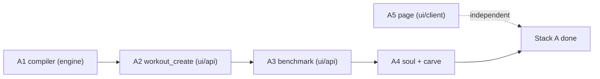

# Stack A — LLD

> Status: Current · Owner: Tech Lead · Verified: 2026-08-30

Execution detail for Stack A in [`workouts-season-model.md`](workouts-season-model.md) §8. That
doc holds the *why*; this one is what an agent follows. Stack B is gated (§12 there) and is not in
this file.

**Read before starting:** `AGENTS.md`, your role doc, this file, and the §8 row for your PR.
Do not read the rest of the design unless your row cites it.

`validate_kdb.py` warns that eight paths here do not exist. That is correct — they are the files
Stack A creates, marked `(new)` below. The warnings clear as the PRs land.

## 0. Order and ownership



| PR | Branch | Owner | Base | Files it may touch |
|---|---|---|---|---|
| A5 | `feat/727-workouts-day-view` | UI Expert | `main` | `ui/client/` only |
| A1 | `feat/727-compile-workout` | Bob | `main` | `engine/lib/`, `engine/scripts/` |
| A2 | `feat/727-workout-create` | Bob | A1 | `ui/api/coach-chat/` |
| A3 | `feat/727-fsp-benchmark` | Bob | A2 | `ui/api/coach-chat/`, `shared/workout-library/` (delete) |
| A4 | `core/727-soul-carve` | Tech Lead | A3 | `platform/soul/`, `platform/`, `engine/scripts/` |

**A5 and A1 start at the same time** — disjoint files, no shared contract. A5 ships first because
it is the only PR the four live athletes see.

**A diff outside your file column fails review.** If you need a file you do not own, stop and ask
Tech Lead — do not widen the PR.

Every PR: `Refs: #727`. Only A4 carries `Fixes: #727`.

## 1. Worktree and PR mechanics

```bash
git fetch origin main
git worktree add -b feat/727-<brief> /tmp/wt-<brief> origin/main   # A5, A1
git worktree add -b feat/727-<brief> /tmp/wt-<brief> <base-branch>  # A2, A3, A4
# ... work, commit ...
git push -u origin feat/727-<brief>
git worktree remove /tmp/wt-<brief> --force
```

Never switch branches in the primary checkout. Leave it on `main`. Commit prefix per
`.github/CONVENTIONS.md`: `feat:` for A1–A3, `core:` for A4, `ui:` for A5, each with `(#727)`.
No `Co-Authored-By` footers.

---

## 2. A5 — day-first Workouts page

**Goal:** the page shows *today*, not every template the athlete owns. Read-only over data that
exists now. No new storage, no schema bump, no `ui/api/` change.

**Files**
- `ui/client/src/lib/workoutDay.ts` (new) — the state selector, pure
- `ui/client/src/lib/workoutDay.test.ts` (new)
- `ui/client/src/pages/Workouts.tsx` — render the states; keep `WorkoutCard`, `TYPE_ORDER`
- `ui/client/src/components/home-warm/warm-instrument.css` if new classes are needed

**Contract**

```ts
export type DayView =
  | { kind: "planned";   workout: Workout; priority: string | null }
  | { kind: "done";      workout: Workout; activityIds: string[] }
  | { kind: "rest";      next: { date: string; title: string } | null }
  | { kind: "unplanned"; activityIds: string[] }
  | { kind: "no_plan" }
  | { kind: "unavailable"; reason: string };

export function selectDayView(
  workouts: WorkoutsData,
  currentWeek: unknown,       // parse with parseCurrentWeek from @/lib/currentWeek
  today: string,              // toLocalDateStr(new Date())
): DayView;
```

**Rules**
1. Parse `current_week` with `parseCurrentWeek` (re-exported from `engine/lib/current-week.mts`
   via `ui/client/src/lib/currentWeek.ts`). Availability not `live` → `unavailable`, never a crash.
2. Today's session with a matching `sessions[]` entry → `planned` with the session; else the
   template. `status: "done"` → `done`.
3. No session today but the week is live → `rest`, carrying the next dated session.
4. No `current_week` at all → `no_plan`.
5. **Routine library stays on the page, below the day** — the existing grouped list, unchanged.
   That is the ad-hoc / look-it-up / show-a-physio surface.

**Tests** — `workoutDay.test.ts`, one case per `kind`, six total. Fixtures from
`ui/client/src/components/home-warm/currentWeek.fixture.ts`.

**Validate:** `cd ui && npm run test` · `npm run build`
**Done when:** all six states render from a live repo's current data, and the page no longer opens
on an undifferentiated list of every template.

---

## 3. A1 — `compileWorkout()` in `engine/`

**Goal:** a pure function that turns a minimal exercise list into timer-ready JSON. Nothing calls
it in this PR.

**Files**
- `engine/lib/compileWorkout.mjs` (new)
- `engine/lib/compileWorkout.test.mjs` (new)
- `engine/scripts/compile-dryrun.mjs` (new) — the §10 verification tool

**Why `engine/`, not `ui/api/`:** `scaling-plan.md` §2.2 already names `coach-chat.ts` as "a
*second* engine". `.mjs` with named exports, same style as `plugins.mjs`, so BYO and the API both
import one module.

**Contract**

```js
/** @typedef {{ name, type: "reps"|"timed", reps?, duration_secs?, sets,
 *              form_cue, why, both_sides?, optional?, progression_id? }} SpecExercise */
/** @typedef {{ name, exercises: SpecExercise[], circuit?, rounds?, coaching_note? }} SpecPhase */
/** @typedef {{ id, title, subtitle, workout_type, location, equipment,
 *              coaching_note, phases: SpecPhase[], progression_notes? }} WorkoutSpec */
export function compileWorkout(spec, opts = {}) // -> Workout
```

**Fills, deterministically:**

| Field | Rule |
|---|---|
| `num` | sequential from 1 across all phases, in order; no gaps |
| `prep_secs` | `timed` → 5; `reps` → omitted |
| `rest_between_sets_secs` | omitted when `sets === 1`; else 60 (`reps`) / 45 (`timed`) |
| `rest_after_exercise_secs` | 30; 0 on the last exercise of the last phase |
| `default_rest_secs` (phase) | max `rest_between_sets_secs` in the phase, else 30 |
| `duration` (phase) | `"<n> min"`, from the phase's computed seconds, rounded up |
| `estimated_duration_mins` | sum of phase seconds ÷ 60, rounded up |

Work seconds per exercise: `timed` → `duration_secs × sets × (both_sides ? 2 : 1)`;
`reps` → `reps × 3s × sets`. Add rests. `circuit` multiplies the phase by `rounds`.

**Non-negotiable:** every default is overridable — a value present in the spec is never
recomputed. `opts.defaults` allows overriding the table above; callers pass nothing today.

**Tests** — `compileWorkout.test.mjs`
1. `golden` — a fixture spec compiles byte-identically to a checked-in expected JSON.
2. `determinism` — compiling the same spec twice deep-equals.
3. `numbering` — exercises across three phases number 1..n with no gaps after a skip.
4. `duration math` — a known spec yields the expected `estimated_duration_mins`.
5. `override` — a spec that sets `prep_secs: 0` on a timed exercise keeps 0.
6. `both_sides` — doubles the work seconds, does not double `sets`.

**Dry-run tool** — `compile-dryrun.mjs <repo-path>`: read every
`user_data/activities/workout_plans/templates/*.json`, reduce each to a spec, recompile, diff
against the original, print a per-file summary. Read-only, writes nothing.

**Validate:** `node --test engine/lib/compileWorkout.test.mjs` ·
`node engine/scripts/compile-dryrun.mjs <each of the four repos>`
**Done when:** tests green, and the dry-run diff across all four repos is explainable line by line.
An unexplained diff blocks the merge.

---

## 4. A2 — `workout_create`, on ordinary turns

**Goal:** an athlete asks mid-conversation and a routine file is committed on that turn.

**Files**
- `ui/api/coach-chat/_lib/coachReplySchema.ts` — the action field + turn-mode wiring
- `ui/api/coach-chat/_lib/turnWrites/workoutWrite.ts` — `buildWorkoutCreateWrite`
- `ui/api/coach-chat/_lib/coachWorkoutFiles.ts` — applier + invariant 7
- `ui/api/coach-chat/_lib/coachTurn.ts` — include the write in `commitOrdinaryTurn`
- `ui/api/coach-chat/_lib/coachPromptText.ts` — tell Coach the action exists
- `ui/api/coach-chat/_tests/layer2-fields/workoutCreate.test.ts` (new)

**Schema** — add to `RESPONSE_PROPERTIES` beside `template_edit` (~line 144). Coach sends the
spec, never timer physics:

```
workout_create: { type: "object", properties: {
  title, workout_type, location, coaching_note: {type:"string"},
  equipment: {type:"array", items:{type:"string"}},
  phases: {type:"array", items:{type:"object", properties:{
    name: {type:"string"},
    exercises: {type:"array", items:{type:"object", properties:{
      name, type, form_cue, why: {type:"string"},
      reps, duration_secs, sets: {type:"number"},
      both_sides: {type:"boolean"}, progression_id: {type:"string"},
    }, required:["name","type","sets","form_cue","why"]}},
  }, required:["name","exercises"]}},
}, required:["title","workout_type","phases"] }
```

**Turn wiring** — `responsePropertiesFor` (~line 336) returns `[]` for
`mode === "ordinary" && !firstSession`. Add:

```ts
const ORDINARY_ACTIONS = ["workout_create"] as const satisfies readonly ResponseField[];
```

and return it for that branch instead of `[]`. Also append `workout_create` to
`RETURNING_CLOSE_ACTIONS` so it works on a closing turn too. **Do not** widen the ordinary branch
to any other action — that is a separate decision.

**Commit rule.** `commitOrdinaryTurn` (`coachTurn.ts:592`) already commits on ordinary turns for
FSP incremental writes. Append the workout write to its `writes` array. Commit message:
`coach: workout created`. No new commit path, no exception to invent.

**Applier — `applyWorkoutCreate(spec, injuries, existingIds, traceId)`**
1. Derive `id` by slugifying `title`; suffix `-2`, `-3` on collision with `existingIds`.
2. **Invariant 7:** reuse `conflictsWithActiveInjuries`, generalised to take a routine's derived
   tags instead of a library index entry. On conflict, throw — Coach must adjust and retry.
   Removing the library must not remove this check.
3. **Invariant 1:** every `progression_id` present must exist in `progressions.json`, else throw.
4. `compileWorkout(spec)` → `validateWorkout(result, id)` → path
   `user_data/activities/workout_plans/templates/<id>.json` (**old path — no rename in Stack A**).
5. Append the id to `_manifest.json` in the same atomic commit.

**Tests** — six: happy path writes a valid file; id collision suffixes; injury conflict throws;
unknown `progression_id` throws; ordinary-turn mode exposes the action; the committed file passes
`validateWorkout`.

**Validate:** `cd ui && npm run test` · manual: one ordinary turn asking for an upper body workout
**Done when:** a mid-conversation ask produces a committed, schema-valid file the timer can open.
**This kills bug 2.**

---

## 5. A3 — benchmark replaces the library dump

**Goal:** first session ends with a benchmark and seeded progressions, not six guessed workouts.

**Files**
- `ui/api/coach-chat/_lib/coachWorkoutFiles.ts` — delete `selectTemplates`,
  `adjustTemplatesWithGemini`, `loadWorkoutLibrary*`, `generateInitialTemplates`
- `ui/api/coach-chat/_lib/coachTurn.ts` — `generateTemplatesAfterCompletion` → `generateBenchmarkAfterCompletion`
- `ui/api/coach-chat/_lib/coachQuestFiles.ts` — progression seeding
- `shared/workout-library/` — **deleted**, with `_tests/workoutLibrary.test.ts`
- `ui/api/coach-chat/_tests/layer2-fields/benchmark.test.ts` (new)

**Flow.** Coach asks during intake what the athlete can already do — "I do pull-ups, six to eight"
— and sets the entry level from the answer. On the profileComplete transition (same trigger as
today, ADR 0018), Coach emits **one** `workout_create` spec tagged as the benchmark, covering 4–6
movement patterns, each exercise carrying an easier and a harder alternative in its `form_cue`.
The athlete picks in the app; nothing branches in the timer.

**Progression seeding.** For each benchmarked pattern write a `Progression`:
`{ id, name, current, target, unit, history: [{ date, value, trace_id }] }`. `current: null` is
legal and means "not yet" — a beginner and an athlete with a flared joint use the same field.

**Invariant 2** is enforced here: a starting dose may not exceed the benchmarked value.

**Tests** — five: FSP close writes exactly one benchmark file; progressions seeded one per
pattern; `current: null` accepted; a dose above the benchmark throws; no reference to
`shared/workout-library/` survives (`grep -r` in the test).

**Validate:** `cd ui && npm run test` · `grep -rn "workout-library\|selectTemplates" --exclude-dir=node_modules .` returns nothing
**Done when:** a fresh athlete's first close writes a benchmark and populated progressions.
**This stops bug 1 recurring for the next athlete.** The four existing athletes are fixed by A5.

---

## 6. A4 — soul and carve

**Goal:** Coach knows the new rules, and BYO gets the compiler. **All of Stack A's soul edits land
here, in one compose run.**

**Files**
- `platform/soul/B_engine.md` — the edits below
- `platform/SOUL.chat.md`, `platform/SOUL.claude.md` — regenerated, never hand-edited
- `docs/eng-docs/SOUL_HISTORY.md` — one entry, post-cutover shape
- `engine/scripts/compile-workout` (new) — thin CLI over `compileWorkout.mjs`
- `platform/scripts/carve-skeleton.mjs` — carve the CLI; `WORKOUT_TEMPLATES` covers what the soul names

**Soul edits**
1. Retire *Persisting Session Files*: Coach emits an exercise list; the compiler owns timer
   physics. Delete the *Timer Physics Fields* section — it exists to make a model do a compiler's
   job.
2. First Session Protocol closes with a benchmark, and asks what the athlete can already do first.
3. Coach may create a routine when none fits. **This one line is the absence that caused bug 2.**
4. Every `workout_plans/` path reference still resolves (no rename in Stack A).

**Order inside the PR:** edit layers → `node platform/scripts/compose-soul.mjs` → commit layers
*and* both builds → `SOUL_HISTORY.md` entry (Superpower + short scene + 2–3 bullets + Why, ~12
lines).

**Validate:** `node platform/scripts/validate-soul.mjs` — clean, including the two baselined
template findings · BYO end-to-end: carve a scratch repo, create a routine through the CLI
**Done when:** validate-soul clean and a BYO athlete can create a routine.
**Carries `Fixes: #727`. Deletes `docs/plans/workouts-stack-a-lld.md` and, if Stack B is not
starting, leaves `workouts-season-model.md` in place.**

---

## 7. Paid gate and review

**`npm run eval:coach-chat` runs once, after A4, before merge of the series** — not per PR. A2 and
A3 touch prompt construction and the response schema, so ADR 0024's gate applies to the series.
A1 and A5 state `skipped — no prompt or schema surface`.

**Tech Lead reviews every PR against the seven checks** in `.github/agents/tech-lead.md`. Two that
bite here: the diff is a subset of the file column in §0, and the PR's file list is verified
against the branch (`mcp__github__pull_request_read`, `method: get_files`), not local `main`.

**Worker report shape:** files touched · checks run with evidence (the CI run, not pasted output,
where a runner exists) · what was deliberately not done.

## 8. Agent brief template

```
You are <role> (read AGENTS.md → Agent Routing, then .github/agents/<role>.md).
Task: PR <id> in docs/plans/workouts-stack-a-lld.md §<n>. Read that section and §0-1 only.
Branch: <branch>, worktree off <base>. Files you may touch: <column from §0>.
Do not widen the diff. Do not read the rest of the design.
Validate with the commands in your section. Report: files touched · checks run with evidence ·
what you deliberately did not do.
```

## 9. Not in Stack A

Blocks in `seasons.json` · week compile · non-chat compile trigger · reconciliation rules ·
`templates/` → `routines/` rename · dual-read · widgets · `SCHEMA_VERSION` bump · iOS.
All are Stack B, and Stack B is gated on the repo investigation. Anyone who finds themselves
touching one of these in Stack A has left the plan.
