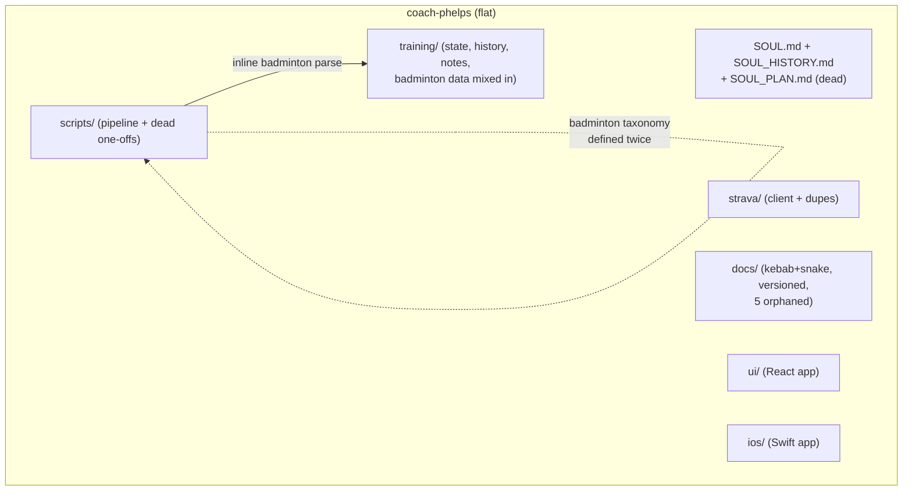
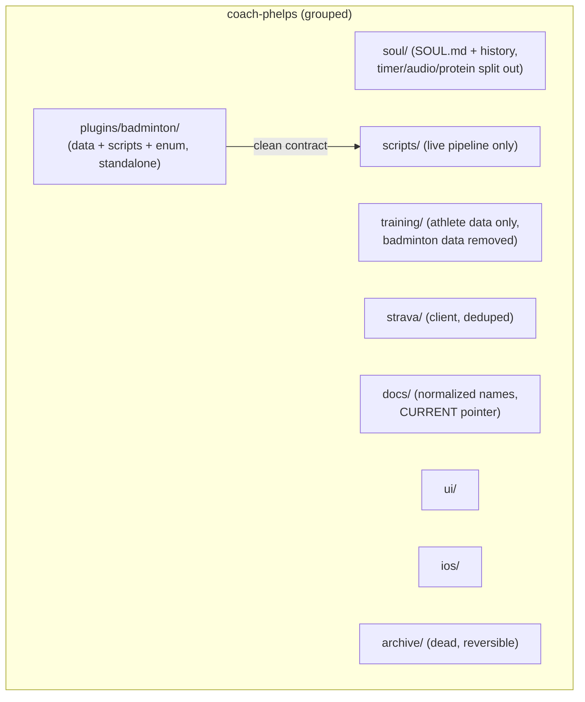
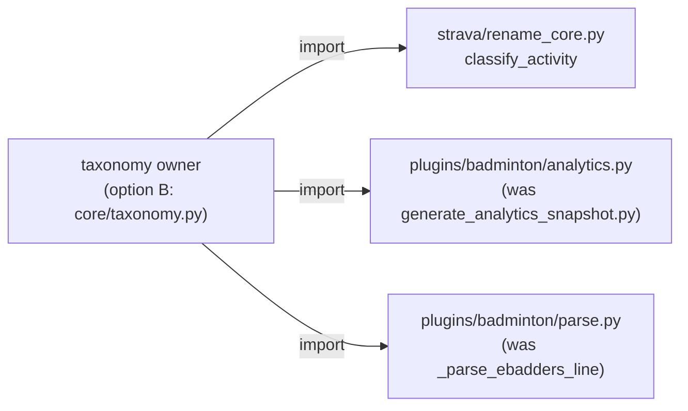
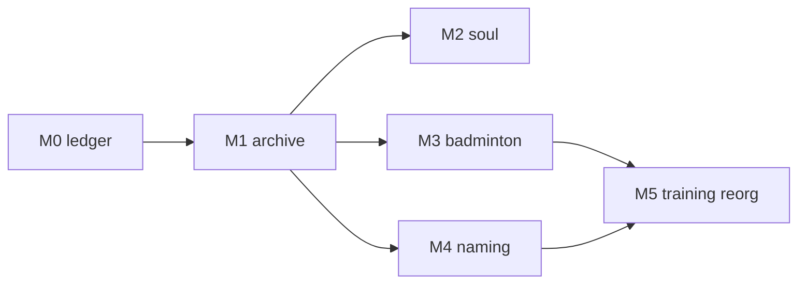

# Repo Restructure & Scaling Plan

> Status: **M0 done** · Owner: Tech Lead · Branch: `core/repo-restructure-p0-ledger`

## 1. Context

`coach-phelps` grew by accretion: a training pipeline, Strava sync, a SOUL, a
badminton sub-domain, and — after `core/unify-ui-into-coach-phelps` — a full
`ui/` React app, all landed in one repo with no top-level story. The result is
naming drift (kebab + snake, version-suffixed docs, `sync_state` vs
`sync_status`), a scatter of dead scripts/docs/ledgers, a 476-line SOUL that
contradicts itself, and a badminton domain tangled into the running pipeline.
Sky's brother is about to fork this repo as a base for his own athlete, so the
layout needs to be legible and the migration mechanical.

**Non-goals (permanent):** no behavior changes to the live pipeline, dashboard,
or iOS sync; no rewrite of analytics logic; no touching the 832 Strava-keyed
history files. This is a *structure* pass, not a *logic* pass.

## 2. Current State

Built and live: `training/` data, `scripts/` pipeline, `strava/` client,
`ui/` dashboard (Netlify), `ios/` app (HealthKit → GitHub), `SOUL.md` +
`training/coach/state.md` coaching memory.

Missing: any top-level grouping, a "current doc" pointer, plugin boundaries, and
a dead-code sweep.

Grounded pain points (real paths):
- **Badminton smeared into generic scripts:** `scripts/generate_analytics_snapshot.py` is 100% badminton but lives in generic `scripts/` and redefines the badminton taxonomy that also lives in `strava/rename_core.py`, `scripts/parse_match_description.py` holds an inline `_parse_ebadders_line`.
- **Misfiled manual tools (NOT dead — reclassify, don't archive):** `strava/parse_ebadders.py` + `strava/merge_ebadders.py` are badminton (eBadders) enrichment tools → belong in `plugins/badminton/`. `strava/rename_activities.py` (bulk backfill, shares `rename_core.py`) + `strava/oauth_reauth.py` (initial Strava OAuth — the fork needs it) stay generic in `strava/`.
- **Dead candidates (each confirmed in the ledger before archiving, with a "who still uses it" check):** orphaned docs (`docs/dashboard_v2_spec.md`, `docs/soul-v5-design.md`, `docs/ui_ideas.md`, `docs/analytics-snapshot-design.md`), `training/leaderboard.json` (write-only orphan), `SOUL_PLAN.md` (defunct 5-file layout). Obsolete agent skills `skills/apple-fitness-screenshot-parser/` and `skills/ebadders-match-parser/` — **deleted** (not archived), superseded by pipeline scripts.
- **Deferred (brother fork parity):** `scripts/generate_quest_history.py` — keep unchanged; `training/seasons/*/` glob is inert until season archives exist. P2: clean ledger generation.
- **Naming collisions:** `sync_state.json` vs `sync_status.json` (unrelated jobs) — disambiguated via `_purpose` comments in each file (M4; rename cancelled Sky 2026-07-25).

> **Audit correction:** the first pass equated "not called by the automated pipeline" with "dead." It isn't — several flagged scripts are live *manual* tools. Every remaining dead-candidate now carries a "who still uses it" column in the ledger and is archived only after that check, never on the audit's say-so.

## 3. Goal State

Top-level domains, a plugin boundary for badminton, a consolidated `soul/`, an
`archive/` for anything dead, and one migration ledger driving a fork-able move.

Key properties: each top-level dir is one domain, badminton is liftable as a
unit, and generic `strava/` code no longer carries badminton-specific logic. The
ledger is the record of every move — it feeds a **single one-time migration of
the brother's fork at the very end**, not a per-PR fork contract.

## 4. Assumptions & Locked Decisions

**Locked (from Sky, this session):**
- **Scope:** full restructure, **staged as several small PRs** for clean review — not one mega-PR.
- **Dead files:** **archive, don't delete.** `git mv` to `archive/`, reversible.
- **Badminton:** **full extraction now**, including the 3 coupling refactors (below).
- **history/ naming:** **untouched.** The 32 `hk_` files are iOS HealthKit-synced and stay separate from the 832 Strava-keyed files.

**Locked (Sky confirmed 2026-07-25):**
- **Taxonomy ownership — option B:** neutral `core/taxonomy.py`; both `strava/rename_core.py` and the badminton plugin import from it. Option A (plugin owns taxonomy, generic code imports up) rejected.

**Deferred (do NOT silently resolve):**
- **P2 — history/ unification:** possibly merge `hk_` and Strava-ID schemes at the *end* of this refactor. Not in scope now.
- Hard-delete of archived files: revisit once the new structure is proven.

**P2 data/format-pruning list (open — add to freely, decide later):** changes we may want but are freezing for now because they ripple through consumers.
- `ui/client/src/data/` aggregate build output (`build-data.mjs --aggregate`) — prune unused fields.
- `training/ebadders_history.json` shape.
- `training/leaderboard.json` — archived in M1; hard-delete candidate once proven.
- `sleep_log.json` stage — remove the pipeline step if it stays empty.
- `scripts/generate_quest_history.py` + `training/seasons/` — brother fork parity; decide season-archive layout and clean multi-season ledger generation.
- (append here as we spot more)

## 5. High-Level Design

Three badminton couplings are the only load-bearing refactor. Everything else is
moves + renames. The generic Strava renamer (`classify_activity`) must keep
knowing badminton exists — so the fix is *centralize the taxonomy*, not sever the
dependency.

- **Taxonomy (was "triplicated enum"):** one definition in `core/taxonomy.py` (option B, locked §4), imported by `rename_core`, badminton analytics, and parse. Ends the double-definition.
- **Inline parse:** lift `_parse_ebadders_line` out of `scripts/parse_match_description.py` into `plugins/badminton/parse.py`, the pipeline calls the plugin for badminton activities.
- **Analytics relocation (not "dependency inversion"):** `generate_analytics_snapshot.py` is badminton-only — move it wholesale into `plugins/badminton/`. It reads `ebadders_history.json`, which also moves. Output (`badminton_analytics_snapshot.json`) must stay byte-identical.

## 6. Low-Level Design

**Migration ledger** (`docs/restructure-ledger.md`) records every move and feeds
the one-time fork migration at the end. Every row carries a **"who still uses
it"** column — nothing is archived until that column is filled and clears. The
doc ships a runnable `git mv` block so the migration is mechanical.

| old_path | new_path | action | who still uses it / reason |
|---|---|---|---|
| `strava/oauth_reauth.py` | `strava/` (stays) | keep | fork's initial Strava auth |
| `strava/rename_activities.py` | `strava/` (stays) | keep | manual bulk backfill, shares `rename_core.py` |
| `strava/parse_ebadders.py` | `plugins/badminton/` | move | badminton eBadders HTML → history |
| `strava/merge_ebadders.py` | `plugins/badminton/` | move | badminton eBadders enrichment |
| `scripts/generate_analytics_snapshot.py` | `plugins/badminton/` | move | badminton-only analytics |
| `skills/.../query_history.py` | `archive/` | move? | byte-identical dupe — confirm nothing loads the skill copy |
| `SOUL_PLAN.md` | `archive/` | move | defunct 5-file layout, no readers |
| `docs/dashboard_v2_spec.md` | `archive/docs/` | move? | confirm zero inbound refs |
| … | … | … | … |

**CI guard:** the existing `validate-data` check stays green throughout — no
consumed-JSON path (`training/current_week.json`, `challenge_v2.json`, etc.)
moves without updating its reader in the same PR. The `ui/` Netlify build is a
frozen contract. The iOS app is **not** frozen: it's Sky-only and Sky-controlled,
so if a move touches a HealthKit target path, the Swift side is updated in the
**same PR** (see §8). Format/field pruning of `aggregate.json` and the ledgers is
explicitly deferred to the §4 P2 list, not done opportunistically here.

## 7. Milestones

Each is one PR, one exit test. **All milestones complete as of 2026-07-25** (M5 + post-M5 cleanup #168 merged).

- **M0 — Ledger & plan (S).** ✅ *Done* — `docs/restructure-ledger.md` + this plan updated (taxonomy B locked 2026-07-25). Every subsequent PR references a ledger row.
- **M1 — Archive dead files (S).** ✅ *Done* — confirmed-dead scripts/docs/ledgers archived; `validate-data` green.
- **M2 — SOUL consolidation (M).** ✅ *Done* — reference sections extracted to `docs/` (§9↔§5 bridge, protein/roster/audio). **`SOUL.md` stays at repo root** (Sky 2026-07-25: `soul/` move cancelled). `docs/soul-v5-design.md` archive deferred until explicit close-out.
- **M3 — Badminton extraction (L).** ✅ *Done* — `plugins/badminton/` holds analytics + match data; taxonomy in `core/taxonomy.py` (option B); `badminton_analytics_snapshot.json` output contract preserved.
- **M4 — Ops & doc-naming normalization (M).** ✅ *Done* — `docs/` kebab-case, `docs/CURRENT.md`, `sync_state`/`sync_status` `_purpose` comments, inbound refs updated.
- **M5 — `training/` internal reorg (L, critical path).** ✅ *Done* — layout regrouped into `coach/`, `ledger/`, `activities/`, `reference/`; `build-data.mjs`, workflows, iOS sync, and Coach paths updated lockstep (#167, #168).

Critical path: **M0 → M1 → M3 → M5**. M2 and M4 parallelize off M1.

## 8. Risks & Open Questions

- **Hardcoded paths in Coach's own memory** (`state.md`, notes) may reference old locations — M5 must grep and fix, or Coach breaks silently.
- **iOS sync writes to fixed paths** — no CI covers the Swift side, so any move that touches a HealthKit target path must update the iOS app in the same PR and be smoke-tested with one real sync before merge. (Not frozen — Sky owns the app.)
- **Over-flagging dead files** — the first audit already mislabeled 4 live tools. Every archive is gated on the ledger's "who still uses it" column; when in doubt, keep.
- **Open:** does M4's doc rename break any `ui/` deep-links or external bookmarks? Audit before renaming.

## 9. Long-Term Vision

*Rough / not committed.*
- P2 history/ unification (`hk_` + Strava-ID one scheme).
- `plugins/` as a real pattern — a second sport drops in as `plugins/<sport>/`.
- Hard-delete `archive/` once structure is proven and the fork has migrated.

## 10. Appendix

Live contracts (do not break without updating the consumer in the same PR): `training/ledger/current_week.json`, `training/ledger/challenge_v2.json`, `training/coach/state.md`, `sessions/**`, `ui/` Netlify build + `ui/scripts/build-data.mjs`, `.github/workflows/{sync,validate-data,apply-coach-patch}.yml`, `training/sync_status.json` (commit-message source), `strava/oauth_reauth.py` (fork auth). iOS `hk_*` targets are updatable in-PR, not frozen.
