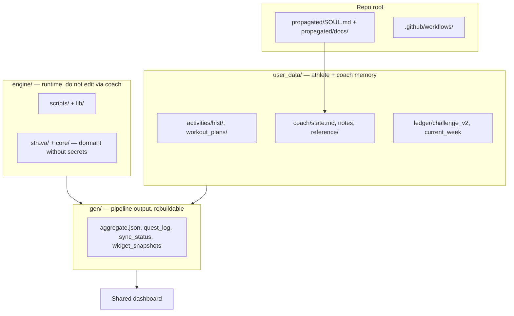
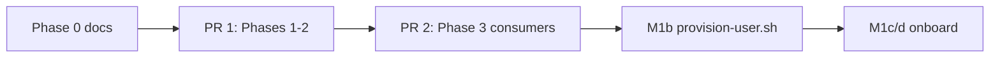

# Skeleton Layout — Full BYO Tree

> Status: **Locked (2026-07-26)** · Owner: Tech Lead · Authority: [`m1-plan.md`](m1-plan.md) · Carve: [`scripts/carve-skeleton.mjs`](../scripts/carve-skeleton.mjs)

## Context

First ~10 athletes use **BYO Claude** — clone one repo, follow `SETUP.md`, open Claude Code, talk to Coach. The org template (`sibling-shipyard/coach-skeleton`) must ship the **complete coaching workspace** on first clone. Coach sessions fill `user_data/` — not repo structure.

**Permanent non-goals:** agents in skeleton, `engine/soul/` source layers, compose script, `ui/`, `ios/`, `kdb/`, plugins (add-on later).

---

## Goal State

Every athlete repo — greenfield or migrated — uses **identical layout**. Strava path activates when `STRAVA_*` secrets exist (Option A). iOS path ignores dormant Strava code.



---

## Canonical tree

```
coach-skeleton/  (= coach-user after fork)
├── propagated/
│   ├── SOUL.md
│   └── docs/                        # timer-state-machine, current-week-contract, etc.
├── CLAUDE.md
├── README.md
├── SETUP.md
├── .coach-engine-version
├── .gitignore
├── .env.example
│
├── .github/workflows/
│   ├── sync.yml
│   ├── validate-data.yml
│   └── apply-coach-patch.yml
│
├── engine/
│   ├── scripts/          # regenerate, aggregate, quest gen, run_sync_pipeline
│   ├── lib/
│   ├── strava/           # all athletes — inactive without STRAVA_* secrets
│   └── core/
│
├── gen/
│   ├── aggregate.json
│   ├── widget_snapshots.json
│   ├── quest_log.md
│   ├── quest_history.json
│   └── sync_status.json
│
└── user_data/
    ├── activities/
    │   ├── hist/                    # synced activity JSON (iOS or Strava)
    │   ├── sync_state.json          # ingestion counters
    │   └── workout_plans/
    │       ├── templates/
    │       │   ├── foundation.json  # sample — shipped in carve
    │       │   └── strength_a.json
    │       └── sessions/            # YYYY-MM-DD_<id>.json coach overrides
    ├── coach/
    │   ├── state.md                 # boot anchor — First Session fills blanks
    │   ├── coach_notes.md
    │   ├── opponent_notes.md
    │   ├── sleep_log.json
    │   ├── chat_history.json
    │   └── reference/
    └── ledger/
        ├── challenge_v2.json        # repo marker for GitHub App
        └── current_week.json
```

**Not in skeleton:** `.github/agents/`, `engine/soul/`, compose script, plugins, HQ-only docs/skills.

---

## Lifecycle bands

| Band | Paths | Lifecycle |
|---|---|---|
| **init** | `user_data/coach/*`, `user_data/activities/hist/` | Seeded at fork or migration |
| **post-init** | `user_data/ledger/*`, `user_data/.../sessions/` | Precious — grows in use |
| **gen** | `gen/*` | Rebuildable — pipeline-owned |
| **engine** | `engine/*` | Carved from HQ — coach must not edit |

---

## BYO boundary (clone / setup / coach)

| Phase | Who | What |
|---|---|---|
| **Clone** | Athlete | Full repo on disk — SOUL, engine, gen, user_data |
| **Setup** | Athlete + operator (App/secrets in M1) | `SETUP.md`: secrets, GitHub App, optional iOS/Strava |
| **Coach** | Athlete + Claude | Fills `user_data/` per SOUL boot + First Session Protocol |

We cannot hide files from a local clone. Control is **SOUL boot sequence**, **write allowlist** (§2/§12), and **CI validators** — not filesystem ACL.

**Boot trigger:** empty Athlete Profile in `user_data/coach/state.md` → First Session Protocol.

**Coach writable:** `user_data/coach/*`, `user_data/ledger/*`, `user_data/.../sessions/*`, not `engine/`, `gen/`, or `SOUL.md`.

---

## Ingestion (Option A)

| Path | iOS athlete | Strava athlete |
|---|---|---|
| `engine/strava/` | Present, unused | Active when `STRAVA_*` set |
| `user_data/activities/hist/` | iOS commits `hk_*.json` | CI fetches via pipeline |
| Pipeline entry | `regenerate_derived.py` | `run_sync_pipeline.py` when secrets exist |

No `SYNC_SOURCE` flag — workflow picks pipeline by secrets + file presence.

---

## Path migration map (legacy → new)

For `provision-user.sh --migrate` and HQ consumer updates (PR 2).

| Old | New |
|---|---|
| `training/coach/*` | `user_data/coach/*` |
| `training/ledger/*` | `user_data/ledger/*` |
| `training/activities/history/` | `user_data/activities/hist/` |
| `training/activities/sleep_log.json` | `user_data/coach/sleep_log.json` |
| `training/sync_state.json` | `user_data/activities/sync_state.json` |
| `training/sync_status.json` | `gen/sync_status.json` |
| `training/widget_snapshots.json` | `gen/widget_snapshots.json` |
| `training/activities/quest_log.md` | `gen/quest_log.md` |
| `training/activities/quest_history.json` | `gen/quest_history.json` |
| `training/chat_history.json` | `user_data/coach/chat_history.json` |
| `training/reference/` | `user_data/coach/reference/` |
| `data/aggregate.json` | `gen/aggregate.json` |
| `sessions/` | `user_data/activities/workout_plans/sessions/` |
| `templates/` | `user_data/activities/workout_plans/templates/` |
| `scripts/`, `lib/` | `engine/scripts/`, `engine/lib/` |
| `strava/`, `core/` | `engine/strava/`, `engine/core/` |

---

## Greenfield vs migrate

| | Greenfield (user_3) | Migrate (Akash, Skanda) |
|---|---|---|
| Source | Fork org skeleton as-is | Legacy `coach-phelps` + path rewrite |
| Templates | `foundation` + `strength_a` from carve | Athlete's real templates (rewritten paths) |
| `hist/` | Empty until sync | Full history import |
| Secrets | Operator sets PAT + optional Strava | Copy from legacy repo |

Same tree in both cases.

---

## Delivery plan (two PRs)



| PR | Scope | Done when |
|---|---|---|
| **PR 1** | `carve-skeleton.mjs`, engine path migration, SOUL file map, skeleton push | Live skeleton matches this doc, engine scripts use new paths |
| **PR 2** | `ui/api/*`, iOS path updates | Dashboard + iOS read new paths |
| **After merge** | M1b provision, M1c/d validation | See [`m1-plan.md`](m1-plan.md) |

**Cutover:** B-style — you/Skanda tolerate brief breakage until PR 2 lands.

---

## Deferred

- **Plugins** — badminton, visualization/audio; optional add-on pack, not in base carve
- **SOUL propagation** — manual carve refresh until M2/M3 server-side engine

---

## Appendix

| Concern | Path |
|---|---|
| Carve operator tool | `scripts/carve-skeleton.mjs` |
| HQ engine source | `engine/` |
| Live skeleton | https://github.com/sibling-shipyard/coach-skeleton |
| M1 milestones | `docs/m1-plan.md` |
