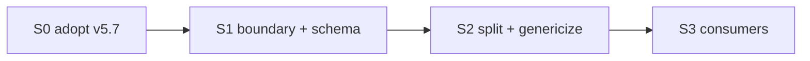

# SOUL Split Plan — Three Layers + Extensibility Seam (MVP)

> Status: **not started** · Owner: Tech Lead (plan only; execution by a separate agent) ·
> Built **from scratch on main**, not from `core/soul-split-m0` (pre-restructure, baked-in
> assumptions — do not reuse). Prereq for the `coach-skeleton` carve — do it now so every fork
> is born clean and extensible. See `docs/scaling-plan.md` §5.2.

## Goal

Split the monolithic `SOUL.md` into three layers **and** formalize the seam that lets new
use-cases (sports, conditions, tracking signals) land as *data*, not engine edits:

- **A — Soul:** voice, identity, philosophy. Shared, generic.
- **B — Engine:** boot, guardrails, rules, workflows, commit — written to **read Layer C
  generically** (no hardcoded sport/injury/signal). Shared.
- **C — Athlete:** a **declarative schema** (shared, in `soul/`) + the per-user **data** it
  describes (already external in `training/coach/state.md` + `training/ledger/challenge_v2.json`).

MVP = the split + the seam. **No roadmap features** (see Follow-ups). The seam is cheap because
`SOUL.md` today has **zero** sport hardcoding and its Rules Engine already says "adapt for the
athlete's sport" — we are formalizing what B does implicitly, not rewriting its logic.

## Source of truth

**Personal-repo `SOUL.md` v5.7** — the richer base. Main currently runs a thinner, de-personalized
`v1.0`; splitting that would bake a downgrade into every fork. So **S0 lands v5.7 on main first**,
as its own verified checkpoint, *then* we split. Not the `soul-split-m0` branch (pre-restructure).

S0 is a **reconciliation, not a copy** — three landmines from the v5.7↔v1.0 diff:

- **Section renumbering.** v5.7 has 12 sections (no separate "First Session Protocol"); Commit
  Protocol is **§12**, Rules Engine **§9**. `ui/api/coach-chat.ts` hardcodes SOUL §-references
  ("§13 commit protocol", "§2/§13 authority") — these must be re-pointed to v5.7's numbering in
  the **same PR**, or the server coach instructs Gemini against wrong sections.
- **Preserve hq-only content** absent from v5.7: the `training/chat_history.json` web-chat row and
  the Vercel-serverless / Sync-button pipeline note.
- **v5.7 is Sky-personalized** (§7 "The Athlete: Sky"). Leave it — S2's split extracts Sky's
  specifics into Layer C. Interim personalization of the shared brain is fine (only Sky/Skanda use
  it today).

v5.7 already uses the restructured `training/ledger|coach|activities/...` paths, so no path
reconciliation — confirm in S0.

## Guardrails

- **Behavior-preserving.** The assembled brain a coach reads must mean the same as today's
  `SOUL.md`. Guard with `VALIDATION_TESTS.md`. Genericizing B is a *reword to read C*, not a
  logic change — if a rule's behavior would change, stop and flag.
- **Keep a single assembled `SOUL.md` as the read artifact** (= A + B + C-schema). Split the
  *sources* into `soul/`. This keeps `coach-chat.ts` and BYO-Claude boot reading one brain, and
  stops the two runtimes diverging.
- **Do not hardcode C into B.** Every sport/condition/signal is C data B reads — the one rule
  that keeps the seam extensible.
- **Preserve v5.7's section numbering in the assembled `SOUL.md` through the split**, so the
  `coach-chat.ts` §-references fixed in S0 stay valid — the split touches file layout, not the
  numbered headings. `coach-chat.ts` then changes **once** (S0), not twice.
- One milestone = one PR = one exit test. `validate-data` stays green.

## The declarative Layer C schema (the seam — MVP shape only)

Minimal, extensible-by-adding-data. Ship the shape with today's single athlete's data; leave
slots empty otherwise.

- `sports[]` — a **list** (not one hardcoded sport). Sport-pack content stays Layer C, never in B.
- `injury_flags[]` — acute/transient (region + contraindicated pattern).
- `conditions[]` — chronic (region, contraindicated patterns, optional load ceiling). Fields
  optional per condition.
- `tracking_modules{}` — **reserved, empty in MVP.** The slot future signals (cycle, readiness,
  illness) drop into without a B change. No module content ships now.

B reads these generically (auto-regulation consults `injury_flags[]`/`conditions[]`; week
framework consults `sports[]`) instead of listing examples inline as the rules.

## Consumers the split must not break

- **`ui/api/coach-chat.ts` — load-bearing.** `SOUL_FILE_PATH = "SOUL.md"`; reads the whole file
  into the Gemini system prompt. If the assembled `SOUL.md` stays the artifact, **no logic
  change** — just verify it still receives the full A+B+C-schema brain.
- **BYO-Claude boot** — `CLAUDE.md` / `AGENTS.md` + `SOUL.md` §1 read `SOUL.md`. Unchanged if the
  artifact stays `SOUL.md`.
- **Agent docs** (`.github/agents/*`), `VALIDATION_TESTS.md`, `CONVENTIONS.md` — wording updates
  ("two-file portable architecture" → the layered layout).

## File layout

```
soul/
  A_identity.md    # voice, philosophy
  B_engine.md      # boot, guardrails, rules, workflows, commit — reads C generically
  C_athlete.md     # the declarative schema (sports[], injury_flags[], conditions[], tracking_modules{})
SOUL.md            # assembled = A + B + C-schema (what both runtimes read)
```

## Milestones

| # | Size | Milestone | Done when |
|---|---|---|---|
| **S0** | M | Adopt v5.7 on main | Main's `SOUL.md` reconciled to v5.7 content (hq-only bits preserved); `coach-chat.ts` §-references re-pointed to v5.7 numbering in the same PR; v5.7 paths confirmed to match hq's layout; `validate-data` green, one coach-chat smoke-test, live coach boots clean. **Still monolithic — no split yet.** |
| **S1** | S | Boundary + schema | Every v5.7 section mapped to A/B/C; the C schema (`sports[]`, `injury_flags[]`, `conditions[]`, empty `tracking_modules{}`) written up and signed off. No content moved yet. |
| **S2** | M, **critical** | Split + genericize + assemble | `soul/A_identity.md` + `B_engine.md` + `C_athlete.md` created from v5.7; B reworded to read C generically; Sky's specifics extracted into the C schema; `SOUL.md` reassembled, **behavior-equivalent**, section numbering preserved; `VALIDATION_TESTS.md` passes; a BYO-Claude boot behaves identically. |
| **S3** | S | Reconcile consumers | `coach-chat.ts` verified to still send the full brain to Gemini (one chat smoke-test); agent docs + `CLAUDE.md`/`AGENTS.md` updated; `validate-data` green. |



Critical path: **S0 → S1 → S2**. S0 and S2 are the two behavior-change events on the live coach —
both guarded by the validation tests + a coach-chat smoke-test.

## Deferred (not MVP)

- **Runtime-agnostic / capability-contract B** (no shell/git/python assumptions). Needed only for
  the Gemini/server host (`scaling-plan.md` M2/M3). BYO-Claude has a shell — leave B's boot/commit
  verbs as-is for now.

## Follow-ups (roadmap §5 — build post-split, as data into the seam)

All of `extensibility_roadmap.md` is downstream of this split. None ship in MVP; each becomes a
P1/P2 once the seam exists:

- **P1 (safety/privacy — jump the queue):** red-flag escalation guardrails (§5.8, the *one*
  justified B addition); field-level consent tiering before any new sensitive field reaches the
  server prompt (§5.7).
- **P1 (cheap, behind existing fields):** goal archetypes (§5.5); RA/hypermobility/asthma/diabetes
  pack *content* into `conditions[]` (§5.4).
- **P2 (new C fields / signals):** life-load, HRV-deload, illness + shared `return_ramp{}` (§5.1);
  cycle / peri-menopause / pregnancy (§5.1, consent-gated); sport packs cycling/swimming then
  climbing/team (§5.2); proactivity + equipment memory (§5.9).
- **P2 (structural lifts, defer hardest):** wearable N-vendor ingestion (§5.6); cross-sport load
  normalization — the other justified B addition, needs ≥2 sport packs first (§5.3).

## Not in scope

Carving `coach-skeleton`, the SOUL copy mechanism, onboarding — the next milestone
(`scaling-plan.md` M1), once the brain is cleanly split.
