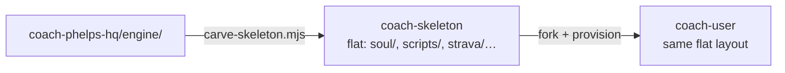

# engine/ — skeleton source of truth

Everything under `engine/` is **carved into** `sibling-shipyard/coach-skeleton` (flattened to repo
root in the fork) and **propagated** to per-user `coach-<user>` repos.

**HQ-only (never carved):** `ui/`, `ios/`, `kdb/`, `shared/`, root `scripts/carve-skeleton.mjs`.

**Ingestion (not in this folder):**

| Path | Role |
|---|---|
| `ios/` | HealthKit → commits `training/activities/history/hk_*.json` directly to GitHub |
| `engine/strava/` | Strava API pull when repo has `STRAVA_*` secrets |
| `engine/scripts/run_sync_pipeline.py` | Actions post-process: optional Strava pull + regenerate quest/aggregate |

**Operator:** `node scripts/carve-skeleton.mjs --dry-run` · `--push`
