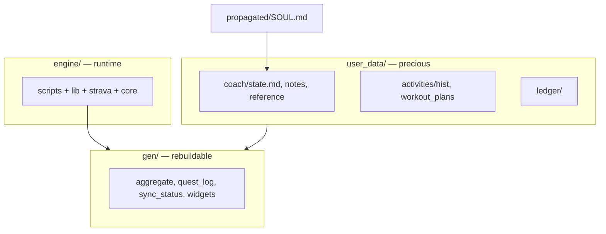

# engine/ — HQ brain (IP stays here)

Everything coaches, protocols, plugins, and activity-naming logic is **authored in HQ** `engine/`.
**coach-skeleton gets a carved copy** of the runnable BYO stack — same tree every athlete clones.

Canonical layout: [`docs/skeleton-layout.md`](../docs/skeleton-layout.md).

## IP boundary

| Stays in HQ only (never carved) | Carved into athlete `engine/` |
|---|---|
| `engine/soul/` source layers + compose script | — |
| `.github/agents/`, KDB, skills, HQ docs | — |
| `plugins/` (badminton, visualization) | — |
| Template **source** authoring (`engine/templates/`) | Copy of 2 samples → `user_data/.../templates/` |
| UI, iOS app source | — |
| `engine/SOUL.md` (draft during compose) | `propagated/SOUL.md` + `propagated/docs/` (composed copy) |

| In every athlete repo | Notes |
|---|---|
| `engine/scripts/`, `engine/lib/` | Sync + aggregate pipeline |
| `engine/strava/`, `engine/core/` | Shared activity-naming + local-query logic (Strava ingestion itself removed, issue #113) |
| `user_data/` | Athlete + coach memory |
| `gen/` | Pipeline output |

**Endgame (M2/M3):** SOUL + engine run server-side → skeleton thins to **data only**.

## Athlete repo shape (carved)

Operator refresh: `node scripts/carve-skeleton.mjs --push`
