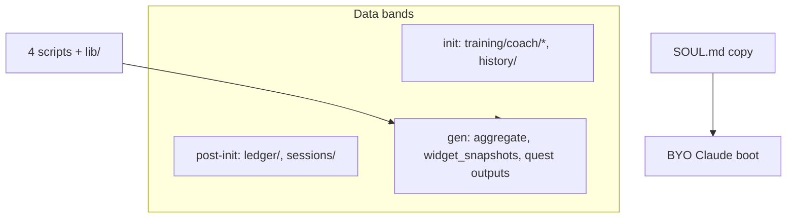

# engine/ — HQ brain (IP stays here)

Everything coaches, protocols, plugins, and Strava/rename logic lives in HQ `engine/`.
**coach-skeleton gets the bare minimum** to run dashboard + BYO boot.

## IP boundary

| Stays in HQ (never in base skeleton) | In skeleton |
|---|---|
| `engine/soul/` source layers + compose | `SOUL.md` copy only |
| Agents, KDB, skills, templates, plugins | — |
| `strava/`, `core/taxonomy`, rename logic | Added at **provision** for Strava athletes only |
| `run_sync_pipeline.py` (full pipeline) | `regenerate_derived.py` (quest + aggregate path) |
| UI, iOS app source | — |

**Endgame (M2/M3):** SOUL + engine run server-side → skeleton thins to **data only**.

## Skeleton contents (base carve)

**Provision adds for Strava:** `strava/`, `core/`, `run_sync_pipeline.py`, `.env.example`, secrets.

Operator: `node scripts/carve-skeleton.mjs --push`
