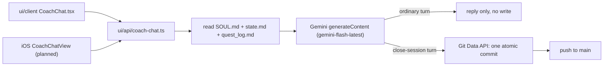
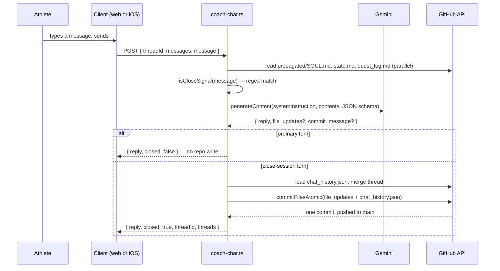

# Coach Chat — how it works

## Context

Real Coach Phelps sessions from the browser (and soon iOS), backed by Gemini. This doc traces
exactly what happens between the athlete hitting send and anything landing on `main` — see
ADR 0012 for why it commits the way it does. Companion to `engine/docs/ios-sync.md`: that doc
covers the HealthKit ingestion path, this one covers the coaching-conversation path. They share
a commit pattern (Git Data API, atomic) but nothing else.

## Overview

## Trigger — sending a message

Entry points:

- `CoachChat.tsx` — the web chat page, send button / Enter.
- iOS `CoachChatView` (planned, see ADR 0012 and the iOS Builder issue) — same endpoint, same
  contract, `Bearer <token>` auth instead of a session cookie.

Both call `POST /api/coach-chat` with `{ threadId?, messages, message }`. `messages` is the
client's own in-memory running history for the thread — nothing is persisted server-side for an
unwrapped conversation, so the server stays stateless per turn until a close signal.

## What a turn does, in order

1. **Context read** — `askGemini()` fetches `propagated/SOUL.md`, `user_data/coach/state.md`,
   `gen/quest_log.md` fresh from GitHub every turn (no caching), and builds a `systemInstruction`
   string: full SOUL.md, a computed "today is..." line derived from state.md's `**Timezone:**`
   field (the web-chat equivalent of SOUL.md's boot-sequence `TZ=<zone> date` step), a hard
   role-lock ("Coach Phelps ONLY — never Tech Lead/UI Expert/Bob/iOS Builder"), current state.md
   and quest_log.md verbatim, then either close-session or ordinary-turn instructions.
2. **Close-signal check** — `isCloseSignal()` matches the athlete's message against a fixed regex
   (`wrap this session`, `done for today`, `goodnight coach`, etc.) — deterministic, not left to
   the model to self-detect.
3. **Gemini call** — one non-streaming `generateContent` request, JSON-schema-constrained
   response (`reply`, optional `commit_message`, optional `file_updates`).
4. **Ordinary turn** — no repo write at all. The client appends both messages to its own
   in-memory thread; refreshing before "wrap" loses the conversation (accepted trade-off, no
   separate database — the repo is the only durable store).
5. **Close-session turn** — the one moment a real commit happens:
   - Load `chat_history.json`, find or create the thread, merge in the full message list.
   - Filter Gemini's `file_updates` through `isCoachWritable()` — only files in
     `COACH_WRITABLE_FILES` (`user_data/coach/state.md`, `coach_notes.md`,
     `user_data/ledger/challenge_v2.json`, `current_week.json`, `sleep_log.json`,
     `user_data/activities/workout_plans/sessions/**`) survive, regardless of what the model
     proposed — defense in depth, not trust in instruction-following.
   - Apply the count-based retention cap (ADR 0012): keep the 7 most-recently-active threads.
   - `commitFilesAtomic()` — every valid `file_updates` entry plus the updated
     `chat_history.json`, in **one** commit via the Git Data API (blob → tree → commit → ref,
     retried on a non-fast-forward conflict), pushed straight to `main`. Commit message:
     `coach: chat — <cleaned commit_message>`.

## What does NOT happen in this action

No GitHub Actions workflow is dispatched by chat. `challenge_v2.json` (if touched) is a plain
push to `main` — on a repo where `sync.yml` already has a push trigger on that path, this
indirectly re-triggers the downstream pipeline the same way an iOS HealthKit sync would; on a
repo where `sync.yml` is `workflow_dispatch`-only, `quest_log.md` just stays slightly stale until
the athlete next hits Sync themselves. This was a deliberate choice to avoid a second, racing
workflow run — see the comment block at `coach-chat.ts:203-212`.

An ordinary (non-closing) turn writes nothing, commits nothing, and touches no file — the whole
conversation lives in browser/app memory until close.

## Auth

`coach-chat.ts` uses the shared `resolveRepoAuth()` helper (`ui/api/auth/_lib/resolve-auth.ts`),
the same one `widget-snapshots.ts` already uses (ADR 0005) — no new auth code needed for iOS:

- **Web:** session cookie present → `ensureFreshSession`/`withSessionCookie` (ADR 0009's
  refresh-token rotation), resolving `gh_token` and `repo_full_name`.
- **iOS:** no cookie → falls through to `Authorization: Bearer <token>` +
  `X-Coach-Repo: owner/repo` headers, same pattern `GitHubAPIClient.fetchWidgetSnapshots()`
  already sends (`GitHubAPIClient.swift:215-259`). `CoachChatAPIClient` follows that exact
  header shape.

## Retention (ADR 0012)

Newest 7 threads by last activity survive, across active + archived status combined. Creating
an 8th evicts the oldest. Soft-deleted threads (`status: "deleted"`) don't count toward the cap
and aren't auto-purged — they sit in the DELETED section until the athlete taps Restore (back to
active) or Delete Forever, which sends the same "deleted" status a second time; the server
recognizes that as a real hard delete and removes the thread outright. Replaces the prior
30-day-archived / 7-day-deleted calendar purge.

## Files changed — summary

| File | Written by | Notes |
|---|---|---|
| `user_data/coach/chat_history.json` | close-session turn only | full thread list, capped at 7 |
| `user_data/coach/state.md` | close-session turn, if Gemini proposes it | must pass `isCoachWritable()` |
| `user_data/coach/coach_notes.md` | close-session turn, if proposed | same |
| `user_data/ledger/challenge_v2.json` | close-session turn, if proposed | same; may indirectly re-trigger `sync.yml` |
| `user_data/ledger/current_week.json` | close-session turn, if proposed | same |
| `user_data/coach/sleep_log.json` | close-session turn, if proposed | same |
| `user_data/activities/workout_plans/sessions/*.json` | close-session turn, if proposed | any filename under this prefix |

**Read-only** in this flow: `propagated/SOUL.md`, `gen/quest_log.md` — fetched fresh every turn,
never written by chat.

## Appendix — file/class reference

| File | Role |
|---|---|
| `ui/api/coach-chat.ts` | request handler, Gemini call, commit orchestration |
| `ui/api/_lib/githubGitData.ts` | atomic multi-file commit helper (Git Data API), shared by all writes in `coach-chat.ts` |
| `ui/client/src/pages/CoachChat.tsx` | web chat page |
| `ui/client/src/components/coach-chat/coachChatModel.ts` | client fetch helpers (`fetchThreads`, `sendMessage`, `setThreadStatus`) |
| `ios/CoachHQ/CoachHQ/Services/CoachChatAPIClient.swift` (planned) | iOS client of the same endpoint |
| `ios/CoachHQ/CoachHQ/Services/GitHubAPIClient.swift` | iOS's own Git Data API implementation — HealthKit sync only, not shared with chat |
