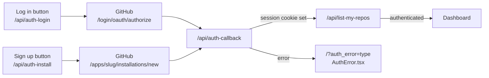
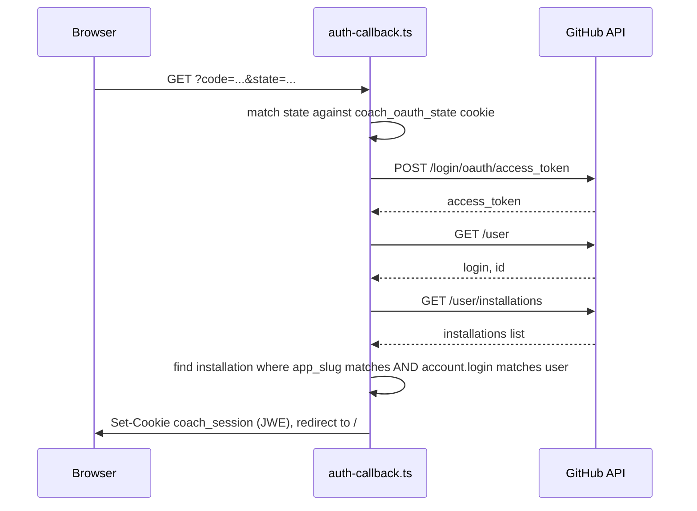
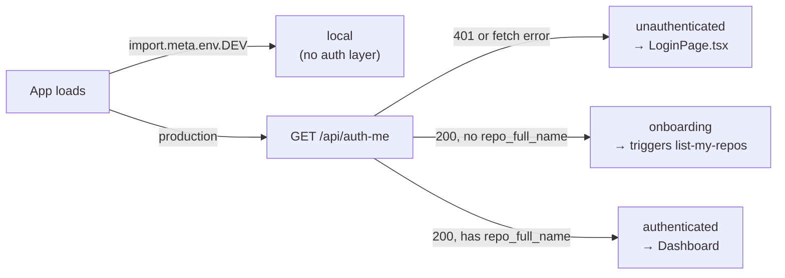

# GitHub Auth — how Log in and Sign up work

## Context

The dashboard has one GitHub App and two buttons on `LoginPage.tsx` — **Log in** and
**Sign up**. Both are OAuth+PKCE flows that land on the same callback and produce the same kind
of session, so this doc traces both side by side rather than duplicating the shared half twice.
Covers the same ground as [[strava-sync]] and [[ios-sync]] do for their trigger paths - "if I
press X, what changes."

`docs/user-3-onboarding-gate.md` covers a different, separate concern (auto-provisioning a repo
on sign-up so a friend never touches a PAT) - not duplicated here, this doc is a mechanics trace
of the auth flow as it exists today.

## Overview

- **Log in** — the fast path. Goes straight to GitHub's sign-in endpoint, which recognizes an
  existing App installation and skips straight to authorization.
- **Sign up** — always routes through GitHub's install/repo-picker. Used by first-time users
  (the only path that makes sense for them) and by already-installed users who want to add or
  switch which repo the App can see.
- Both set the same short-lived state+PKCE cookie before redirecting to GitHub, so
  `auth-callback.ts` doesn't need to know or care which button was pressed.

## Flow 1 — pressing Log in

`ui/api/auth-login.ts`:

1. Generates a random `state` and a PKCE `codeVerifier`, derives `codeChallenge` from it
   (`ui/api/_lib/pkce.ts`).
2. Builds `https://github.com/login/oauth/authorize` with `client_id`, `redirect_uri` (this
   deployment's `/api/auth-callback`), `state`, `code_challenge`, `code_challenge_method=S256`.
3. Sets `coach_oauth_state` cookie (`{ state, codeVerifier }`, 10 min max-age) via
   `buildCookie` in `ui/api/_lib/session.ts`.
4. 302s the browser to that GitHub URL.

Deliberately **not** `/apps/<slug>/installations/new` - that URL always shows the
install/repo-picker, even to someone already installed. `/login/oauth/authorize` is the actual
sign-in endpoint, so a returning user just gets signed in.

## Flow 2 — pressing Sign up

`ui/api/auth-install.ts` - same PKCE/state mechanics as Log in, different target URL:

1. Same random `state` + PKCE `codeChallenge` generation.
2. Builds `https://github.com/apps/{APP_SLUG}/installations/new` with `state`, `redirect_uri`,
   `client_id`, `code_challenge`, `code_challenge_method=S256`.
3. Sets the same `coach_oauth_state` cookie.
4. 302s the browser to GitHub's install picker.

Because the App is configured with "Request user authorization (OAuth) during installation",
GitHub continues straight into the OAuth authorize step once install completes, landing back on
the same `auth-callback.ts` as Flow 1 - no special-casing needed downstream.

## Shared: `auth-callback.ts`

Key checks, in order - any failure redirects to `/?auth_error=<type>` instead of returning raw
JSON, since the browser lands here directly from GitHub's redirect (not a `fetch()` call):

| Step | Failure → `auth_error` type |
|---|---|
| `CLIENT_ID`/`CLIENT_SECRET` not configured | `config_error` |
| Missing `code` or `state` query params | `missing_params` |
| No `coach_oauth_state` cookie | `missing_oauth_session` |
| Cookie doesn't parse as JSON | `corrupt_oauth_session` |
| Cookie's `state` doesn't match the query param | `state_mismatch` |
| Token exchange rejected by GitHub | `token_exchange_failed` |
| `GET /user` fails | `user_fetch_failed` |
| `GET /user/installations` fails | `lookup_failed` |
| No installation matches this App **and** this user's account login | `not_installed` |

The `app_slug` + `account.login` double-check on the installations lookup matters:
`/user/installations` returns every installation the calling user has *any visibility into*,
including installations on repos they're merely a collaborator on - not just their own. Checking
`app_slug` alone let a collaborator's session resolve to the repo owner's installation instead of
their own (sibling-shipyard/coach-phelps-hq#30).

`not_installed` is the expected state for anyone who's never installed the App - most new
friends. `AuthError.tsx` points them at Sign up, not a dead end.

On success: `ui/api/_lib/session.ts`'s `encryptSession()` builds a JWE (`{ github_user_id, login,
gh_token, installation_id }`), set as the `coach_session` cookie (~8h max-age), and the browser
is redirected to `/`.

## Repo resolution — `list-my-repos.ts`

A fresh session has no `repo_full_name` yet - `AuthContext.tsx` reads this as `onboarding`, not
`authenticated`. The dashboard calls `GET /api/list-my-repos` to resolve it:

- Lists repos granted to the session's `installation_id`
  (`GET /user/installations/{id}/repositories`), filtered to ones actually **owned** by the
  logged-in account (`repo.owner.login === session.login`) - same class of cross-account leak as
  #30 above, since the installation can include repos the user only collaborates on.
- Each owned candidate is checked for a `user_data/ledger/challenge_v2.json` marker file via the
  Contents API, to confirm it's actually a coach-phelps repo.
- **1 confirmed candidate** → auto-selected, session updated with `repo_full_name`, done.
- **0 confirmed candidates** → `{ candidates: [], reason }`, where `reason` distinguishes
  "nothing owned was granted" (`no_owned_repos`, fix: Sign up and grant a repo) from "something
  granted but none look like a coach-phelps repo" (`no_marker_match`, fix: finish setup).
- **2+ confirmed candidates** → `{ candidates: [...] }`, client renders a picker;
  `GET ?select=<owner>/<repo>` persists the pick (re-checked for ownership + marker file first).
- `GET ?switch=1` re-lists every candidate instead of trusting the cached `repo_full_name` -
  lets an already-resolved user deliberately switch repos without logging out.

## Session mechanics

`ui/api/_lib/session.ts` - shared by every `auth-*.ts` handler and `list-my-repos.ts`:

- `coach_session` - the real session, a JWE (encrypted, not just signed) via `jose`
  (`EncryptJWT`, `A256GCM`, key = `SESSION_SECRET` env var). Encrypted so the embedded
  `gh_token` isn't readable even if the cookie value leaks somewhere - `HttpOnly` already blocks
  client JS, this is defense in depth on top of that. ~8h max-age (`SESSION_MAX_AGE_SEC`).
- `coach_oauth_state` - short-lived (10 min), holds `{ state, codeVerifier }` across the
  redirect round trip to GitHub and back.
- Both cookies: `Path=/; HttpOnly; Secure; SameSite=Lax`.

## Logout

`ui/api/auth-logout.ts` - one step: clears `coach_session`, redirects to `/`. No GitHub API call
- there's nothing to revoke server-side for this flow.

## Client-side gate — `AuthContext.tsx`

`local` only fires in `npm run dev` (Vite's `import.meta.env.DEV`), for self-hosted single-repo
use with no hosted auth layer at all. Any real fetch/parse failure in production falls back to
`unauthenticated`, never `local` - a genuine production error must show the login screen, not
silently unlock the dashboard. `auth-error` query params (from `auth-callback.ts`'s redirects)
are read separately and rendered by `AuthError.tsx`.

## Appendix — file reference

| Path | Role |
|---|---|
| `ui/client/src/components/login/LoginPage.tsx` | Log in / Sign up buttons |
| `ui/api/auth-login.ts` | Log in entry point |
| `ui/api/auth-install.ts` | Sign up entry point |
| `ui/api/_lib/pkce.ts` | PKCE verifier/challenge generation |
| `ui/api/auth-callback.ts` | shared OAuth callback, token exchange, installation lookup |
| `ui/api/_lib/session.ts` | cookie helpers, JWE session encrypt/decrypt |
| `ui/api/auth-me.ts` | session read endpoint |
| `ui/api/list-my-repos.ts` | post-auth repo resolution / picker |
| `ui/api/auth-logout.ts` | clears session cookie |
| `ui/client/src/contexts/AuthContext.tsx` | client-side auth state gate |
| `ui/client/src/pages/AuthError.tsx` | renders `auth_error` types |
| `docs/user-3-onboarding-gate.md` | separate concern: auto-provisioning a repo on sign-up |
