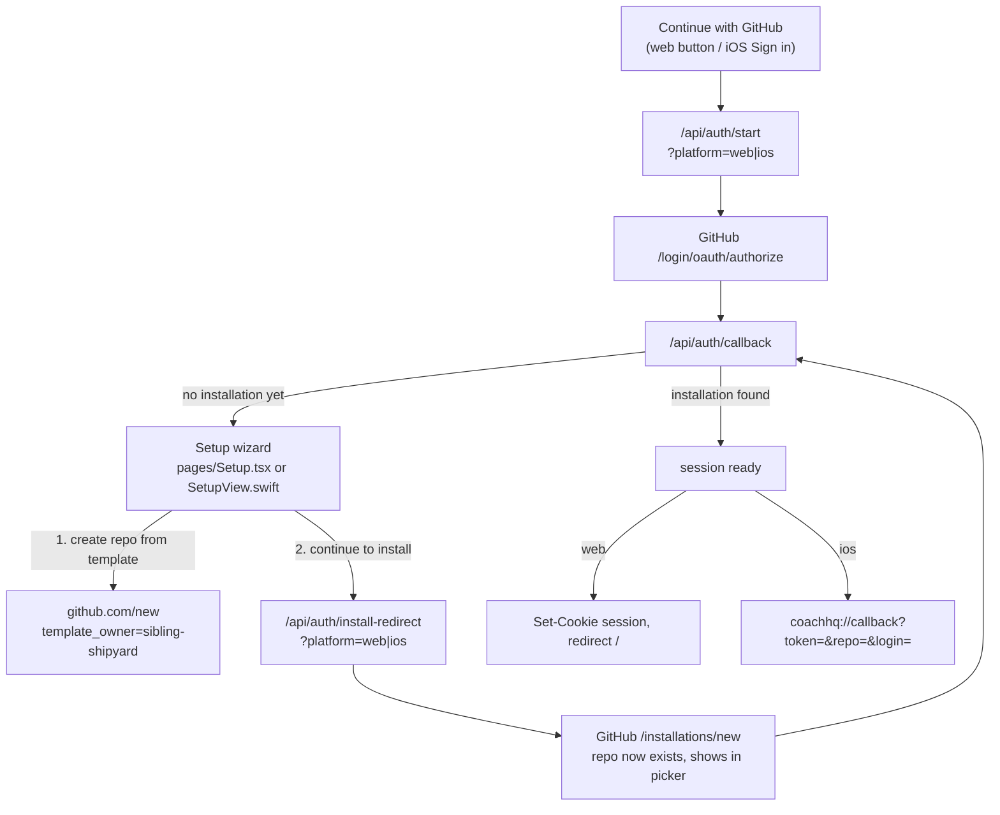
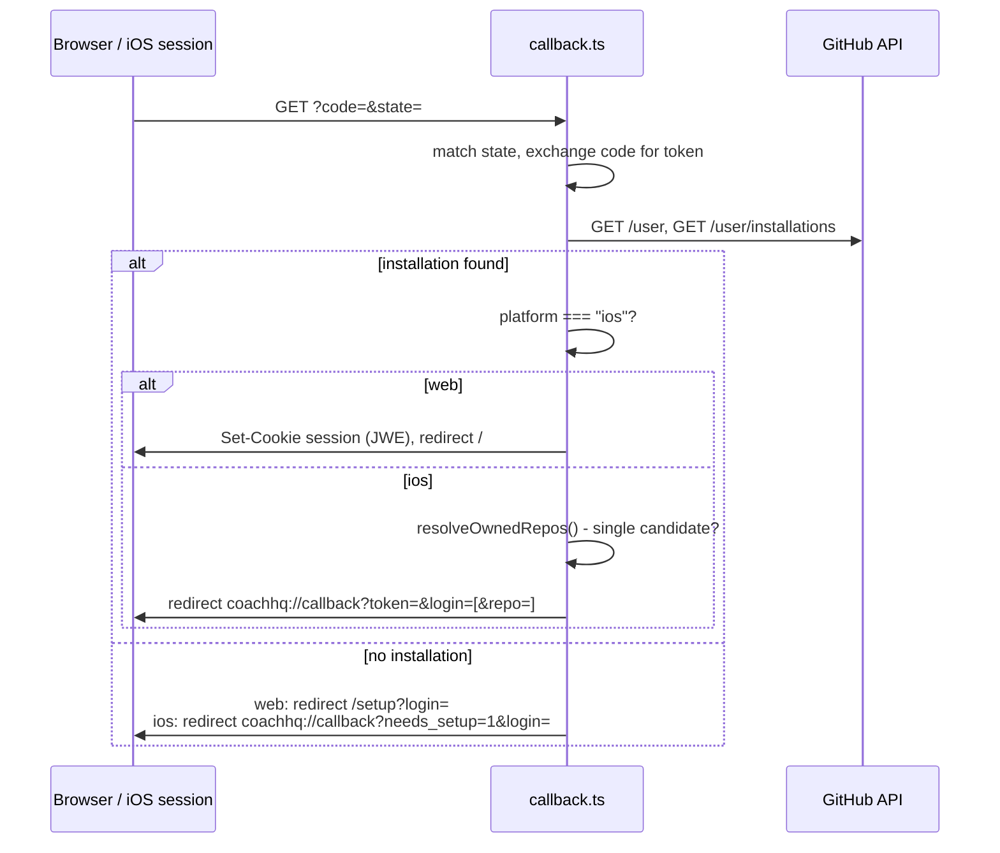

# GitHub Auth — how sign-in works (web + iOS, shared backend)

## Context

One shared backend, `ui/api/auth/`, handles GitHub sign-in for both the web dashboard and the
iOS app. There's a single entry point ("Continue with GitHub" on web, "Sign in with GitHub" on
iOS) - it looks the same whether the person is new or returning. First-time users (no
`coach-phelps` App installation yet) are walked through a two-step Setup wizard instead of
seeing a dead-end error page. Covers the same ground as [[strava-sync]] and [[ios-sync]] do for
their trigger paths - "if I press X, what changes."

This replaces an earlier two-button (Log in / Sign up) web-only flow and a completely separate
classic-OAuth iOS flow (embedded client secret, on-device token exchange - a real App Store
distribution blocker). Both are gone; this is what's there now.

## Why sign-up can't be fully automated

GitHub App user-to-server tokens cannot create repositories under a personal account - confirmed
live: `404 Not Found` on `POST /repos/{template}/generate`, `403 Resource not accessible by
integration` on `POST /user/repos`. This is a hard platform rule, not a config issue: Apps only
ever act on repos they're already installed on. Only a classic OAuth token/PAT with `repo` scope
can create a personal repo via API, and this system deliberately doesn't introduce one (keeps the
single-repo-access-only design the GitHub App was chosen for in the first place).

Every install of `coach-phelps` also grants access to exactly **one** repo, picked from GitHub's
own repo-picker on `/installations/new` - which only lists **existing** repos. So for a brand-new
user, the repo has to exist *before* that picker has anything to show.

Net result: two GitHub-native screens are unavoidable for a first-time user - creating the repo
from the `coach-skeleton` template, then installing the App on it. Everything else is automatic.
(`sibling-shipyard/coach-skeleton` had to be made **public** for this to work at all - a private
template is invisible to a brand-new account regardless of what kind of token it presents. Audited
first for secrets/PII before flipping visibility - clean, single commit, all placeholder data.)

## Overview

- The button always hits the plain `/login/oauth/authorize` sign-in endpoint - identical for new
  and returning users. It never routes straight into `/installations/new`; only `callback.ts`
  does that, and only when it discovers there's genuinely no installation yet.
- `callback.ts` branches its final response on a `platform` value (`web` or `ios`) that rides
  through the whole redirect chain inside the existing `coach_oauth_state` cookie payload
  (`{ state, codeVerifier, platform }`) - no new cookie, no new endpoint needed for that.

## Shared backend — `ui/api/auth/`

| File | Role |
|---|---|
| `start.ts` | The one entry point. Builds PKCE state, redirects to GitHub's authorize endpoint. Accepts `?platform=ios`. |
| `callback.ts` | Shared landing point. Token exchange, `GET /user`, installation lookup (`app_slug` + `account.login` match, per #30). Branches on platform - see below. |
| `install-redirect.ts` | Internal step, not linked from product UI directly - only the Setup wizard's "Continue to install" calls it. Same PKCE/state mechanics as `start.ts`, targets `/apps/coach-phelps/installations/new`. Accepts `?platform=ios`. |
| `me.ts` | Session read endpoint (web only - iOS has no session cookie to read). |
| `logout.ts` | Clears the session cookie. |
| `list-my-repos.ts` | Repo resolution/picker. Dual auth: session cookie (web) or `Authorization: Bearer <token>` with no cookie (iOS's fallback for the rare 0-or-2+-candidate case). |
| `_lib/session.ts` | JWE session cookie helpers (unchanged from before). |
| `_lib/pkce.ts` | PKCE verifier/challenge generation (unchanged from before). |
| `_lib/repo-resolution.ts` | **Single source of truth** for installation + owned-repo lookup - used by both `callback.ts` (iOS's inline resolution) and `list-my-repos.ts` (web's picker, iOS's fallback), so the ownership/marker-file rules can't drift between the two callers. |

### `callback.ts`'s platform branch

- **Web** gets what it always got: a `Set-Cookie` session, redirect to `/`.
- **iOS** has no cookie jar shared with the API - it authenticates every subsequent request with
  `Authorization: Bearer <gh_token>` + `X-Coach-Repo: owner/repo` (`_lib/resolve-auth.ts`'s
  contract, also what `widget-snapshots.ts` and `GitHubAPIClient.swift`'s direct GitHub calls
  use). So instead of a cookie, the redirect carries the raw token, plus `repo` when
  `resolveOwnedRepos()` finds exactly one owned+marker-confirmed candidate - true for every
  install going forward, since installs are single-repo by design. If it's not exactly one
  (legacy multi-repo installs), the app falls back to calling `list-my-repos.ts` itself with the
  bearer token once it has one, running the same picker logic web's `Onboarding.tsx` uses.
- Error paths mirror this split too: web redirects to `/?auth_error=<type>` (`AuthError.tsx`
  renders it); iOS gets `coachhq://callback?error=<type>`.

## Web flow

- `WelcomePage.tsx` - one link, `/api/auth/start`. (The old separate `/api/auth-install` "Sign
  up" link and `LoginPage.tsx`/`pages/Login.tsx` route are gone - both were fully replaced.)
- `pages/Setup.tsx` - shown when `callback.ts` redirects to `/setup?login=<login>`. Two buttons:
  a `target=_blank` link to `github.com/new?template_owner=sibling-shipyard&template_name=coach-skeleton&owner=<login>&name=coach-<login>&visibility=private`
  (opens in a new tab, user clicks GitHub's own green "Create repository" button), and a link to
  `/api/auth/install-redirect`.
- `pages/Onboarding.tsx` - unchanged from before: calls `list-my-repos.ts`, auto-selects on one
  candidate, renders a picker on 2+.

## iOS flow

`ASWebAuthenticationSession` (what presents the GitHub sign-in webview) is a single,
self-contained session - it can't cleanly host the web wizard's "click a link, it opens a new
tab, come back" pattern. So `Setup.tsx` gets reimplemented **natively** as `SetupView.swift`
rather than embedding the React page.

- `GitHubAuthManager.swift` - `signIn()` opens `ASWebAuthenticationSession` against
  `{dashboardBaseURL}/api/auth/start?platform=ios`, `callbackURLScheme = "coachhq"`. Parses the
  `coachhq://callback` redirect (`handleCallback()`): `error=` throws, `needs_setup=1&login=`
  sets `pendingSetupLogin` (routes to `SetupView`), `token=&login=[&repo=]` saves the token to
  Keychain (`com.siblingshipyard.coachhq.github.token`, unchanged key) and sets `selectedRepo`
  when present.
- `SetupView.swift` - step 1 opens the same `github.com/new?template_owner=...` URL in system
  Safari via `UIApplication.shared.open()` (standard "switch out, do a thing, switch back"
  mobile pattern - no in-session navigation needed). Step 2 calls
  `authManager.continueToInstall()`, which opens a **second** `ASWebAuthenticationSession`
  against `/api/auth/install-redirect?platform=ios`.
- `resolveRepoIfNeeded()` - the fallback for the rare not-exactly-one-candidate case, calls
  `list-my-repos.ts` with `Authorization: Bearer <token>`, no `X-Coach-Repo` (that's what's being
  resolved). No native picker UI exists yet for a genuine 2+ result - `selectedRepo` just stays
  nil in that case.
- `CoachHQApp.swift` routing: `isAuthenticated` → `MainTabView`, else `pendingSetupLogin != nil`
  → `SetupView`, else `LoginView`.
- `GitHubAuthManager`'s public surface (`isAuthenticated`, `isSessionReady`, `user`,
  `selectedRepo`, `loadToken()`, `signOut()`) is unchanged, so `GitHubAPIClient.swift`,
  `SettingsView.swift`, etc. needed no changes.

## Session mechanics

- **Web**: `coach_session` cookie - JWE (encrypted, not just signed) via `jose`, key =
  `SESSION_SECRET`. ~8h max-age. Payload: `{ github_user_id, login, gh_token, installation_id,
  repo_full_name? }`. `coach_oauth_state` - short-lived (10 min), carries `{ state, codeVerifier,
  platform }` across the GitHub redirect round trip.
- **iOS**: no server-side session at all - stateless. Every API call presents
  `Authorization: Bearer <gh_token>` + `X-Coach-Repo: owner/repo`, verified fresh each time by
  `_lib/resolve-auth.ts`. Token lives in iOS Keychain, not a cookie.

## Appendix — file reference

| Path | Role |
|---|---|
| `ui/client/src/components/welcome/WelcomePage.tsx` | Web "Continue with GitHub" entry point |
| `ui/client/src/pages/Setup.tsx` | Web Setup wizard |
| `ui/client/src/pages/Onboarding.tsx` | Web repo picker (post-auth) |
| `ui/client/src/pages/AuthError.tsx` | Renders `auth_error` types |
| `ui/client/src/contexts/AuthContext.tsx` | Client-side auth state gate |
| `ui/api/auth/start.ts` | Sign-in entry point (both platforms) |
| `ui/api/auth/callback.ts` | Shared OAuth callback, platform branch |
| `ui/api/auth/install-redirect.ts` | Setup wizard step 2 |
| `ui/api/auth/me.ts` | Web session read endpoint |
| `ui/api/auth/logout.ts` | Clears web session cookie |
| `ui/api/auth/list-my-repos.ts` | Repo resolution/picker, dual auth |
| `ui/api/auth/_lib/session.ts` | Cookie helpers, JWE encrypt/decrypt |
| `ui/api/auth/_lib/pkce.ts` | PKCE verifier/challenge generation |
| `ui/api/auth/_lib/repo-resolution.ts` | Shared installation/repo lookup logic |
| `ui/api/auth/_lib/resolve-auth.ts` | Per-request auth for repo-scoped endpoints (cookie or Bearer+X-Coach-Repo) |
| `ui/api/widget-snapshots.ts` | Server-side widget snapshot generation, used by iOS |
| `ios/CoachHQ/CoachHQ/Services/GitHubAuthManager.swift` | iOS sign-in, Keychain, repo resolution |
| `ios/CoachHQ/CoachHQ/Views/SetupView.swift` | iOS native Setup wizard |
| `ios/CoachHQ/CoachHQ/Views/LoginView.swift` | iOS sign-in screen |
| `ios/CoachHQ/CoachHQ/CoachHQApp.swift` | iOS auth-state routing |
| `ios/CoachHQ/CoachHQ/Services/GitHubAPIClient.swift` | iOS direct GitHub Contents/Git Data API calls |
