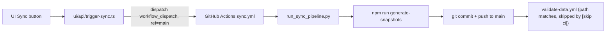
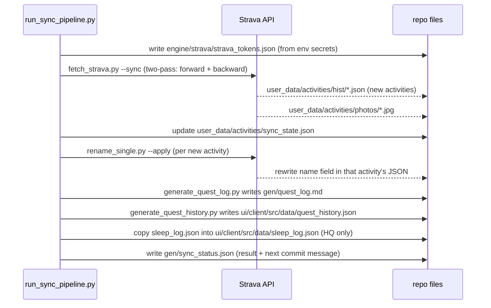

# Strava Sync — how it works

## Context

I have Strava Premium, so my repo pulls activities from Strava's API instead of HealthKit. This
doc traces exactly what happens when I press the Sync button, so I (or another agent) can answer
"if X triggers, what changes" without re-reading five files each time. Covers the [[ios-sync]]
counterpart's opposite number — see that doc for the HealthKit path.

Sync only runs on demand today. There is no cron/schedule trigger anywhere in this repo's
`.github/workflows/` — only `workflow_dispatch` (the UI button, or `gh workflow run sync.yml`).

## Overview



## Trigger 1 — pressing Sync

`ui/api/trigger-sync.ts` runs on Vercel. It changes **nothing in the repo** — its only job is to
call the GitHub API:

```
POST https://api.github.com/repos/{repo}/actions/workflows/sync.yml/dispatches
body: { "ref": "main" }
```

- Uses the signed-in user's own GitHub App token, so it dispatches that user's own repo — not a
  shared bot.
- Per-repo 60s cooldown so double-clicking doesn't spam dispatches.
- Always targets `main`.

## Trigger 2 — `sync.yml` runs

This repo (HQ) has `.github/workflows/sync.yml`, `workflow_dispatch`-only. User forks get a
different but related file, `engine/.github/workflows/sync.user.yml`, carved in as `sync.yml` —
covered separately below since its steps differ.

Each step, and exactly what it changes on disk:

| Step | What it does | Files touched |
|---|---|---|
| Checkout (PAT) | Clones repo with `secrets.PAT_TOKEN`, not default `GITHUB_TOKEN`, so the later push can land on `main` directly | none |
| `python3 engine/scripts/run_sync_pipeline.py` | Runs the 7-part pipeline below | see below |
| `cd ui && npm ci && npm run generate-snapshots` | Regenerates the dashboard's data bundle | `ui/client/src/data/*.json` |
| Commit step | Stages outputs, commits, pushes straight to `main` — no PR | see "Commit mechanics" |

### `run_sync_pipeline.py` — the 7 things it does, in order



1. **Write tokens from env** — builds `engine/strava/strava_tokens.json` from the
   `STRAVA_CLIENT_ID`/`STRAVA_CLIENT_SECRET`/`STRAVA_REFRESH_TOKEN` repo secrets, forcing the
   first API call to refresh.
2. **`engine/strava/fetch_strava.py --sync`** — the actual Strava pull. Two-pass: a forward pass
   from the last sync point (with a 48h overlap window, to catch late-arriving Apple
   Watch→Strava activities) up to now, and a backward pass filling older history. Writes one JSON
   per new activity to `user_data/activities/hist/`, downloads any photos to
   `user_data/activities/photos/`, updates `user_data/activities/sync_state.json`
   (`oldest_synced`, `newest_synced`, `total_activities`, `last_run`).
3. **`engine/strava/rename_single.py --apply`**, once per new activity — classifies the activity
   (run/swim/foundation/weight/recovery/etc via `rename_core.py`), renames it on Strava itself via
   API, and rewrites the `name` field in the local history JSON to match. Non-fatal on failure —
   pipeline continues, warning collected.
4. **`engine/scripts/generate_quest_log.py`** — reads `user_data/ledger/challenge_v2.json` (the
   coach-maintained challenge ledger — read-only here, never written by sync) plus activity
   history, writes `gen/quest_log.md` (a "DO NOT EDIT" auto-generated file the coach reads at
   boot).
5. **`engine/scripts/generate_quest_history.py`** — reads archived seasons plus the current
   ledger, reconstructs full daily-streak timelines, writes
   `ui/client/src/data/quest_history.json` (HQ, since `ui/` exists) or `gen/quest_history.json`
   on a fork.
6. **Copy sleep log** — `user_data/coach/sleep_log.json` → `ui/client/src/data/sleep_log.json`.
   HQ only; skipped on forks without `ui/`.
7. **Write `gen/sync_status.json`** — the pipeline's own result record: `status`,
   `activities_synced`, `activities_renamed`, `warnings`, and a `commit_message` string the next
   step reads verbatim. On any exception, this step still runs (with `status: "error"`) and the
   job then exits non-zero.

### `npm run generate-snapshots`

Runs `ui/scripts/generate-widget-snapshots.ts`. Regenerates `ui/client/src/data/*.json` —
`activities.json`, `challenge_v2.json` (mirror of the ledger), `current_week.json`,
`workouts.json`, `sync_status.json`, plus whatever `quest_history.json`/`sleep_log.json` step 5/6
already wrote.

### Commit mechanics

```bash
git config user.name "github-actions[bot]"
git add -f ui/client/src/data/
git restore --staged engine/strava/strava_tokens.json 2>/dev/null || true
git add -A
# commit message = gen/sync_status.json's "commit_message" field,
# fallback "core: sync pipeline run [skip ci]"
git commit -m "$MSG"
git push
```

- The Strava token file is explicitly un-staged before commit — refreshed OAuth tokens never
  enter git history from CI, even though `git add -A` runs.
- Commit message includes `[skip ci]`.
- Push goes straight to `main`. No PR.

### What that `[skip ci]` push then does

`.github/workflows/validate-data.yml` triggers on `push` to `main` touching
`user_data/ledger/challenge_v2.json` / `gen/widget_snapshots.json` / workout session files — the
sync commit matches this path filter, but GitHub's built-in `[skip ci]` handling means the
workflow **does not actually run** on this commit. Worth knowing: the guard exists but is
bypassed on sync-pipeline commits by design (or by accident — flagging it here either way).

## Fork variant — `engine/.github/workflows/sync.user.yml`

Carved into user repos as `sync.yml`. Same shape, different specifics:

- Triggers on `workflow_dispatch` **and** `push` to `main` on
  `user_data/activities/hist/**`, `user_data/ledger/challenge_v2.json`,
  `user_data/coach/sleep_log.json` — this is what lets an iOS HealthKit push (see [[ios-sync]])
  trigger this workflow automatically.
- Pipeline step runs `run_sync_pipeline.py` only if Strava secrets are configured; otherwise falls
  back to `engine/scripts/regenerate_derived.py` (the no-Strava path).
- No `ui/` build (forks don't ship the dashboard).
- Runs `node engine/scripts/build-aggregate.mjs --aggregate` instead, writing `gen/aggregate.json`.
- Commit step stages `gen/aggregate.json`, `gen/quest_log.md`, `gen/quest_history.json`,
  `gen/sync_status.json` specifically, same token-unstage + `[skip ci]` pattern, same direct push.

## Files changed — summary

| File | Written by | Notes |
|---|---|---|
| `user_data/activities/hist/*.json` | `fetch_strava.py` | one per new activity |
| `user_data/activities/photos/*.jpg` | `fetch_strava.py` | downloaded activity photos |
| `user_data/activities/sync_state.json` | `fetch_strava.py` | sync boundaries |
| `user_data/activities/hist/*.json` (name field) | `rename_single.py --apply` | in place |
| `gen/quest_log.md` | `generate_quest_log.py` | auto-generated, read at boot |
| `ui/client/src/data/quest_history.json` (or `gen/quest_history.json` on forks) | `generate_quest_history.py` | |
| `ui/client/src/data/sleep_log.json` | pipeline step 6 | HQ only |
| `gen/sync_status.json` | pipeline step 7 | result + commit message |
| `ui/client/src/data/*.json` bundle | `npm run generate-snapshots` | HQ only |
| `gen/aggregate.json` | `build-aggregate.mjs` | fork only |
| `engine/strava/strava_tokens.json` | `strava_api.py` | refreshed, never committed in CI |

`user_data/ledger/challenge_v2.json` is **never written** by sync — it's coach-maintained,
consumed read-only by `generate_quest_log.py`/`generate_quest_history.py`.

## Appendix — file reference

| Path | Role |
|---|---|
| `ui/api/trigger-sync.ts` | dispatch endpoint |
| `.github/workflows/sync.yml` | HQ workflow |
| `engine/.github/workflows/sync.user.yml` | fork template, carved in as `sync.yml` |
| `engine/scripts/run_sync_pipeline.py` | orchestrator |
| `engine/strava/fetch_strava.py` | Strava pull |
| `engine/strava/strava_api.py` | token refresh/save |
| `engine/strava/rename_single.py`, `rename_core.py` | per-activity rename/classify |
| `engine/scripts/generate_quest_log.py` | quest log |
| `engine/scripts/generate_quest_history.py` | quest history |
| `engine/scripts/build-aggregate.mjs` | fork-only aggregate |
| `.github/workflows/validate-data.yml` | post-push guard (skipped on sync commits) |
| `engine/lib/repo_layout.py` / `repo-layout.mjs` | resolves `user_data/`+`gen/` vs legacy `training/` paths |

Legacy-layout equivalents (repos still on `training/`, per `repo_layout.py`'s else-branch):
`training/activities/history/`, `training/sync_state.json`, `training/sync_status.json`,
`training/activities/quest_log.md`, `training/activities/quest_history.json`,
`training/activities/sleep_log.json`.
