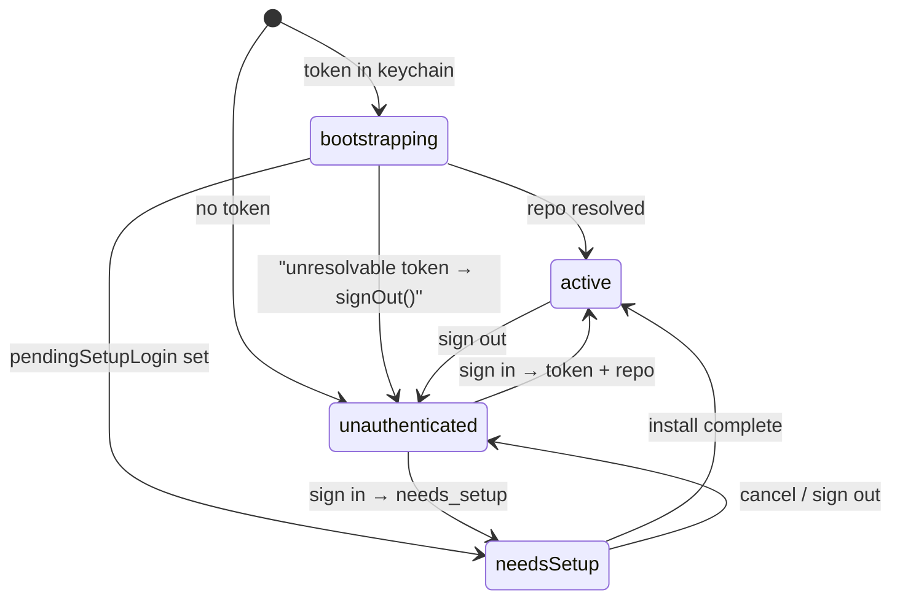
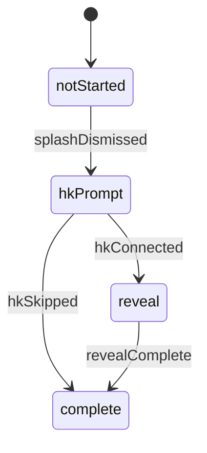

# App Launch State Machine

**Context:** Startup routing is encoded across 10 booleans in `CoachHQApp`, `GitHubAuthManager`, and AppStorage; the `!isSessionReady` escape hatch and a three-callback onboarding cascade are where most signup bugs live.

**Decision:** `AppRouter` derives `AppState` from `GitHubAuthManager`'s published properties plus a single persisted `OnboardingPhase`. Auth state flows in automatically; 4 onboarding-only events mutate the phase. `CoachHQApp.body` becomes a plain `switch`. Onboarding overlays stay inside `MainTabView`.

---

## AppState

`AppState` has no `.sessionExpired` case — that overlay lives in `MainTabView.swift:112–119` and stays there. No onboarding cases either; splash, HK prompt, and reveal are overlays inside `MainTabView` driven by `router.effectivePhase`.

`AppRouter.state` is a pure derivation from `authManager`'s published properties (`isSessionReady`, `isAuthenticated`, `selectedRepo`, `pendingSetupLogin`). No events for auth transitions. `isSessionReady` stays on `GitHubAuthManager` — 6 consumers outside routing gate on it.

`.bootstrapping` and `.active` both render `MainTabView`. Per-view `isSessionReady` gating provides warm loading skeletons during bootstrap, matching the current cold-launch experience.

---

## OnboardingPhase (one persisted AppStorage `Int`)

Replaces `personalizeShown`, `hkPrePromptShown`, `onboardingRevealShown`. The router also persists `lastOnboardingLogin` alongside it.

**Account switch reset.** Router persists `lastOnboardingLogin` alongside `onboardingPhase`. `lastOnboardingLogin` is NOT written at migration time — only when `authManager.user` first resolves. When user resolves, the router checks:
- `lastOnboardingLogin` absent → write the resolved login silently; no reset. Covers migrated users on their first post-migration launch.
- Present and equal → no action.
- Present and different → reset `onboardingPhase` to `.notStarted`, clear `hkAuthorizationGranted`, write new login.

Sign-out → sign-in as the same person resumes from the stored phase. A different person on the same device gets fresh onboarding and a visible SettingsView reconnect CTA.

**Session-expired suppression.** Keeping onboarding overlays in `MainTabView` means fullScreenCovers render above the `SessionExpiredView` overlay (`MainTabView.swift:112–119`). A 401 mid-onboarding — most likely during `OnboardingRevealFlow.swift:101–104`'s `fetchYearSummary()` — would leave the user on a silently-failing reveal with the recovery screen hidden beneath it. Fix: the router exposes `effectivePhase: OnboardingPhase`, which returns `.complete` when `authManager.sessionExpired == true`. `MainTabView` uses `effectivePhase` for all overlay rendering decisions; when expired, no fullScreenCover renders and the session-expired screen wins. Splash specifically: while `sessionExpired`, `effectivePhase == .complete` means the splash overlay never renders at all — `onComplete()` never fires and the phase stays `.notStarted`. After re-auth, the splash replays correctly from `.notStarted`.

**`hkConnected` semantics.** Fires on button tap, not on system dialog outcome — `authorizationStatus(for:)` is not meaningful for read types and `requestAuthorization()` does not throw on denial. Denial is handled at data-read time. `onboardingPhase` does not gate on `hkAuthorizationGranted`.

---

## Migration (P0 — existing TestFlight installs)

On first read of `onboardingPhase`, if the key is absent, migrate from old keys and delete them:

| Old state | Migrated phase |
|---|---|
| `onboardingRevealShown == true` | `.complete` |
| `hkPrePromptShown == true` | `.complete` (connect and skip both mean done) |
| `personalizeShown == true` | `.hkPrompt` |
| none set | `.notStarted` |

Evaluate top to bottom, first match wins — a mid-onboarding user can have multiple old keys true simultaneously. Do not write `lastOnboardingLogin` at migration time; it is written when `authManager.user` first resolves (see Account switch reset above). Migration runs once.

---

## Service setup ownership

`CoachHQApp.swift:56–71` mixes service configuration with onboarding branching. In the new design:

- **Service configuration** (`syncManager.configure`, `workoutService.configure`, `widgetStore.configure`) — `.task` on `MainTabView`. Runs on every cold launch when auth is ready.
- **HK setup for returning users** (`requestAuthorization + requestNotificationPermission + enableBackgroundDelivery + setupWorkoutObserver`) — same `.task`, guarded by `router.onboardingPhase == .complete` (the real phase, not `effectivePhase` — a 401 during onboarding must not fire system permission dialogs over the session-expired screen). Must not be silently dropped.
- **HK setup for new users** — `AppRouter.advance(.hkConnected)` handler.

The existing `onChange(of: personalizeShown)` chain and the `CoachHQApp`-level `.task` are both deleted.

---

## What changes

| File | Change |
|---|---|
| New: `Services/AppRouter.swift` | Derives `AppState`; owns `OnboardingPhase` + `lastOnboardingLogin`; migration logic; account-switch reset; exposes `effectivePhase`; 4 onboarding events |
| `CoachHQApp.swift` | Replace routing condition + AppStorage booleans + `onChange` chain + `background(EmptyView().fullScreenCover)` hack with `switch router.state`; delete `.task` |
| `GitHubAuthManager.swift` | `isSessionReady` kept; router observes it. In `bootstrapSession()`: if `selectedRepo == nil && pendingSetupLogin == nil` after resolution (zombie token), call `signOut()` before `isSessionReady = true` |
| `MainTabView.swift` | Reads `router.effectivePhase` (via `@EnvironmentObject`); owns service-configuration `.task` and HK setup for returning users |
| `SetupView.swift` | Accepts `login: String` param; drops internal `authManager.pendingSetupLogin` read |
| `OnboardingRevealFlow.swift` | Removes `@AppStorage("onboardingRevealShown")` — router owns completion |

---

## Behaviour deltas

- **Crash mid-reveal** → `OnboardingPhase.reveal` is persisted before the reveal renders → resumes at reveal on relaunch (improvement; today the reveal is lost).
- **Account switch** → User B on the same device now gets full onboarding. Previously: skipped straight to tabs with User A's `hkAuthorizationGranted = true` hiding the reconnect CTA.
- **Zombie token** → `bootstrapSession()` failure with a valid keychain token now calls `signOut()` and routes to `LoginView` cleanly. Previously: fell through to `LoginView` leaving a zombie token that failed identically every subsequent launch.
- **Session expiry mid-onboarding** → expired screen now wins over fullScreenCovers. Previously: SessionExpiredView rendered invisibly beneath them.

---

## Done when

- `CoachHQApp.body` is a `switch router.state` with no boolean routing logic
- Three old AppStorage keys (`personalizeShown`, `hkPrePromptShown`, `onboardingRevealShown`) deleted from the codebase
- Migration verified: existing install on update does not replay splash or HK prompt
- Account switch verified: sign in as User B after User A shows full onboarding and SettingsView reconnect CTA
- Session expiry mid-reveal verified: SessionExpiredView wins; no zombie cover remains
- HK observer confirmed to initialize on cold launch for returning users (`onboardingPhase == .complete` path)
- Verify on device: whether iOS revokes HK read authorization on app deletion; decide whether to add a reinstall-detection guard if it does not
- `CoachSetupState` and `TestModeManager` compile and route correctly
- ADR `kdb/decisions/0015-ios-app-launch-state-machine.md` merged

## Deferred

- **P2** — HK denial recovery: `hkAuthorizationGranted` set unconditionally on tap in both `CoachHQApp.swift:87` and `connectHealthKit():104`. Fix both; re-gate `SettingsView:183` on data presence rather than intent. `authorizationStatus(for:)` is not a valid detection signal for read types — empty reads are the only signal.
- iOS test target not in scope.
