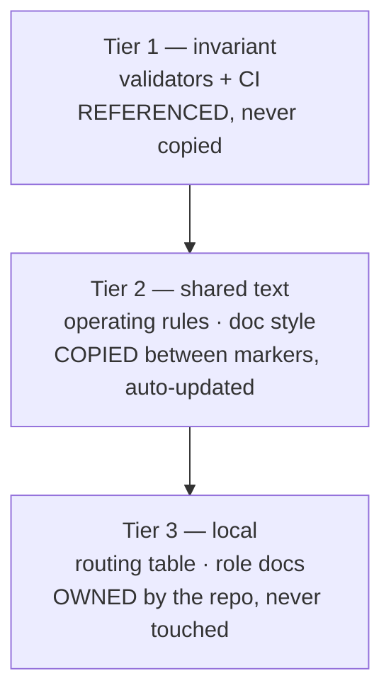

# Agent Kit

**Context:** The HQ agent setup (routing table, role docs, rules, and enforcement) needs to be portable across all our repos, without tying the logic exclusively to a single editor.

## Goal

Extract the shared agent instructions and validators into a reusable toolkit. We split the setup into tiers: invariants (CI/validators), managed text (shared rules synced via `update.sh`), and local configuration (repo-specific ADRs and roles).

## Done when

1. Bootstrapping into a new git repo stamps a functional Knowledge Base (KB).
2. Managed blocks are automatically updated by `update.sh` without discarding local edits outside markers.
3. Tiers 1 and 2 mention no provider names.
4. Validation workflows prevent stale blocks and enforce file-size limits.

## Deferred

- Carving this directory out into `sibling-shipyard/agent-kit`.
- Claude Code plugin + marketplace wrap for the installer.
- Migrating HQ to use the decoupled kit setup.
