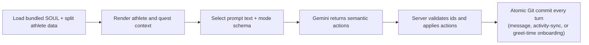

# `api/coach-chat/` — hosted Coach internals

This folder owns the hosted Coach Phelps implementation shared by web and iOS. The routed entry
points stay one level up because Vercel maps literal file paths to URLs:

| Route file                        | Endpoint                         | Responsibility                                                          |
| --------------------------------- | -------------------------------- | ----------------------------------------------------------------------- |
| `../coach-chat.ts`                | `/api/coach-chat`                | Authenticate and dispatch GET history or POST greet/sync/message stages |
| `../coach-chat-context.ts`        | `/api/coach-chat-context`        | Preload the same cached context used by chat                            |
| `../coach-chat-profile-status.ts` | `/api/coach-chat-profile-status` | Report FSP completion + live `coachSince` for the day badge             |

Do not move those files here without intentionally changing every client URL. See
[`../README.md`](../README.md) and ADR 0017.

## Turn flow



- SOUL and the First Session horcrux are build outputs in `api/_generated/soul.ts`, not athlete-repo files.
- Athlete context comes from `profile.json`, `memory.json`, `injuries.json`, the last five
  `coach_log.json` rows, the split quest ledger, and `gen/athlete_insights.json`.
- Greetings and activity syncs expose no write actions. First Session turns expose only intake
  actions. A returning athlete's turns expose every action field, data-fact and operational alike,
  on every turn - there is no separate closing turn (C1).
- Gemini reports facts and requested operations. The server owns ids, dates, timestamps, file
  shapes, commit messages, thread titles, validation, and atomic persistence.

Full lifecycle: [`coach-chat-flow.md`](../../../docs/eng-docs/coach-chat-flow.md). Gemini request,
schema, caching, and retry details: [`gemini-flow.md`](../../../docs/eng-docs/gemini-flow.md).
Atomic commit/retention design: [ADR 0012](../../../kdb/decisions/0012-coach-chat-atomic-commits-and-retention.md).
Day-number design: [ADR 0018](../../../kdb/decisions/0018-coach-since-day-number.md).

## `_lib/` map

### Context and time

| File                  | Responsibility                                                                                     |
| --------------------- | -------------------------------------------------------------------------------------------------- |
| `coachChatFiles.ts`   | Read bundled SOUL and the nine athlete context files; in-flight/60-second cache; completion checks |
| `coachMemoryFiles.ts` | Paths and types for profile, memory, injuries, and coach log                                       |
| `coachQuestFiles.ts`  | Paths and types for seasons, quests, progress, and progressions                                    |
| `coachContext.ts`     | Render compact athlete, Fitness Snapshot, season, quest, and milestone prompt sections             |
| `coachDay.ts`         | IANA-timezone dates, thread offsets, and `coach_since` day-number math                             |

### Gemini boundary

| File                  | Responsibility                                                                                                                                                 |
| --------------------- | -------------------------------------------------------------------------------------------------------------------------------------------------------------- |
| `coachPromptText.ts`  | Static cached prefix, dynamic mode instructions, history window, and optional context blocks                                                                   |
| `coachReplySchema.ts` | `LlmReply`, `TurnMode`, and the mode-specific structured-output schemas (`additionalProperties: false` at every object level, enforced by `LlmJsonSchemaNode`) |
| `coachLlmClient.ts`   | Build the prompt/request and parse replies, then run it through `selectLlmAdapter` (`_lib/llmClient.ts`)                                                       |

The explicit soul cache and the retry-on-400/503/504 logic live behind the seam now, in
`../../_lib/llmAdapters/geminiAdapter.ts` and its `geminiSoulCache.ts` helper (#713 M2 PR 2) - not
in this directory. `coachPromptText.ts` may import the `TurnMode` type from `coachReplySchema.ts`;
the schema module must not depend on prompt text.

### Server-owned actions and writes

| File                         | Responsibility                                                                                         |
| ---------------------------- | ------------------------------------------------------------------------------------------------------ |
| `coachProfileIntents.ts`     | Apply profile, memory, coaching-style, availability, sports, and coach-log actions                     |
| `coachInjuryIntents.ts`      | Apply injury flag/event actions                                                                        |
| `coachSeasonQuestIntents.ts` | Apply season-start, quest-create, and quest-event actions                                              |
| `coachWeekFiles.ts`          | Validate and apply full week plans, session reconciliation, and dated plan edits                       |
| `coachWorkoutFiles.ts`       | Select/generate initial templates; validate template edits and today's modified session                |
| `workoutSchema.ts`           | Structural runtime validation for workout/template JSON                                                |
| `coachSinceStamp.ts`         | Load profile state and stamp `coach_since` once when First Session completes                           |
| `turnRequest.ts`             | Parse the incoming request and load turn state (context, ids, pending clarification)                   |
| `turnReplyValidation.ts`     | Reply-content validators the reprompt loop in `requestCoachReply.ts` checks against                    |
| `requestCoachReply.ts`       | Call Gemini, run the one-shot reprompt loop against `turnReplyValidation.ts`'s checks                  |
| `buildTurnWrites.ts`         | Decide→write assembly - validate reply actions and build the per-field file writes                     |
| `turnCompletion.ts`          | Post-write cleanup (first-session benchmark generation) and the final atomic commit                    |
| `activitySync.ts`            | Activity-sync batch id, hist lookup, and attachment rows                                               |
| `activitySyncTurn.ts`        | Persist-on-sync Coach turn — one committed thread per verified batch                                   |
| `turnWrites/`                | One file per `LlmReply` action field's write-builder — see its own [README](_lib/turnWrites/README.md) |
| `onboardingWrites.ts`        | Normalize native onboarding hints and suppress duplicate greet commits                                 |

### Conversation lifecycle

| File             | Responsibility                                                                           |
| ---------------- | ---------------------------------------------------------------------------------------- |
| `chatThreads.ts` | Thread/message model, `chat_history.json`, seven-thread retention, server-derived titles |

`_lib/_generated/` holds the checked-in esbuild output for the `engine/lib/` cross-band bundles
(`current-week`, `current-week-rollover`, `compile-workout`, `text-caps`) — never hand-edit.

## Tests

`_tests/` covers the pure modules and cross-module behavior. Golden live-Gemini transcripts live
under `ui/eval/transcripts/` and are run by `ui/eval/eval-coach-chat.ts`.

```bash
cd ui
npx tsc --noEmit
npm test -- --run
```

`npm run eval:coach-chat` is a paid/live gate. Run it only when that gate is explicitly requested;
ordinary deterministic verification must not call Gemini.

## Scope boundaries

- Generic GitHub commit and timeout infrastructure stays in `api/_lib/`.
- Client rendering/state stays in `client/`; native client behavior stays in `ios/`.
- Coach identity and behavior originate in `platform/soul/`, never in this folder.
- Three-route consolidation remains separate from this folder's lifecycle modules.
